# FIN Business

<!-- Consolidated from the previous aidly-business-doc/backend, frontend, memory, and planning files. -->

FIN is the accounting sink: chart of accounts, voucher setup, voucher entry, GL mapping, opening balances, auto-posting, financial periods, year-end close, and statutory/management reports.

## Finance Database and Backend Blueprint

# FIN — Finance / General Ledger Module (Production Blueprint)

> **Forms covered (NEW — none exist yet):** **Setup** FIN_1001 Chart of Accounts · FIN_1002 Account Group Setup · FIN_1003 Voucher Type Setup · FIN_1004 Opening Balance Entry · FIN_1005 Bank/Cash Account Setup · FIN_1006 GL Account Mapping (auto-posting config) · FIN_1007 Finance Settings — **Transactions** FIN_1101 Voucher Entry (**one** form; `voucher_type` = Journal / Payment / Receipt / Contra drives the layout) · FIN_1102 Bank Reconciliation — **AR/AP & posting** FIN_1201 Auto-Posting Monitor · FIN_1202 Receivables (AR) · FIN_1203 Payables (AP) — **Reports** FIN_1301 Trial Balance · FIN_1302 General/Account Ledger · FIN_1303 Day Book · FIN_1304 Profit & Loss · FIN_1305 Balance Sheet · FIN_1306 Cash Flow · FIN_1307 AR/AP Aging — **Period control** FIN_1401 Period / Year-End Close — **Optional** FIN_1501 Fixed Asset Register · FIN_1502 Depreciation Run · FIN_1601 Budget Setup · FIN_1602 Budget vs Actual.
>
> **Depends on (consumes, never duplicates):** `sys-db.md` — `sys_fin_year` + `sys_fin_year_dtl` (period control, SYS_1003), `sys_cost_center` (SYS_1007), `sys_currency` + `sys_exchange_rate` (SYS_1004/1006), `sys_vat_tax` (SYS_1005), `sys_doc_sequence` (numbering), `sys_event_outbox` (the transactional outbox FIN drains), `sys_approval_workflow`/`sys_approval_request` (voucher approval), `sys_file` (attachments). **Aligns with** the conventions table reproduced in `inv-db.md`/`hrm-db.md`/`pur-db.md`/`sal-db.md`.
>
> **What FIN is:** the **accounting sink** of the ERP. Every value-moving event in HRM, INV, PUR and SAL ends as a **balanced double-entry voucher** here. FIN owns the **chart of accounts**, the **journal vouchers**, the **immutable GL ledger**, the **control accounts** that reconcile against the AR/AP sub-ledgers (which live in SAL/PUR), bank/cash, and the **financial statements**. It buys, sells and stocks nothing — it *records* all of it.

---

## Conventions inherited from the existing codebase (applies to every table below)

Identical to `inv-db.md` → "Conventions inherited from the existing codebase". Not re-explained per table:

| Concern | Rule |
|---|---|
| Surrogate PK | `{entity}_no BIGSERIAL PRIMARY KEY` (Java `Long`, `@GeneratedValue(IDENTITY)`) |
| Business key | `{entity}_id VARCHAR(n)` — human code, unique **per company among live rows** via partial index `WHERE is_deleted = 0` |
| Tenant columns | `company_no BIGINT NOT NULL`; `branch_no BIGINT` (NOT NULL for branch-scoped txns; **nullable = "All Branches"** for company-wide setup such as the chart of accounts) |
| Booleans | `SMALLINT NOT NULL DEFAULT 0/1` + `CHECK (col IN (0,1))` — never native `BOOLEAN` |
| Enums / states | `SMALLINT` + `CHECK (col IN (...))` + inline comment listing codes |
| Money | `NUMERIC(20,4)` amounts, `NUMERIC(20,6)` FX rates / unit costs, `NUMERIC(5,2)` percentages |
| Audit block | `is_active, is_deleted, created_by/at, updated_by/at, deleted_by/at, row_version` (= `AuditEntity`), abbreviated `-- << AUDIT BLOCK >>` |
| Soft delete | never hard-delete; `performSoftDelete(userNo)`; override `nullifyBusinessId()` to free a unique slot |
| Optimistic lock | `row_version BIGINT NOT NULL DEFAULT 1` (`@Version`) → 409 on conflict |
| Header → detail | `fin_voucher_dtl` child `ON DELETE CASCADE`; masters (`fin_account`) `ON DELETE RESTRICT` |
| Immutable journals | `fin_ledger` is **append-only** — never updated or deleted; corrections are *reversing vouchers* (same discipline as `inv_stock_ledger` / `hrm_leave_ledger`) |

### MANDATORY API ISOLATION (inherited from SYS, no exceptions)
Every FIN endpoint enforces the 4 dimensions from `sys-db.md`: `company_no` + `branch_no` (from `CompanyBranchContext`, **never** the DTO) + `is_deleted = 0` + `role_no` permission (`RbacAuthorizationInterceptor`, header `X-Form-Id: FIN_xxxx`). The **chart of accounts, account groups, voucher types and GL mapping are company-wide** (`branch_no NULL = All Branches`); **vouchers and the ledger are branch-stamped** (every posting belongs to the branch that produced it) so branch P&L is possible, while consolidation rolls them up by `company_no`.

---

# 0. DELTA — what changes vs. the current schema

FIN does not exist yet. Everything here is **new**, but it slots onto contracts other modules **already emit**:

| Area | Today | This blueprint | Migration action |
|---|---|---|---|
| **Chart of accounts** | none (`gl_account_code` is free text on `hrm_salary_component`; `cash_gl_account_no`/`gl_voucher_no` are dangling FKs in SAL/PUR/INV) | first-class `fin_account` + `fin_account_group` tree; the dangling refs now resolve here | new tables; seed a COA template per Country Pack |
| **Journal / GL** | none | `fin_voucher` (+`fin_voucher_dtl`) document + immutable `fin_ledger` + `fin_account_balance` (balance-plus-ledger split, same as INV) | new |
| **Auto-posting** | HRM/INV/PUR/SAL write `sys_event_outbox` events; **no consumer** (no-op stub) | `FinPostingService` drains the outbox → balanced vouchers via `fin_gl_map` | wire the consumer; modules unchanged |
| **AR / AP control** | sub-ledgers live in SAL (`sal_customer.current_due`) and PUR (`pur_supplier.current_payable`) | FIN holds the **control accounts**; a reconciliation report ties control ↔ sub-ledger | new control accounts + recon report |
| **Period control** | `sys_fin_year`/`sys_fin_year_dtl` already gate inv/sal/pur postings | FIN **reuses** it (does not redefine); adds year-end close that writes to Retained Earnings | reuse; new close routine |
| **Bank / cash** | `cash_gl_account_no` on POS session; no bank master | `fin_bank_account` + `fin_bank_recon` | new |
| **Approvals** | engine exists | journal/payment/receipt vouchers above a threshold gate through `sys_approval_workflow` (`document_type = FIN_VOUCHER`) | reuse SYS approval engine |

---

# 1. MODULE OVERVIEW

## 1.1 What FIN owns
FIN owns **the money dimension as a system of record**: *what is owned and owed, what was earned and spent, and the audit-grade trail of every entry that moved a number.* It is a **double-entry general ledger** (every transaction has equal debits and credits) plus the **statements** derived from it. It consumes SYS for identity, isolation, fiscal periods, cost centers, currency and numbering. It is the **terminal sink**: HRM posts payroll cost, INV posts inventory value, PUR posts payables, SAL posts revenue/receivables — all into FIN. FIN posts nowhere else; it only emits a `GlPosted` acknowledgement so source documents can stamp their `gl_voucher_no`.

## 1.2 Sub-modules (clean, modular split)
```
fin/
 ├── setup/        Chart of Accounts, Account Groups, Voucher Types, Opening Balances,
 │                 Bank/Cash accounts, GL Mapping (event→account), Finance Settings
 ├── transactions/ Journal · Payment · Receipt · Contra vouchers · Bank Reconciliation
 ├── posting/      FinPostingService — the outbox consumer that turns module events into vouchers
 ├── arap/         Receivables & Payables control + aging (sub-ledgers stay in SAL/PUR)
 ├── reports/      Trial Balance · GL/Account Ledger · Day Book · P&L · Balance Sheet · Cash Flow · Aging
 ├── close/        Period & Year-End close (P&L → Retained Earnings), period guard
 └── assets/budget Optional: Fixed Assets + Depreciation, Budget vs Actual
```

## 1.3 Organizational position (inherits SYS hierarchy)
```
sys_company (the accounting entity — owns the chart of accounts & fiscal calendar)
 └── sys_branch (every voucher is branch-stamped; branch P&L rolls up to company)
      └── sys_cost_center (optional analytic dimension on every posting line)
```
The **chart of accounts and fiscal calendar are a company policy** (`branch_no NULL`); **vouchers/ledger are branch transactions**. Multi-company consolidation is a `company_no` roll-up; cross-company postings are never allowed (the cardinal SYS isolation rule).

---

# 2. FULL FIN BUSINESS FLOW (end-to-end)

## 2.1 The lifecycle, one picture

```mermaid
flowchart TD
    subgraph SETUP["â‘  SETUP (once)"]
      COA["Chart of Accounts<br/>(fin_account + groups)"] --> MAP["GL Mapping<br/>(fin_gl_map: which account for<br/>inventory, AP, AR, salary, VAT, cash…)"]
      OPEN["Opening Balances<br/>(one opening voucher)"]
    end
    subgraph SOURCES["â‘¡ SOURCE EVENTS (other modules)"]
      H["HRM payroll Approved"] --> OB[(sys_event_outbox)]
      I["INV stock posted / adjusted"] --> OB
      P["PUR invoice / payment posted"] --> OB
      S["SAL invoice / receipt posted"] --> OB
    end
    OB -->|drained by| ENG{{"FinPostingService<br/>reads fin_gl_map → builds a BALANCED voucher"}}
    MAP --> ENG
    subgraph MANUAL["â‘¢ MANUAL ENTRY"]
      JV["Voucher Entry — ONE form (FIN_1101)<br/>voucher_type = Journal/Payment/Receipt/Contra"]
    end
    ENG --> VCH["fin_voucher (Draft)"]
    JV --> VCH
    VCH -->|POST<br/>period open + Dr=Cr| LED[("fin_ledger (immutable)<br/>+ fin_account_balance")]
    VCH -.->|GlPosted event| OB
    OB -.->|stamps gl_voucher_no back| SOURCES
    LED --> RPT["④ REPORTS<br/>Trial Balance · GL · P&L · Balance Sheet · Cash Flow · Aging"]
    RPT --> CLOSE["⑤ Period / Year-End Close<br/>P&L net → Retained Earnings; lock period"]
```


## 2.2 The double-entry invariant (the one rule everything obeys)
Every `fin_voucher` must satisfy **Σ debit = Σ credit** across its `fin_voucher_dtl` lines (enforced on save, re-checked on post). Nothing reaches `fin_ledger` unbalanced. All balances, every report, and the Trial Balance are **derived only from `fin_ledger`** — never from the document tables — so the books always tie out.

## 2.3 Posted is immutable; corrections are reversals
A voucher is editable **only while `Draft`**. `Post` writes `fin_ledger` rows and updates `fin_account_balance`; the voucher is then immutable. To fix a posted voucher you **Cancel** it (writes an equal-and-opposite reversing set into `fin_ledger`, never edits history) or post an adjusting voucher. Identical discipline to `inv_stock_ledger`.

## 2.4 Auto-posting: how a module event becomes a voucher
`FinPostingService` is a `@TransactionalEventListener(AFTER_COMMIT)` / `@Scheduled` relay that drains `sys_event_outbox`. For each event it looks up the account pair(s) in `fin_gl_map` (keyed by `company_no` + event type + sub-key like cost-center / tax-code) and builds one balanced voucher:

| Event (emitter) | Voucher built (Dr / Cr) |
|---|---|
| `PayrollPosted` (HRM_1202) | **Dr** Salary Expense (per cost-center) · **Cr** Salary Payable · **Cr** Statutory Payables (tax/PF) · loans net to their control account |
| `PurchaseInvoicePosted` (PUR_1102) | **Dr** Inventory / GRN-clearing · **Dr** Input VAT · **Cr** Accounts Payable (supplier sub-ledger party) |
| `SupplierPaymentPosted` (PUR_1104) | **Dr** Accounts Payable · **Cr** Bank / Cash |
| `SalesInvoicePosted` (SAL_1001) | **Dr** Cash / Accounts Receivable · **Dr** COGS · **Cr** Sales Revenue · **Cr** Output VAT · **Cr** Inventory |
| `CustomerReceiptPosted` (SAL_1102) | **Dr** Bank / Cash · **Cr** Accounts Receivable |
| `StockAdjustmentPosted` (INV_1102) | **Dr/Cr** Inventory · **Cr/Dr** Stock Adjustment (gain/loss) |
| `StockTransferPosted` (INV_2003) | usually no GL impact (same entity) unless inter-company → in-transit account |

**Idempotency:** each event carries `(aggregate_type, aggregate_id)`; FIN records the produced `voucher_no` against it and **skips** a second delivery (the outbox is at-least-once). On success FIN emits `GlPosted(sourceDoc, voucherNo)` so the source row can set its `gl_voucher_no` — decoupled both ways.

## 2.5 Roles
Accountant (create/post journals, run reports, reconcile bank), AP Clerk (payments, payable aging), AR Clerk (receipts, receivable aging), Finance Manager (approve over-threshold vouchers, period close, void posted), Auditor (read-only ledger + statements), Admin (chart of accounts, GL mapping, voucher types).

---

# 3. FORM INTEGRATION MAP

| Form | Reads | Writes | Emits / Consumes | Approval |
|---|---|---|---|---|
| FIN_1001 Chart of Accounts | `fin_account_group`, `sys_cost_center` | `fin_account` | — | — |
| FIN_1002 Account Group | — | `fin_account_group` | — | — |
| FIN_1003 Voucher Type | `fin_account` | `fin_voucher_type`, `sys_doc_sequence` | — | — |
| FIN_1004 Opening Balance | `fin_account` | one opening `fin_voucher` (type=Opening) → `fin_ledger` | — | — |
| FIN_1005 Bank/Cash Account | `fin_account` | `fin_bank_account` | — | — |
| FIN_1006 GL Mapping | `fin_account` | `fin_gl_map` | (read by `FinPostingService`) | — |
| FIN_1101 Voucher Entry (one form; Journal/Payment/Receipt/Contra by `voucher_type`) | `fin_account`, `fin_voucher_type`, `sys_fin_year`, `sys_cost_center`, `sys_exchange_rate` | `fin_voucher` (+dtl), on post → `fin_ledger`, `fin_account_balance` | emits `GlPosted` | `FIN_VOUCHER` (amount band) |
| FIN_1102 Bank Reconciliation | `fin_ledger` (bank account), `fin_bank_account` | `fin_bank_recon` (+dtl) | — | — |
| FIN_1201 Auto-Posting Monitor | `sys_event_outbox`, `fin_voucher` | re-drive failed posts | consumes outbox | — |
| FIN_1202/1203 AR/AP | `fin_ledger`, `sal_customer`/`pur_supplier` (control vs sub-ledger) | — (report) | — | — |
| FIN_1301–1307 Reports | `fin_ledger`, `fin_account_balance`, `fin_account(_group)` | — | — | — |
| FIN_1401 Period/Year Close | `fin_ledger`, `sys_fin_year_dtl` | closing `fin_voucher` (P&L→Retained Earnings); sets `period_status` | — | Manager |

---

# 4. DATABASE SCHEMA

## 4.1 `fin_account_group` (FIN_1002) — the COA tree
```sql
CREATE TABLE fin_account_group (
    account_group_no   BIGSERIAL PRIMARY KEY,
    account_group_id   VARCHAR(30)  NOT NULL,             -- partial-unique per company
    group_name         VARCHAR(150) NOT NULL,
    parent_group_no    BIGINT REFERENCES fin_account_group(account_group_no) ON DELETE RESTRICT,
    root_type          SMALLINT NOT NULL,                 -- 1=Asset 2=Liability 3=Equity 4=Income 5=Expense
    normal_balance     VARCHAR(2) NOT NULL,               -- dr=Debit cr=Credit (natural side)
    is_control         SMALLINT NOT NULL DEFAULT 0 CHECK (is_control IN (0,1)),
    order_sl           INTEGER  NOT NULL DEFAULT 0,
    company_no         BIGINT NOT NULL,
    branch_no          BIGINT,                            -- NULL = All Branches (company-wide)
    -- << AUDIT BLOCK >>
);
CREATE UNIQUE INDEX uq_fin_grp_id_company ON fin_account_group(account_group_id, company_no) WHERE is_deleted = 0;
CREATE INDEX idx_fin_grp_parent ON fin_account_group(parent_group_no) WHERE is_deleted = 0;
```
A self-referencing tree under 5 statutory roots (Asset/Liability/Equity/Income/Expense). `normal_balance` + `root_type` decide statement placement and the sign convention.

## 4.2 `fin_account` (FIN_1001) — the GL account (chart of accounts)
```sql
CREATE TABLE fin_account (
    account_no         BIGSERIAL PRIMARY KEY,
    account_code       VARCHAR(30)  NOT NULL,             -- the value other modules stored as gl_account_code
    account_name       VARCHAR(200) NOT NULL,
    account_group_no   BIGINT NOT NULL REFERENCES fin_account_group(account_group_no) ON DELETE RESTRICT,
    root_type          SMALLINT NOT NULL,                 -- denormalized from group for fast reports (1..5)
    normal_balance     VARCHAR(2) NOT NULL,               -- dr=Debit cr=Credit
    is_postable        SMALLINT NOT NULL DEFAULT 1 CHECK (is_postable IN (0,1)), -- 0 = header/summary, no direct posting
    control_type       SMALLINT,                          -- NULL=plain; 1=AR 2=AP 3=Bank 4=Cash 5=Inventory 6=Tax 7=Retained-Earnings
    requires_cost_center SMALLINT NOT NULL DEFAULT 0 CHECK (requires_cost_center IN (0,1)),
    requires_party     SMALLINT NOT NULL DEFAULT 0 CHECK (requires_party IN (0,1)),  -- AR/AP must carry a party
    currency_no        BIGINT REFERENCES sys_currency(currency_no),  -- NULL = base currency
    opening_balance    NUMERIC(20,4) NOT NULL DEFAULT 0,
    opening_dr_cr      VARCHAR(2) NOT NULL DEFAULT 'dr',   -- dr=Debit cr=Credit (sign of opening_balance)
    company_no         BIGINT NOT NULL,
    branch_no          BIGINT,                             -- NULL = All Branches
    -- << AUDIT BLOCK >>
);
CREATE UNIQUE INDEX uq_fin_acc_code_company ON fin_account(account_code, company_no) WHERE is_deleted = 0;
CREATE INDEX idx_fin_acc_group   ON fin_account(account_group_no) WHERE is_deleted = 0;
CREATE INDEX idx_fin_acc_control ON fin_account(company_no, control_type) WHERE control_type IS NOT NULL AND is_deleted = 0;
```
`control_type` marks the accounts the engine and reconciliation care about. `is_postable = 0` = a summary/header account you cannot post to directly. `requires_party = 1` forces every line on an AR/AP account to carry `party_type/party_no` (the sub-ledger link).

## 4.3 `fin_voucher_type` (FIN_1003) — document types + numbering
```sql
CREATE TABLE fin_voucher_type (
    voucher_type_no  BIGSERIAL PRIMARY KEY,
    voucher_type_id  VARCHAR(20) NOT NULL,                -- partial-unique per company
    type_name        VARCHAR(100) NOT NULL,
    base_kind        SMALLINT NOT NULL,                   -- 1=Journal 2=Payment 3=Receipt 4=Contra 5=Sales 6=Purchase 7=Opening 8=Closing
    doc_sequence_no  BIGINT REFERENCES sys_doc_sequence(doc_sequence_no), -- numbering series
    default_dr_account_no BIGINT REFERENCES fin_account(account_no),
    default_cr_account_no BIGINT REFERENCES fin_account(account_no),
    is_system        SMALLINT NOT NULL DEFAULT 0 CHECK (is_system IN (0,1)), -- system types can't be deleted
    company_no       BIGINT NOT NULL,
    branch_no        BIGINT,
    -- << AUDIT BLOCK >>
);
CREATE UNIQUE INDEX uq_fin_vtype_id_company ON fin_voucher_type(voucher_type_id, company_no) WHERE is_deleted = 0;
```

## 4.4 `fin_voucher` (header) + `fin_voucher_dtl` (lines) — FIN_1101 Voucher Entry

> **ONE form, not four.** Journal, Payment, Receipt and Contra are the *same* document — one `fin_voucher` header with balanced `fin_voucher_dtl` lines — differing only by `fin_voucher_type.base_kind`. **FIN_1101 Voucher Entry** is a single screen whose chosen voucher type drives the layout, so there is no duplicated form/controller/service:
> - **Journal (1)** — free-form grid: any postable accounts, multiple Dr and Cr lines, must balance.
> - **Payment (2)** — one fixed **credit** leg = the Bank/Cash account (`control_type` 3/4); Dr lines are the expenses/parties paid (with allocation to bills via `against_voucher_no`).
> - **Receipt (3)** — mirror of Payment: one fixed **debit** Bank/Cash leg; Cr lines are the income/parties received from.
> - **Contra (4)** — both legs are Bank/Cash (cash↔bank, bank↔bank transfers).
>
> The type also selects the numbering series (`fin_voucher_type.doc_sequence_no` → `JV-/PV-/RV-/CV-…`) and any default accounts. Backend stays form-wise (`Fin1101Controller/Service`), the frontend is one component that switches mode on `voucher_type`. The auto-posting engine reuses the exact same `fin_voucher` shape with a *system* voucher type — manual and machine postings are one model.

```sql
CREATE TABLE fin_voucher (
    voucher_no       BIGSERIAL PRIMARY KEY,
    voucher_id       VARCHAR(30) NOT NULL,                -- from sys_doc_sequence (e.g. JV-2026-000123)
    voucher_type_no  BIGINT NOT NULL REFERENCES fin_voucher_type(voucher_type_no) ON DELETE RESTRICT,
    voucher_date     DATE NOT NULL,
    fin_year_no      BIGINT NOT NULL REFERENCES sys_fin_year(fin_year_no) ON DELETE RESTRICT,
    fin_period_no    BIGINT NOT NULL REFERENCES sys_fin_year_dtl(fin_period_no) ON DELETE RESTRICT,
    narration        VARCHAR(1000),
    reference_no     VARCHAR(100),                        -- cheque no / external ref
    currency_no      BIGINT REFERENCES sys_currency(currency_no),  -- NULL = base
    fx_rate          NUMERIC(20,6) NOT NULL DEFAULT 1,
    total_debit      NUMERIC(20,4) NOT NULL DEFAULT 0,    -- in BASE currency; CHECK = total_credit on post
    total_credit     NUMERIC(20,4) NOT NULL DEFAULT 0,
    status           SMALLINT NOT NULL DEFAULT 1,         -- 1=Draft 2=Posted 3=Cancelled
    source_module    SMALLINT,                            -- NULL=manual; 1=HRM 2=INV 3=PUR 4=SAL 5=FIN-auto
    source_doc_type  VARCHAR(40),                         -- e.g. 'PurchaseInvoicePosted'
    source_doc_no    BIGINT,                              -- the originating document PK (idempotency key with type)
    reversal_of_no   BIGINT REFERENCES fin_voucher(voucher_no), -- set on a cancellation/reversal voucher
    approval_request_no BIGINT,                           -- → sys_approval_request when gated
    posted_by        BIGINT, posted_at TIMESTAMPTZ,
    company_no       BIGINT NOT NULL,
    branch_no        BIGINT NOT NULL,                     -- vouchers are branch transactions
    -- << AUDIT BLOCK >>
);
CREATE UNIQUE INDEX uq_fin_voucher_id_company ON fin_voucher(voucher_id, company_no) WHERE is_deleted = 0;
CREATE UNIQUE INDEX uq_fin_voucher_source ON fin_voucher(source_doc_type, source_doc_no, company_no)
    WHERE source_doc_no IS NOT NULL AND is_deleted = 0;   -- idempotent auto-posting
CREATE INDEX idx_fin_voucher_period ON fin_voucher(company_no, fin_period_no, status);
CREATE INDEX idx_fin_voucher_date   ON fin_voucher(company_no, branch_no, voucher_date);

CREATE TABLE fin_voucher_dtl (
    voucher_dtl_no   BIGSERIAL PRIMARY KEY,
    voucher_no       BIGINT NOT NULL REFERENCES fin_voucher(voucher_no) ON DELETE CASCADE,
    line_no          INTEGER NOT NULL,
    account_no       BIGINT NOT NULL REFERENCES fin_account(account_no) ON DELETE RESTRICT,
    debit            NUMERIC(20,4) NOT NULL DEFAULT 0,    -- base currency; exactly one of debit/credit > 0
    credit           NUMERIC(20,4) NOT NULL DEFAULT 0,
    debit_fc         NUMERIC(20,4) NOT NULL DEFAULT 0,    -- foreign-currency amounts (when currency_no set)
    credit_fc        NUMERIC(20,4) NOT NULL DEFAULT 0,
    cost_center_no   BIGINT REFERENCES sys_cost_center(cost_center_no),
    party_type       SMALLINT,                            -- 1=Customer 2=Supplier 3=Employee (AR/AP sub-ledger)
    party_no         BIGINT,                              -- sal_customer / pur_supplier / hrm_employee PK
    against_voucher_no BIGINT REFERENCES fin_voucher(voucher_no), -- allocation (payment ↔ invoice)
    line_narration   VARCHAR(500),
    CHECK (debit >= 0 AND credit >= 0 AND (debit = 0 OR credit = 0))
);
CREATE INDEX idx_fin_vdtl_voucher ON fin_voucher_dtl(voucher_no);
CREATE INDEX idx_fin_vdtl_account ON fin_voucher_dtl(account_no);
CREATE INDEX idx_fin_vdtl_party   ON fin_voucher_dtl(party_type, party_no) WHERE party_no IS NOT NULL;
```

## 4.5 `fin_ledger` — immutable posted GL journal (SOURCE OF TRUTH)
```sql
CREATE TABLE fin_ledger (
    ledger_no        BIGSERIAL PRIMARY KEY,
    voucher_no       BIGINT NOT NULL REFERENCES fin_voucher(voucher_no) ON DELETE RESTRICT,
    voucher_dtl_no   BIGINT NOT NULL,
    account_no       BIGINT NOT NULL REFERENCES fin_account(account_no) ON DELETE RESTRICT,
    voucher_date     DATE   NOT NULL,
    fin_year_no      BIGINT NOT NULL,
    fin_period_no    BIGINT NOT NULL,
    debit            NUMERIC(20,4) NOT NULL DEFAULT 0,
    credit           NUMERIC(20,4) NOT NULL DEFAULT 0,
    cost_center_no   BIGINT,
    party_type       SMALLINT, party_no BIGINT,
    is_reversal      SMALLINT NOT NULL DEFAULT 0 CHECK (is_reversal IN (0,1)),
    company_no       BIGINT NOT NULL,
    branch_no        BIGINT NOT NULL,
    created_by       BIGINT, created_at TIMESTAMPTZ NOT NULL DEFAULT now()   -- append-only; NO update/delete cols
);
CREATE INDEX idx_fin_ledger_acc_period ON fin_ledger(account_no, fin_period_no);
CREATE INDEX idx_fin_ledger_company_date ON fin_ledger(company_no, branch_no, voucher_date);
CREATE INDEX idx_fin_ledger_party ON fin_ledger(party_type, party_no) WHERE party_no IS NOT NULL;
```
**Append-only.** Every report (Trial Balance, GL, P&L, Balance Sheet, Aging) is a `GROUP BY` over this table. Corrections add reversing rows (`is_reversal = 1`); nothing is ever mutated.

## 4.6 `fin_account_balance` — running balance cache (balance-plus-ledger split)
```sql
CREATE TABLE fin_account_balance (
    balance_no       BIGSERIAL PRIMARY KEY,
    account_no       BIGINT NOT NULL REFERENCES fin_account(account_no) ON DELETE CASCADE,
    fin_year_no      BIGINT NOT NULL,
    fin_period_no    BIGINT NOT NULL,
    opening_debit    NUMERIC(20,4) NOT NULL DEFAULT 0,
    opening_credit   NUMERIC(20,4) NOT NULL DEFAULT 0,
    period_debit     NUMERIC(20,4) NOT NULL DEFAULT 0,
    period_credit    NUMERIC(20,4) NOT NULL DEFAULT 0,
    company_no       BIGINT NOT NULL,
    branch_no        BIGINT NOT NULL,
    -- << AUDIT BLOCK (row_version for optimistic lock under concurrent posting) >>
    CONSTRAINT uq_fin_bal UNIQUE (account_no, fin_year_no, fin_period_no, branch_no)
);
```
Maintained under a row lock by the posting service (the only writer), exactly like `inv_stock`. A denormalized accelerator for Trial Balance / opening-carry; it can always be rebuilt from `fin_ledger`.

## 4.7 `fin_gl_map` (FIN_1006) — event → account routing (the auto-posting config)
```sql
CREATE TABLE fin_gl_map (
    gl_map_no        BIGSERIAL PRIMARY KEY,
    event_type       VARCHAR(60) NOT NULL,                -- 'PayrollPosted','SalesInvoicePosted',...
    leg_key          VARCHAR(60) NOT NULL,                -- which leg: 'EXPENSE','PAYABLE','VAT_OUTPUT','COGS','INVENTORY','CASH','BANK','ROUNDING','FX_GAIN'...
    sub_key          VARCHAR(60),                         -- optional discriminator: cost_center / tax_code / component
    account_no       BIGINT NOT NULL REFERENCES fin_account(account_no) ON DELETE RESTRICT,
    company_no       BIGINT NOT NULL,
    branch_no        BIGINT,                              -- NULL = applies to all branches
    -- << AUDIT BLOCK >>
);
CREATE UNIQUE INDEX uq_fin_glmap ON fin_gl_map(company_no, event_type, leg_key, COALESCE(sub_key,''), COALESCE(branch_no,0)) WHERE is_deleted = 0;
```
The single source of "which account does this leg hit." Unconfigured `(event_type, leg_key)` ⇒ the posting is **parked** (status on the auto-posting monitor) rather than guessed — the Finance admin maps it, then re-drives.

## 4.8 `fin_bank_account` (FIN_1005) + `fin_bank_recon` (FIN_1102)
```sql
CREATE TABLE fin_bank_account (
    bank_account_no  BIGSERIAL PRIMARY KEY,
    bank_account_id  VARCHAR(30) NOT NULL,
    account_no       BIGINT NOT NULL REFERENCES fin_account(account_no), -- the GL Bank/Cash account (control_type 3/4)
    bank_name        VARCHAR(150), branch_name VARCHAR(150),
    account_title    VARCHAR(200), account_number VARCHAR(60),
    routing_number   VARCHAR(30), swift_code VARCHAR(20),
    currency_no      BIGINT REFERENCES sys_currency(currency_no),
    opening_balance  NUMERIC(20,4) NOT NULL DEFAULT 0,
    company_no       BIGINT NOT NULL, branch_no BIGINT,
    -- << AUDIT BLOCK >>
);
-- fin_bank_recon (+ _dtl): statement_date, statement_balance, status (Draft/Reconciled);
--   _dtl matches fin_ledger bank lines ↔ statement lines (matched / outstanding cheque / deposit-in-transit).
```

## 4.9 Optional sub-modules (specced, build later)
- **Fixed Assets** (FIN_1501/1502): `fin_asset` (cost, life, method, cost-center, asset account, accum-dep account) + `fin_asset_depreciation` (append-only run journal → posts a depreciation voucher).
- **Budget** (FIN_1601/1602): `fin_budget` (+ `_dtl` per account/period/cost-center); Budget-vs-Actual reads `fin_ledger`.

---

# 5. CONSOLIDATED STATE MACHINES
- **Voucher (`fin_voucher.status`):** `Draft → Posted → Cancelled`. `Draft`: fully editable; `Σdebit=Σcredit` checked on save. `Post`: period must be **Open** (`sys_fin_year_dtl.period_status=1`), `Σdebit=Σcredit` re-checked, writes `fin_ledger` + updates `fin_account_balance`, sets `posted_by/at`; document now immutable. `Cancel`: posts a reversing set (`is_reversal=1`, `reversal_of_no` linked); never edits `fin_ledger` history.
- **Approval (when gated):** Draft → (raise `FIN_VOUCHER`) → pending → approver acts → `applyApprovalOutcome` posts on approve, returns to Draft on reject. Same engine as HRM/INV.
- **Period (`sys_fin_year_dtl.period_status`):** `Open(1) → Closed(2) → Locked(3)`. Posting allowed only into Open. **Year-End Close** (FIN_1401) posts a Closing voucher (sum of Income − Expense → Retained Earnings), zeroes P&L accounts' carry, and flips the year's periods to Closed/Locked.

---

# 6. CROSS-MODULE INTEGRATION (the contract)
```mermaid
flowchart LR
    HRM["HRM payroll Approved"] -->|PayrollPosted| OB[(sys_event_outbox)]
    PUR["PUR invoice/payment"] -->|*Posted| OB
    SAL["SAL invoice/receipt"] -->|*Posted| OB
    INV["INV stock/adjustment"] -->|*Posted| OB
    OB -->|drain| FIN[["FinPostingService<br/>fin_gl_map → fin_voucher → fin_ledger"]]
    FIN -.->|GlPosted{doc,voucherNo}| OB
    OB -.->|stamp gl_voucher_no| HRM & PUR & SAL & INV
```
> **Decoupling rule (same as INV/HRM):** modules **never write `fin_*` tables**. They emit a domain event into `sys_event_outbox` in their own transaction; `FinPostingService` consumes it and posts the balanced voucher; FIN emits `GlPosted` back so the source row stamps its `gl_voucher_no`. Until a `fin_gl_map` row exists for a leg, the post is **parked** (FIN_1201), not guessed.

**Sub-ledger ownership:** the **AR sub-ledger is `sal_customer` + its receipts**; the **AP sub-ledger is `pur_supplier` + its payments**. FIN holds the **AR/AP control accounts** (`fin_account.control_type` 1/2). FIN_1202/1203 reconcile **control balance (`fin_ledger`) vs. sub-ledger total (`sal_customer.current_due` / `pur_supplier.current_payable`)** and flag drift. The employee-loan/advance control (HRM) reconciles the same way against `hrm_loan_advance`.

**Period guard is shared:** inv/sal/pur/hrm already validate `sys_fin_year`; FIN uses the identical guard so a posting into a Closed period is rejected everywhere consistently.

---

# 7. NUMBERING, INDEXING & ERD
- **Numbering:** every voucher pulls its `voucher_id` from `sys_doc_sequence` via the `fin_voucher_type.doc_sequence_no` series (e.g. `JV-{FY}-{seq}`, `PV-…`, `RV-…`). Per-company, gap-tolerant, branch-prefixable.
- **High-write tables** (`fin_ledger`, `fin_voucher_dtl`) — **`GenerationType.SEQUENCE` with `allocationSize ≥ 50`**, *not* IDENTITY (IDENTITY disables JDBC insert batching; see CLAUDE.md Query Performance Rules). `fin_ledger` is append-only and the hottest insert path.
- **Indexes:** match the report `WHERE/GROUP BY` — `fin_ledger(account_no, fin_period_no)` (Trial Balance / account ledger), `(company_no, branch_no, voucher_date)` (day book), `(party_type, party_no)` (sub-ledger drill-down). The `uq_fin_voucher_source` partial unique guarantees **idempotent** auto-posting.
- **ERD spine:** `fin_account_group → fin_account → fin_voucher_dtl → fin_voucher → fin_ledger`; `fin_gl_map`/`fin_voucher_type` reference `fin_account`; everything ties to `sys_fin_year(_dtl)`, `sys_cost_center`, `sys_currency`.

---

# 8. LOCALIZATION & REGIONAL SWITCH (BD ↔ GLOBAL)
Same Country-Pack mechanism as HRM (`hrm.country_code` resolver — DATA, not schema branches):
- **Chart-of-accounts template** seeded per pack (BD SME COA vs. an IFRS-style global default) — all `fin_account_group`/`fin_account` **rows**, no schema change.
- **Tax accounts** wired from `sys_vat_tax`: BD = VAT (input/output, 15% + truncated rates) → output/input VAT control accounts; Global = GST/Sales-Tax or none, mapped through `fin_gl_map` leg `VAT_*`.
- **Statement format/labels** (P&L, Balance Sheet ordering, "Retained Earnings" vs "Accumulated Surplus") are presentation config keyed by pack; the ledger is identical.
- **Base currency** from `sys_currency.is_base_currency=1`; foreign-currency vouchers store `*_fc` + `fx_rate` (from `sys_exchange_rate`) and post the **base** amount to `fin_ledger`; FX differences route to the `FX_GAIN/FX_LOSS` mapped accounts at settlement.

---

# Appendix A — Shared enum reference (SMALLINT)
| Field | Codes |
|---|---|
| `fin_account_group.root_type` / `fin_account.root_type` | 1=Asset 2=Liability 3=Equity 4=Income 5=Expense |
| `normal_balance` | dr=Debit cr=Credit |
| `fin_account.control_type` | 1=AR 2=AP 3=Bank 4=Cash 5=Inventory 6=Tax 7=Retained-Earnings |
| `fin_voucher_type.base_kind` | 1=Journal 2=Payment 3=Receipt 4=Contra 5=Sales 6=Purchase 7=Opening 8=Closing |
| `fin_voucher.status` | 1=Draft 2=Posted 3=Cancelled |
| `fin_voucher.source_module` | 1=HRM 2=INV 3=PUR 4=SAL 5=FIN-auto (NULL=manual) |
| `fin_voucher_dtl.party_type` | 1=Customer 2=Supplier 3=Employee |
| `sys_fin_year_dtl.period_status` (reused) | 1=Open 2=Closed 3=Locked |

# Appendix B — Build order (dependency-safe)
1. **Setup masters:** `fin_account_group` → `fin_account` → `fin_voucher_type` → `fin_bank_account` → `fin_gl_map` (FIN_1001–1006). Seed the COA template per Country Pack.
2. **Opening balances:** FIN_1004 posts one Opening voucher → `fin_ledger`.
3. **Manual transactions + ledger engine:** `fin_voucher`(+dtl) → post → `fin_ledger` + `fin_account_balance` — **one** type-driven Voucher Entry form (FIN_1101) for Journal/Payment/Receipt/Contra; reversal/cancel path; approval gate.
4. **Posting consumer:** `FinPostingService` draining `sys_event_outbox` (`PayrollPosted`, `*InvoicePosted`, `*PaymentPosted`, `StockAdjustmentPosted`) → vouchers; idempotency + `GlPosted` ack; FIN_1201 monitor/re-drive.
5. **AR/AP control + reconciliation:** FIN_1202/1203 (control vs sub-ledger).
6. **Reports:** Trial Balance → GL/Account Ledger → Day Book → P&L → Balance Sheet → Cash Flow → Aging (FIN_1301–1307), all `GROUP BY fin_ledger`.
7. **Bank reconciliation:** FIN_1102.
8. **Period & year-end close:** FIN_1401 (P&L → Retained Earnings; lock periods).
9. **Optional:** Fixed Assets + Depreciation (FIN_1501/1502), Budget vs Actual (FIN_1601/1602).

*This document is the engineering blueprint for the FIN module: §2 is the "why/how" in business terms; §4–§7 are the exact tables, states, and integration contracts engineers build from. It deliberately mirrors `inv-db.md`'s balance-plus-immutable-ledger discipline (`fin_account_balance` + `fin_ledger`), `sys-db.md`'s isolation/period/cost-center/currency/numbering services, and the event-outbox decoupling used by the inventory and payroll posting paths — FIN is the consumer that finally turns those events into balanced double-entry vouchers.*


## Finance Build Memory

---
name: fin-module-plan
description: FIN (Finance/GL) module blueprint location + its core architecture and integration contracts
metadata: 
  node_type: memory
  type: project
  originSessionId: 9cca2c5d-341a-4a5a-8fbf-926297681c99
---

FIN module **blueprint written** at `aidly-business-doc/fin-db.md` (mirrors inv/hrm/sys-db.md style). Not built yet — design only.

**FIN = the GL sink.** It owns chart of accounts + journal vouchers + immutable GL ledger; consumes events, never writes other modules' tables.

Core tables: `fin_account_group` (COA tree, 5 roots), `fin_account` (GL accounts; `account_code` = the `gl_account_code` other modules already reference; `control_type` 1=AR 2=AP 3=Bank 4=Cash 5=Inventory 6=Tax 7=Retained-Earnings), `fin_voucher_type`, `fin_voucher`(+`_dtl`) document, `fin_ledger` (append-only SOURCE OF TRUTH — all reports GROUP BY this), `fin_account_balance` (balance cache, balance+ledger split like inv_stock), `fin_gl_map` (event→account routing config), `fin_bank_account`/`fin_bank_recon`.

User training manual: `fin-user-manual.md`. It explains the finance operating flow from system setup, account groups, chart of accounts, voucher types, bank setup, GL mapping, opening balance, voucher entry, auto-posting, reconciliation, reports, and period/year close.

Production guardrail SQL: `sme-software-backend/db-migration/2026-06_fin_production_guardrails.sql`. Run it after the base FIN schema to add live-row unique indexes and posting lookup indexes.

Key contracts (already emitted by other modules — FIN just consumes):
- Reuses SYS: `sys_fin_year`/`_dtl` (period guard), `sys_cost_center`, `sys_currency`/`sys_exchange_rate`, `sys_doc_sequence`, `sys_event_outbox`.
- `FinPostingService` drains `sys_event_outbox` (`PayrollPosted`, `*InvoicePosted`, `*PaymentPosted`, `StockAdjustmentPosted`) → builds balanced voucher via `fin_gl_map` → emits `GlPosted` back so source stamps `gl_voucher_no`. Idempotent via `uq_fin_voucher_source (source_doc_type, source_doc_no, company_no)`. Unmapped leg ⇒ parked (FIN_1201 monitor), not guessed.
- AR/AP sub-ledgers stay in SAL (`sal_customer.current_due`) / PUR (`pur_supplier.current_payable`); FIN holds control accounts + reconciles.
- Double-entry invariant Σdebit=Σcredit per voucher; posted=immutable, corrections=reversing vouchers; high-write `fin_ledger`/`fin_voucher_dtl` use SEQUENCE allocationSize≥50 (not IDENTITY).

Forms: FIN_1001-1007 setup, **FIN_1101 Voucher Entry = ONE type-driven form** (Journal/Payment/Receipt/Contra switch by `fin_voucher_type.base_kind` — NOT four separate forms; same `fin_voucher`/`_dtl` model, manual + auto-posting share it), FIN_1102 Bank Reconciliation, 1201-1203 posting+AR/AP, 1301-1307 reports (TB/GL/Daybook/P&L/BS/CashFlow/Aging), 1401 period close, optional 1501/1502 assets, 1601/1602 budget.


---
name: fin-build-progress
description: "FIN (Finance/GL) module BUILD progress — what's coded vs. remaining"
metadata: 
  node_type: memory
  type: project
  originSessionId: 9cca2c5d-341a-4a5a-8fbf-926297681c99
---

Building the FIN module from `aidly-business-doc/fin-db.md`. Backend pkg `com.infoaidtech.aidly.fin`. FIN entities extend `AuditEntity` + declare own `company_no` (NOT NULL) + `branch_no` (nullable for masters) — like `InvWarehouse`, NOT `BaseEntity`. **Company-scoped isolation enforced explicitly** (repos filter `company_no`; `CompanyBranchContext.getCompanyNo()` in services) since FIN extends AuditEntity (no auto tenant @Filter). PKs are IDENTITY for now (blueprint suggests SEQUENCE allocationSize≥50 for `fin_ledger`/`fin_voucher_dtl` later).

## DONE (backend, compiles + AidlyApplicationTests BUILD SUCCESS)
- **9 entities** (full data model): `FinAccountGroup`, `FinAccount`, `FinVoucherType`, `FinVoucher`, `FinVoucherDtl`, `FinLedger` (append-only), `FinAccountBalance`, `FinGlMap`, `FinBankAccount`.
- **9 repositories** (company-scoped finders + delete-guard `existsByAccountNoAndIsDeleted` on ledger/voucherDtl).
- **FIN_1002 Account Group** (`/api/v1/fin/forms/fin1002/groups`) — COA tree; normal_balance auto-derives from root_type (Asset/Expense=Dr, Liab/Equity/Income=Cr); delete blocked if child groups or accounts reference it.
- **FIN_1001 Chart of Accounts** (`/fin1001/accounts`) — root_type/normal_balance denormalized from group; control_type 1-7; AR/AP control auto-forces requires_party; opening_balance locked once posted; delete blocked if used in ledger/voucher.
- **FIN_1003 Voucher Type** (`/fin1003/voucher-types`) — base_kind 1-8 drives the single voucher form; system types undeletable.
- **FIN_1101 Voucher Entry — THE VOUCHER ENGINE DONE** (`/fin1101/vouchers` + /submit /approve /reject /cancel). `Fin1101Service` DOC_TYPE=`FIN_VOUCHER`. Header+lines (replace-lines on edit); validateLines (one of dr/cr>0, postable acct, requires_party/cost_center enforced, Σdr=Σcr within 0.0001); period guard via sys `FinYear`/`FinYearDtl` (branch-scoped! period_status==1=Open required to post); submit→approvalService.raise→auto post OR pending; `applyApprovalOutcome`→post/clear; **post writes immutable `FinLedger` + upserts `FinAccountBalance`**; cancel of Posted writes reversing ledger (is_reversal=1) + undoes balances; delete Draft-only. voucher_id = prefix+`%06d`(voucherNo) [TODO: per-type sys_doc_sequence for gap-free]. `FinApprovalListener` wired (case FIN_VOUCHER). Verified: AidlyApplicationTests BUILD SUCCESS.
- NOTE: `FinYear`/`FinYearDtl` are **branch-scoped** (branch_no NOT NULL, NO company_no) — period resolved by voucher's branch_no via `findByBranchNoAndIsDeletedAndStartDateLessThanEqualAndEndDateGreaterThanEqual(branch, 0, date, date)`.

- **FIN_1006 GL Map** (`/fin1006/maps`), **FIN_1005 Bank Account** (`/fin1005/bank-accounts`, links control_type 3/4 GL acct) — setup masters DONE.
- **Reports DONE** (read-only over `fin_ledger`, the source of truth) — `FinReportService` + 3 controllers:
  - **FIN_1301 Trial Balance** (`/fin1301/trial-balance?asOf=`) — JPQL group-by per account, net→Dr/Cr column.
  - **FIN_1302 Account Ledger** (`/fin1302/ledger?accountNo=&from=&to=`) — opening + running balance + rows.
  - **FIN_1303 Day Book** (`/fin1303/day-book?from=&to=`).
  - All verified: AidlyApplicationTests BUILD SUCCESS (JPQL projections DrCr/AccountTotal validate).
- **GL CORE IS USABLE END-TO-END on backend**: define accounts (FIN_1001/1002) → voucher types (FIN_1003) → post vouchers (FIN_1101) → see Trial Balance / Ledger / Day Book.

## FRONTEND DONE (all 9 touched forms, nx build SUCCESS)
- Scaffolding: `features/fin/services/data.service.ts` (FinDataService, modulePath='fin'), `features/fin/constants/fin.constants.ts` (rootTypes/drCr/controlTypes/voucherBaseKinds/voucherStatuses/partyTypes — DB-first numeric), `features/fin/fin.routes.ts` (9 routes), app.routes mount `path:'fin'` already wired.
- Setup masters (master-detail): FIN_1001 `form/chart-of-accounts`, FIN_1002 `form/account-group`, FIN_1003 `form/voucher-type`, FIN_1005 `form/bank-account`, FIN_1006 `form/gl-mapping`.
- FIN_1101 `form/voucher-entry` — master + editable working-line set (add-line row + common-table w/ delete action + live Σdr/Σcr balanced indicator) + workflow (submit/approve/reject/cancel).
- Reports (no-sidebar + common-table): FIN_1301 `report/trial-balance` (asOf + balanced check), FIN_1302 `report/account-ledger` (account+date range, opening/closing), FIN_1303 `report/day-book`.
- Lookups via cross-form reads (accounts from forms/fin1001, voucher-types from forms/fin1003) — matches existing HRM practice.

## DB MIGRATION DONE
`sme-software-backend/db-migration/fin_schema_postgres.sql` — 9 `fin_*` tables + 20 indexes, pretty-printed, IF NOT EXISTS, BEGIN/COMMIT (generated via DdlGenTest → extract, same as inv/hrm scripts). Run in pgAdmin.

## POSTING ENGINE DONE (the outbox consumer — verified compile + AidlyApplicationTests BUILD SUCCESS + nx build)
- **Contract**: `GlPostingPayload` (voucherDate, narration, branchNo, legs[{legKey, subKey, amount, drCr, costCenterNo, partyType, partyNo}]) — standard JSON envelope any emitter produces (decoupled; emitters build raw JSON, no FIN import).
- **`FinPostingService`** (`@Scheduled` every 30s via `@EnableScheduling` on AidlyApplication): drains `sys_event_outbox` (status=1) → resolves each leg's account via `fin_gl_map(company,eventType,legKey,subKey)` → `Fin1101Service.postSystemVoucher(...)` (reuses validate+period-guard+post→ledger+balance). Per-event REQUIRES_NEW tx via TransactionTemplate; **idempotent** on (source_doc_type=eventType, source_doc_no=aggregate_id); unmapped leg/missing-config → **parks** event as Failed (status=3), never blocks queue. Uses a self-built ObjectMapper (app has NO ObjectMapper bean — important gotcha).
- `Fin1101Service` added: `postSystemVoucher`, `resolveSystemJournalType` (first base_kind=1 type), `alreadyPosted`.
- **`EventOutboxRepository`** (sys) — drain finders (Limit-based).
- **FIN_1201 Auto-Posting Monitor** — backend (`/fin1201/events?status`, `/drain`, `/events/{no}/redrive`) + frontend (`form/posting-monitor`, status filter + Drain + re-drive row action).
- **Real emitter wired**: `Hrm1202Service.emitPayrollPosted(run)` on payroll approval → outbox `PayrollPosted` (legs EXPENSE=gross Dr / PAYABLE=net Cr / STATUTORY=deduction Cr). Loop is real: payroll approve → outbox → FinPostingService → balanced GL voucher in ledger. Needs FIN_1006 maps: PayrollPosted/EXPENSE, /PAYABLE, /STATUTORY.
- DB migration `fin_schema_postgres.sql` now also includes `sys_event_outbox` (prerequisite, IF NOT EXISTS). 10 tables total.

## FINANCIAL STATEMENTS DONE (FIN_1304 P&L + FIN_1305 Balance Sheet — compile + AidlyApplicationTests BUILD SUCCESS + nx build)
- `FinReportService.profitAndLoss(from,to)` — uses `ledgerRepository.totalsBetween(company,from,to)`; root_type 4 Income (credit-debit), root_type 5 Expense (debit-credit); net_profit = income-expense. DTOs `Fin1304PnlDto` {from_date,to_date,income[],expense[],total_income,total_expense,net_profit} + `FinStatementRowDto` {account_no,account_code,account_name,amount}.
- `FinReportService.balanceSheet(asOf)` — uses `ledgerRepository.trialBalance(company,asOf)`; Asset(1) debit-credit, Liability(2)/Equity(3) credit-debit; current_earnings = Σincome-Σexpense folded into total_equity; balanced if |assets-(liab+equity)| < 0.005. DTO `Fin1305BalanceSheetDto`.
- Controllers: `Fin1304Controller` (`/api/v1/fin/forms/fin1304/profit-loss?from&to`), `Fin1305Controller` (`/fin1305/balance-sheet?asOf`).
- Repo: added `FinLedgerRepository.totalsBetween(companyNo,from,to)→List<AccountTotal>` (group-by within window).
- Frontend: FIN_1304 `report/profit-loss` (from/to + income|expense common-tables side-by-side + Net Profit/Loss summary), FIN_1305 `report/balance-sheet` (asOf + Assets | Liabilities+Equity columns + Current-Year-Earnings + Balanced indicator). Routes added to fin.routes.ts. No new DB tables (reports over fin_ledger).

## MENU SEED + ENROLLMENT DONE
`db-migration/2026-06_fin_menu_seed.sql` — idempotent pgAdmin script: module FIN (order 40, icon account_balance) + 3 submodules (FIN-SETUP/FIN-TXN/FIN-REPORT) + 12 menus (FIN_1001/1002/1003/1005/1006 setup, FIN_1101/1201 txn, FIN_1301-1305 reports) with route_path `/fin/form/*` & `/fin/report/*` (matches fin.routes mounted at app.routes path:'fin'), + enroll ALL FIN menus for company 2 (branch_no NULL = all branches). Same pattern as `2026-06_hrm_inv_menu_seed.sql`. Run in pgAdmin so forms appear + RBAC resolves.

## INV EMITTER WIRED (compile + AidlyApplicationTests BUILD SUCCESS)
- **`Inv1102Service` (Stock Adjustment) now emits GL events** to `sys_event_outbox` (same decoupled raw-JSON pattern as Hrm1202): added `EventOutboxRepository` dep + static `OUTBOX_MAPPER`. `approve()` (post) → `emitGlEvent(a,"StockAdjustmentPosted",false)`; `cancel()` (reverse) → `emitGlEvent(a,"StockAdjustmentReversed",true)`. Net journal: net = total_in_value − total_out_value; Dr INVENTORY / Cr ADJUSTMENT when stock rises (flipped when it falls); pure reclassification (net 0) emits nothing; `reverse=true` swaps Dr/Cr. aggregateType="INV_ADJ", aggregateId=adjustmentNo (numeric — required by FinPostingService.parseLong), eventType distinct for reversal so idempotency (eventType+aggregateId) doesn't dedupe the cancel.
- **`Inv1101Service` (Opening Stock) now emits** `OpeningStockPosted` on `post()` — Dr INVENTORY (total_in_value) / Cr OPENING_EQUITY; aggregateType="INV_OPENING", aggregateId=adjustmentNo. Same EventOutboxRepository+OUTBOX_MAPPER pattern.
- **Needs FIN_1006 maps** (else events park as Failed for FIN_1201 to re-drive): `StockAdjustmentPosted/INVENTORY`, `StockAdjustmentPosted/ADJUSTMENT`, `StockAdjustmentReversed/INVENTORY`, `StockAdjustmentReversed/ADJUSTMENT`, `OpeningStockPosted/INVENTORY`, `OpeningStockPosted/OPENING_EQUITY`.
- NOTE: PUR & SAL modules do NOT exist yet (only sys/hrm/inv/fin packages) — no purchase/sales emitters possible until those modules are built.

## REMAINING FORMS BUILT (all compile + AidlyApplicationTests BUILD SUCCESS + nx build SUCCESS)
- **FIN_1004 Opening Balance** (`/fin/form/opening-balance`) — `Fin1004Service.post()` builds per-account opening `dr`/`cr` lines, accepts selected currency/exchange rate, posts only base-currency voucher amounts, requires total debit and total credit to match, and posts ONE balanced Opening voucher (base_kind 7) via `Fin1101Service.postSystemVoucher` (sourceDocType FIN_OPENING). Endpoints `/fin1004/accounts`, `/fin1004/post`. FE: compact currency/exchange-rate master + inline-edit common-table detail + live entered/base totals/difference; Post is disabled while difference is non-zero.
- **FIN_1306 Cash Flow** (`/fin/report/cash-flow`) — `FinReportService.cashFlow(from,to)`: opening (trialBalance up to from-1) + receipts(Dr)/payments(Cr) (totalsBetween) over control_type 3/4 accounts; per-account rows + totals. `/fin1306/cash-flow`.
- **FIN_1307 AR/AP Aging** (`/fin/report/aging`) — `FinReportService.aging(partyType,asOf)`: groups `FinLedgerRepository.findPartyLedger(company,accNos,asOf)` by party for control_type 1(AR)/2(AP), buckets by doc age 0-30/31-60/61-90/90+. `/fin1307/aging?partyType&asOf`.
- **FIN_1401 Period/Year-End Close** (`/fin/form/period-close`) — `Fin1401Service`: getYears/getPeriods (branch-scoped FinYear/FinYearDtl), setPeriodStatus (1 Open/2 Closed/3 Locked), yearEndClose → posts Closing voucher (base_kind 8) zeroing income/expense into a retained-earnings account (totalsBetween over year start..end), then sets FinYear.isClosed=1 + all periods Locked; idempotent on (FIN_YEAR_CLOSE, finYearNo). FE: year select + periods common-table w/ status actions + RE-account + close button (RE accounts via cross-form read fin1004/accounts).
- **FIN_1102 Bank Reconciliation** (`/fin/form/bank-reconciliation`) — **NEW TABLES** `fin_bank_recon` + `fin_bank_recon_line` (entities extend AuditEntity, company_no NOT NULL, branch_no nullable, IDENTITY PK; repos `FinBankReconRepository`/`FinBankReconLineRepository` w/ `findClearedLedgerNos`). `Fin1102Service`: getBankAccounts (control_type 3), getWorksheet (book balance via openingBefore + uncleared ledger lines up to statement date), save (persist recon header difference=stmt-book + cleared FinBankReconLine rows; a ledger line clears at most once), getList/getDetail/delete. FE: account+date+balance → worksheet common-table w/ toggle-cleared action + difference/cleared summary + save. **DDL added to `fin_schema_postgres.sql`** (2 tables + 4 indexes, audit-column style).

## DB MIGRATION + MENU SEED UPDATED
- `fin_schema_postgres.sql` now also has `fin_bank_recon` + `fin_bank_recon_line` (before COMMIT).
- `2026-06_fin_menu_seed.sql` now seeds 17 FIN menus (added FIN_1004, FIN_1102, FIN_1401, FIN_1306, FIN_1307); the company-2 enroll JOIN auto-covers them (idempotent). fin.constants.ts gained `periodStatuses`.

## REMAINING (roadmap)
- More emitters: PUR/SAL once those modules exist (HRM payroll + INV adjustment + INV opening wired so far).
- FIN_1202/1203 dedicated AR/AP sub-ledger forms (the aging report FIN_1307 already reads party outstanding) — best built alongside PUR/SAL party flows.
- **FIN MODULE IS FEATURE-COMPLETE for the current module set**: setup (COA/groups/types/bank/GL-map/opening) → transactions (voucher entry, bank rec, auto-posting monitor, period/year close) → reports (TB/ledger/daybook/P&L/BS/cash-flow/aging). 17 forms, backend+frontend+DDL+menu seed all built & verified.
- Menu seed + company enrollment for FIN_* forms (needed for forms to appear + RBAC).
- `FinPostingService`: drain `sys_event_outbox` (PayrollPosted/*InvoicePosted/*PaymentPosted/StockAdjustmentPosted) → balanced voucher via `fin_gl_map`; idempotent on (source_doc_type, source_doc_no); emit `GlPosted`. FIN_1201 monitor. (Reuse Fin1101Service post path or a dedicated builder that creates a FinVoucher with source_module set + auto-posts.)
- FIN_1102 Bank Recon; FIN_1202/1203 AR/AP; FIN_1301-1307 reports (TB/GL/Daybook/P&L/BS/CashFlow/Aging — all GROUP BY fin_ledger); FIN_1401 period/year close.
- **Frontend** (`features/fin/...`) for every form; **app route** mount `path:'fin'`; **constants** `fin/constants/fin.constants.ts` (rootTypes, normalBalances, controlTypes, voucherBaseKinds, voucherStatuses — DB-first numeric).
- **DB**: fin_* tables don't exist yet (ddl-auto none) — generate via `DdlGenTest` → extract `fin_*` CREATE TABLEs (same as the inv/hrm pgAdmin scripts). Then menu seed + enroll (FIN_* forms) like the hrm/inv menu seed.

