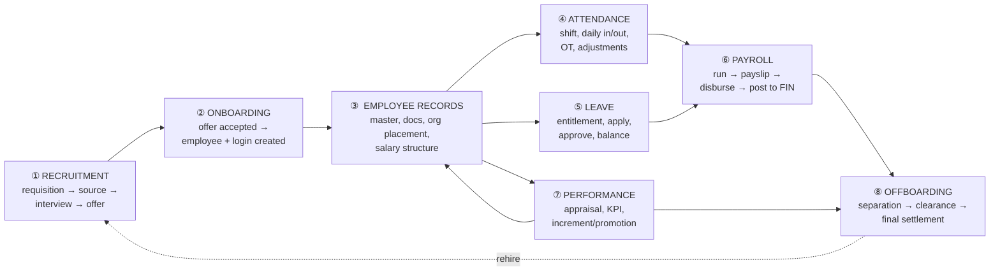
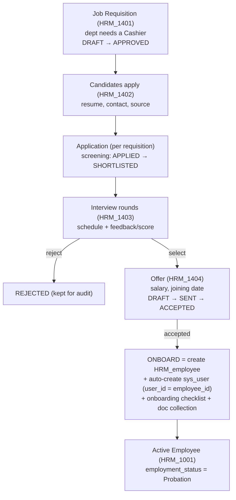
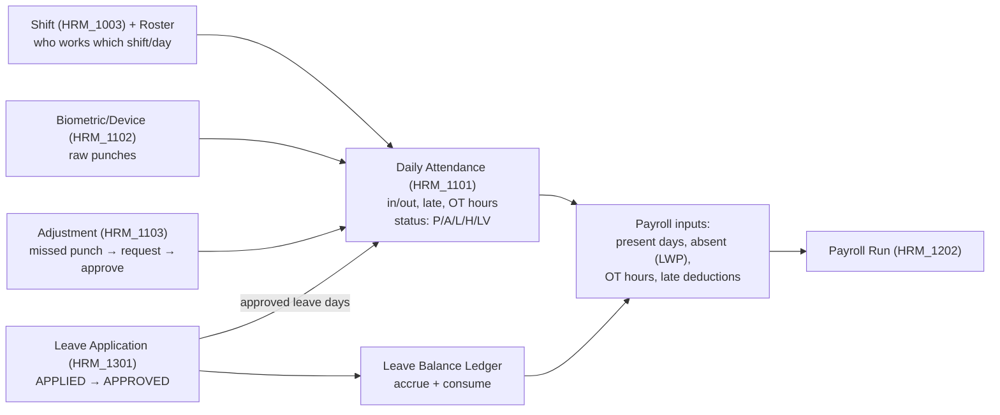
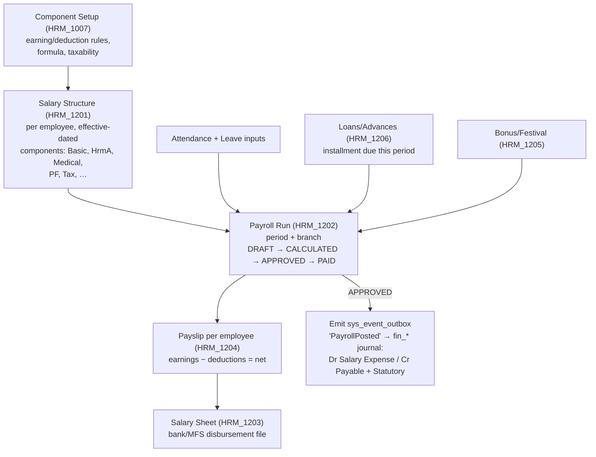
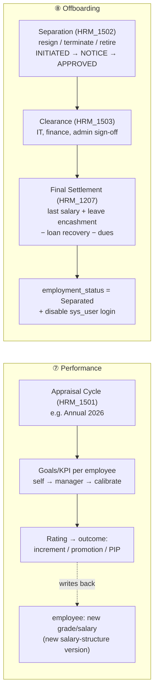
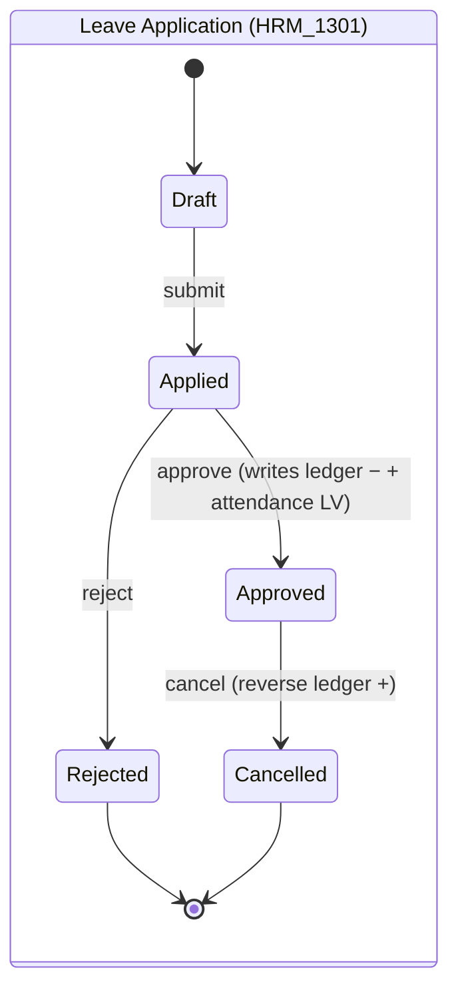
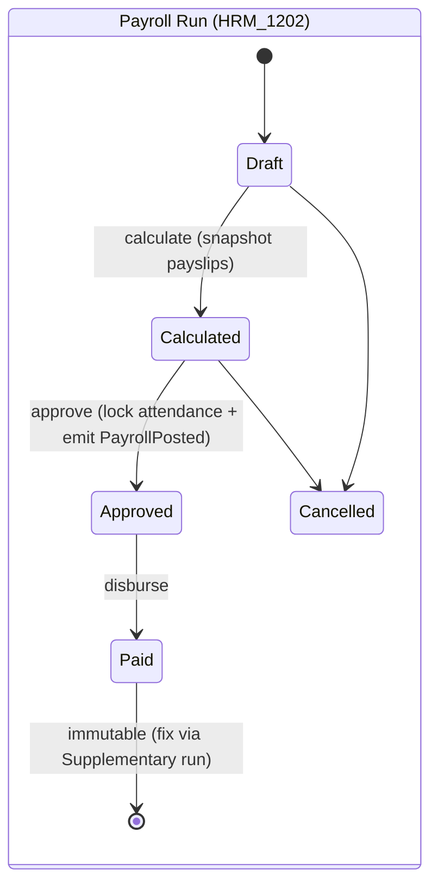
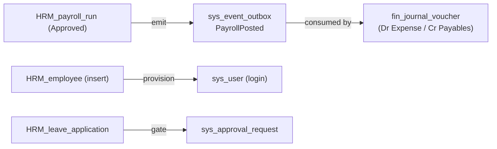
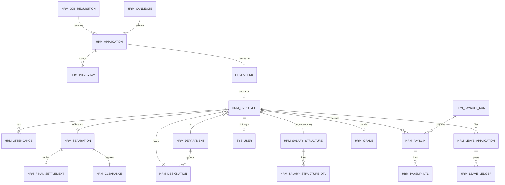
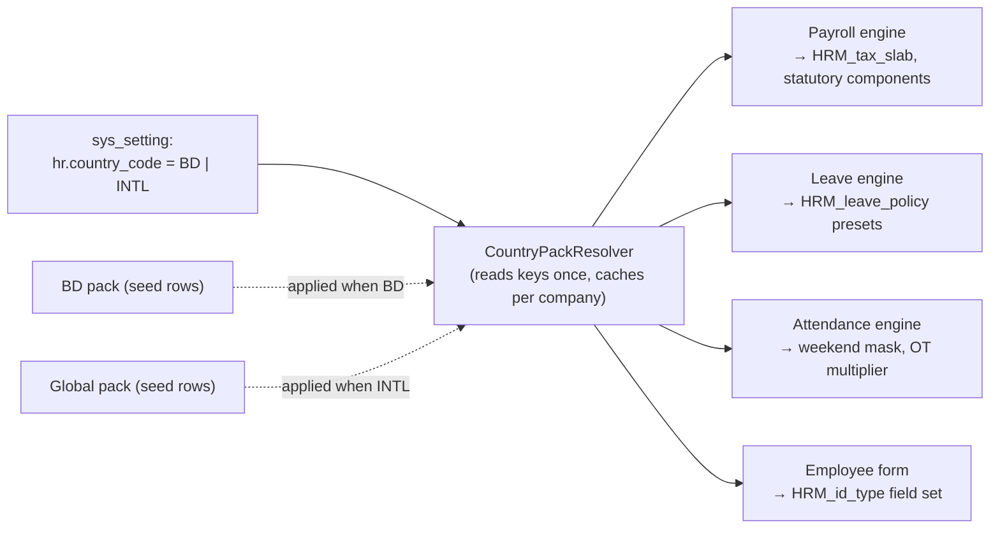

# HRM Business

<!-- Consolidated from the previous aidly-business-doc/backend, frontend, memory, and planning files. -->

HRM manages employees, organization structure, attendance, payroll, leave, recruitment, and HR policies. It depends on SYS branches/users/roles and posts financial effects through FIN where payroll or settlement requires accounting.

## HRM Database and Backend Blueprint

# HRM — Human Resources Module (Production Blueprint)

> **Module prefix:** `hr_` · **Backend package:** `com.infoaidtech.aidly.HRM` · **Frontend feature:** `apps/web-client/src/app/features/hrm`
> **Forms covered (current route):** HRM_1001 Employee Management · HRM_1002 Department & Designation Setup · HRM_1003 Shift Setup · HRM_1101 Manual Attendance · HRM_1102 Device-Sync Attendance · HRM_1103 Attendance Adjustment · HRM_1201 Salary Structure Setup · HRM_1202 Salary Processing · HRM_1203 Salary Sheet (report) · HRM_1204 Payslip Generator (report).
> **Forms added by this blueprint** to complete the standard ERP HRM lifecycle (Recruitment → Onboarding → Records → Time → Leave → Payroll → Performance → Offboarding): see **§3** (clearly flagged `NEW`).
> **Status:** the **Setup band (HRM_10xx) partially exists** (`HRM_employee`, `HRM_department`, `HRM_designation`). Everything else is greenfield. §0 lists the delta against the current schema.
> **Aligns with:** `sys-db.md` (the access/isolation skeleton HRM inherits), `inv-db.md` (ledger/engine + conventions), backend `CLAUDE.md` (Spring Boot 4 / JPA / MapStruct / form-wise API), frontend `CLAUDE.md` (Angular 21 signals, `app-common-table`, `page-form-layout`).

---

## Conventions inherited from the existing codebase (applies to every table below)

Identical to `inv-db.md` → "Conventions inherited from the existing codebase". Not re-explained per table:

| Concern | Rule |
|---|---|
| Surrogate PK | `{entity}_no BIGSERIAL PRIMARY KEY` (Java `Long`, `@GeneratedValue(IDENTITY)`) |
| Business key | `{entity}_id VARCHAR(n)` — human code, unique **per branch among live rows** via partial index `WHERE is_deleted = 0` |
| Tenant columns | `company_no BIGINT NOT NULL`; `branch_no BIGINT` (NOT NULL for branch-scoped entities; **nullable = "All Branches"** for company-wide setup) |
| Booleans | `SMALLINT NOT NULL DEFAULT 0/1` + `CHECK (col IN (0,1))` — never native `BOOLEAN` |
| Enums / states | `SMALLINT` + `CHECK (col IN (...))` + inline comment listing codes |
| Money | `NUMERIC(20,4)` amounts, `NUMERIC(18,4)` quantities/hours, `NUMERIC(5,2)` percentages |
| Audit block | `is_active, is_deleted, created_by/at, updated_by/at, deleted_by/at, row_version` (= `AuditEntity`), abbreviated `-- << AUDIT BLOCK >>` |
| Soft delete | never hard-delete; `performSoftDelete(userNo)`; override `nullifyBusinessId()` to free a unique slot |
| Optimistic lock | `row_version BIGINT NOT NULL DEFAULT 1` (`@Version`) → 409 on conflict |
| Header → detail | `*_dtl` child `ON DELETE CASCADE`; masters `ON DELETE RESTRICT`; optional refs `ON DELETE SET NULL` |
| Immutable journals | accrual/balance journals (`HRM_leave_ledger`) are **append-only** — never updated/deleted; corrections are reversing rows (same pattern as `inv_stock_ledger`) |

### MANDATORY API ISOLATION (inherited from SYS, no exceptions)
Every HRM endpoint enforces the 4 dimensions from `sys-db.md`: `company_no` + `branch_no` (from `CompanyBranchContext`, **never** the DTO) + `is_deleted = 0` + `role_no` permission (`RbacAuthorizationInterceptor`, header `X-Form-Id: HRM_xxxx`). HRM transactions are **branch-scoped** (an employee belongs to a branch); company-wide setup (leave types, salary components, holiday calendar) uses `branch_no NULL = All Branches`.

---

# 0. DELTA — what changes vs. the current schema

| Area | Current | This blueprint | Migration action |
|---|---|---|---|
| **Employee lifecycle state** | `HRM_employee` has `joining_date`, `confirmation_date`, `employment_type` but **no explicit status** | add `employment_status SMALLINT` ∈ 1=Probation·2=Confirmed·3=On-Notice·4=Suspended·5=Separated; drives every downstream gate | add column, default `1`; backfill `2` where `confirmation_date` not null |
| **User ↔ Employee** | `sys_user.employee_no` links to employee | **auto-create `sys_user` on employee insert** (`user_id = employee_id`, password NULL until set) — per `sys-db.md` §3.9 | wire HRM_1001 create → SYS user provisioning |
| **Employee documents/photos** | `photo_url`/`signature_url` VARCHAR | move binaries to `sys_file` (BYTEA); keep nullable FK `photo_file_no`/`signature_file_no`; add `HRM_employee_document` for contracts/NID scans | new child table; `sys_file` already specced in SYS |
| **Grade / pay-scale** | grade folded into `HRM_designation.grade_level` (free text) | add first-class `HRM_grade` (pay band, leave entitlement driver) | new table; designation keeps optional `grade_no` FK |
| **Reusable enums (religion, nationality…)** | hard-coded `SMALLINT` on `HRM_employee` | acceptable as-is; documented in Appendix B | none |
| **Recruitment / Leave / Performance / Offboarding** | none | full sub-modules (§4.2, §4.5, §4.7, §4.8) | new |
| **Payroll → Accounting** | none | payroll run emits `sys_event_outbox` `PayrollPosted` → `fin_*` journal (when FIN lands) | new event; same outbox pattern as INV |
| **Approvals** | none | leave / attendance-adjustment / requisition / final-settlement gate through `sys_approval_workflow` + `sys_approval_request` | reuse SYS approval engine |

---

# 1. MODULE OVERVIEW

## 1.1 What HRM owns
HRM owns **the people dimension** of the ERP: *who works here, under what terms, when they work, how much they are paid, how they perform, and how they join and leave.* It is a **source-of-truth master** (the employee) plus a set of **time- and money-producing transaction streams** (attendance, leave, payroll) that ultimately post cost into Finance. It consumes SYS for identity, isolation, numbering, files, and approvals; it feeds FIN the payroll journal. It never touches stock.

> **Golden rule:** the **employee** is the spine. Recruitment ends by *creating* one; payroll, attendance, leave and performance all *hang off* one; offboarding *closes* one. Every HRM record carries `employee_no` (or resolves to it), and an employee that is `Separated` is a hard gate on every downstream write.

> **Standard-but-switchable:** this is **one module** that serves a Bangladesh client and an international client from the **same schema and codebase** — market differences (weekend, statutory deductions, income-tax slabs, leave law, identity fields) are **configuration packs**, selected by a single `hr.country_code` switch, never a code fork. See **§8**.

## 1.2 Sub-modules (clean, modular split)
```
HRM
├── 1. Organization & Employee Master   (HRM_department, HRM_designation, HRM_grade, HRM_employee + children)
├── 2. Recruitment / ATS                (requisition → candidate → application → interview → offer)
├── 3. Onboarding                       (offer-accept → employee + sys_user + checklist)
├── 4. Time & Attendance                (shift, roster, daily attendance, device sync, OT, adjustment)
├── 5. Leave Management                  (leave types, entitlement, balance ledger, application → approval)
├── 6. Payroll                           (salary structure, component setup, run → payslip → bank/MFS, loans, bonus, settlement)
├── 7. Performance                       (appraisal cycle, KPI/goals, review)
└── 8. Offboarding / Separation          (resignation/termination → clearance → final settlement → deactivate)
```

## 1.3 Organizational position (inherits SYS hierarchy)
```
sys_company  (legal employer — files tax, owns payroll liability)
 └── sys_branch (the employee's posting; attendance & payroll are per branch)
       └── HRM_employee (spine)  ──1:1──► sys_user (auto-created login)
              ├── HRM_department / HRM_designation / HRM_grade (org placement)
              ├── attendance / leave / salary-structure / appraisal (streams)
              └── separation (terminal)
```

---

# 2. FULL HRM BUSINESS FLOW (end-to-end ERP lifecycle)

## 2.1 The lifecycle, one picture

*Goods don't flow here — **time and money** do. Attendance + leave feed payroll; performance feeds increments; offboarding closes the loop.*

## 2.2 ① Recruitment → ② Onboarding (the "create an employee" pipeline)

**Onboarding completion rule:** creating an `HRM_employee` from an accepted offer is the **single point** where a person enters the system. It atomically (a) inserts the employee, (b) provisions the `sys_user` login (SYS §3.9), (c) seeds opening leave balances for the joining year (pro-rated), and (d) opens an onboarding checklist. The candidate/offer rows are retained (audit), linked via `HRM_employee.source_offer_no`.

## 2.3 ④/⑤ Time: attendance + leave both feed payroll

Attendance is the **bridge**: an approved leave writes `LV` days onto attendance; unauthorised absence becomes `LWP` (leave-without-pay) which payroll deducts. Approved attendance for a period is **frozen** the moment its payroll run is finalized.

## 2.4 ⑥ Payroll: structure → run → payslip → post

Implementation plan: see `aidly-business-doc/hrm-payroll-standard-plan.md`.

A payroll run is **idempotent on (company, branch, period, run_type)** and **immutable once PAID** — corrections are a separate *supplementary* or *reversal* run, never an edit (mirrors the INV ledger philosophy).

## 2.5 ⑦ Performance and ⑧ Offboarding


---

# 3. FORM INTEGRATION MAP

> Banding follows the SYS convention: **10xx = setup/masters**, **11xx = attendance ops**, **12xx = payroll**, **13xx = leave**, **14xx = recruitment**, **15xx = performance & offboarding**. `route` is under `/hrm/...`. **Status** = ⬛ exists in route · 🟨 stubbed/commented in route · 🟩 NEW (proposed to complete the lifecycle).

| Form ID | Form name | Route (`/hrm/…`) | Sub-module | Status | Primary tables |
|---|---|---|---|---|---|
| **HRM_1001** | Employee Management | `form/employee-management` | Org/Master | ⬛ | `HRM_employee` (+ children) |
| **HRM_1002** | Department & Designation Setup | `form/department-designation-setup` | Org/Master | ⬛ | `HRM_department`, `HRM_designation` |
| **HRM_1003** | Shift Setup | `form/shift-setup` | Attendance setup | 🟨 | `HRM_shift` |
| **HRM_1004** | Grade / Pay-Scale Setup | `form/grade-setup` | Org/Master | 🟩 | `HRM_grade` |
| **HRM_1005** | Leave Type Setup | `form/leave-type-setup` | Leave setup | 🟩 | `HRM_leave_type`, `HRM_leave_policy` |
| **HRM_1006** | Holiday Calendar | `form/holiday-calendar` | Attendance setup | 🟩 | `HRM_holiday_calendar`, `HRM_holiday` |
| **HRM_1007** | Salary Component Setup | `form/salary-component-setup` | Payroll setup | 🟩 | `HRM_salary_component` |
| **HRM_1008** | HRM Policy / Settings | `form/hr-settings` | Setup | 🟩 | `sys_setting` (hr.* keys) |
| **HRM_1101** | Manual Attendance | `form/manual-attendance` | Attendance | 🟨 | `HRM_attendance` |
| **HRM_1102** | Device-Sync Attendance | `form/device-sync-attendance` | Attendance | 🟨 | `HRM_attendance_device`, `HRM_attendance_punch`, `HRM_attendance` |
| **HRM_1103** | Attendance Adjustment | `form/attendance-adjustment` | Attendance | 🟨 | `HRM_attendance_adjustment` |
| **HRM_1104** | Shift Roster / Assignment | `form/shift-roster` | Attendance | 🟩 | `HRM_shift_roster` |
| **HRM_1105** | Overtime Entry | `form/overtime-entry` | Attendance | 🟩 | `HRM_overtime` |
| **HRM_1201** | Salary Structure Setup | `form/salary-structure-setup` | Payroll | 🟨 | `HRM_salary_structure`, `HRM_salary_structure_dtl` |
| **HRM_1202** | Salary Processing (Run) | `form/salary-processing` | Payroll | 🟨 | `HRM_payroll_run`, `HRM_payslip`, `HRM_payslip_dtl` |
| **HRM_1203** | Salary Sheet (report) | `report/salary-sheet` | Payroll | 🟨 | `HRM_payslip` (read) |
| **HRM_1204** | Payslip Generator (report) | `report/payslip-generator` | Payroll | 🟨 | `HRM_payslip`, `HRM_payslip_dtl` (read) |
| **HRM_1205** | Bonus / Festival Allowance | `form/bonus-processing` | Payroll | 🟩 | `HRM_bonus`, `HRM_bonus_dtl` |
| **HRM_1206** | Loan / Advance | `form/loan-advance` | Payroll | 🟩 | `HRM_loan`, `HRM_loan_installment` |
| **HRM_1207** | Final Settlement | `form/final-settlement` | Payroll/Offboard | 🟩 | `HRM_final_settlement` |
| **HRM_1301** | Leave Application | `form/leave-application` | Leave | 🟩 | `HRM_leave_application`, `HRM_leave_ledger` |
| **HRM_1302** | Leave Approval (inbox) | `form/leave-approval` | Leave | 🟩 | `HRM_leave_application` (+ `sys_approval_request`) |
| **HRM_1303** | Leave Balance / Ledger | `report/leave-balance` | Leave | 🟩 | `HRM_leave_balance`, `HRM_leave_ledger` (read) |
| **HRM_1401** | Job Requisition | `form/job-requisition` | Recruitment | 🟩 | `HRM_job_requisition` |
| **HRM_1402** | Candidate / Applicant | `form/candidate` | Recruitment | 🟩 | `HRM_candidate`, `HRM_application` |
| **HRM_1403** | Interview Schedule & Feedback | `form/interview` | Recruitment | 🟩 | `HRM_interview`, `HRM_interview_feedback` |
| **HRM_1404** | Offer & Onboarding | `form/offer-onboarding` | Recruit/Onboard | 🟩 | `HRM_offer`, `HRM_onboarding_task` |
| **HRM_1501** | Appraisal / Performance | `form/appraisal` | Performance | 🟩 | `HRM_appraisal_cycle`, `HRM_appraisal`, `HRM_appraisal_kpi` |
| **HRM_1502** | Separation / Offboarding | `form/separation` | Offboarding | 🟩 | `HRM_separation` |
| **HRM_1503** | Exit Clearance | `form/exit-clearance` | Offboarding | 🟩 | `HRM_clearance`, `HRM_clearance_item` |

---

# 4. DATABASE SCHEMA

## 4.1 Organization & Employee Master

### `HRM_department` (EXISTS — HRM_1002)
Org unit, self-referencing hierarchy, optional accounting cost-center.
```sql
CREATE TABLE HRM_department (
    department_no       BIGSERIAL PRIMARY KEY,
    department_id       VARCHAR(20)  NOT NULL,          -- code, partial-unique per branch WHERE is_deleted=0
    department_name     VARCHAR(150) NOT NULL,
    parent_department_no BIGINT,                         -- self-ref → hierarchy  ON DELETE SET NULL
    cost_center_no      BIGINT,                          -- → sys_cost_center  (accounting dim)
    company_no          BIGINT NOT NULL,
    branch_no           BIGINT,                          -- NULL = All Branches
    remarks             TEXT,
    -- << AUDIT BLOCK >>
    CONSTRAINT fk_dept_parent FOREIGN KEY (parent_department_no) REFERENCES HRM_department(department_no) ON DELETE SET NULL
);
CREATE UNIQUE INDEX uq_dept_id_live ON HRM_department(branch_no, department_id) WHERE is_deleted = 0;
```

### `HRM_designation` (EXISTS — HRM_1002)
Job title within a department; salary band hints; OT eligibility.
> **Delta:** add `grade_no BIGINT` FK → `HRM_grade` (keep `grade_level` text for back-compat). `job_category` SMALLINT enum (1=Mgmt·2=Officer·3=Staff·4=Worker).

### `HRM_grade` (NEW — HRM_1004)
First-class pay band; the **driver** for leave entitlement and salary ranges.
```sql
CREATE TABLE HRM_grade (
    grade_no         BIGSERIAL PRIMARY KEY,
    grade_id         VARCHAR(20)  NOT NULL,              -- e.g. 'G-5'
    grade_name       VARCHAR(100) NOT NULL,
    rank_order       INTEGER,                            -- 1 = highest; for promotion logic
    min_salary       NUMERIC(20,4),
    max_salary       NUMERIC(20,4),
    is_overtime_eligible SMALLINT NOT NULL DEFAULT 0,
    company_no       BIGINT NOT NULL,
    branch_no        BIGINT,                             -- NULL = All Branches
    -- << AUDIT BLOCK >>
    CONSTRAINT chk_grade_ot CHECK (is_overtime_eligible IN (0,1))
);
CREATE UNIQUE INDEX uq_grade_id_live ON HRM_grade(branch_no, grade_id) WHERE is_deleted = 0;
```

### `HRM_employee` (EXISTS — HRM_1001) — the spine
Already rich (identity, contact, address, bank/MFS, contract). **Deltas only:**
```sql
ALTER TABLE HRM_employee
  ADD COLUMN employment_status SMALLINT NOT NULL DEFAULT 1,  -- 1=Probation 2=Confirmed 3=OnNotice 4=Suspended 5=Separated
  ADD COLUMN grade_no          BIGINT,                       -- → HRM_grade
  ADD COLUMN reporting_to      BIGINT,                       -- (exists) → HRM_employee self-ref (line manager)
  ADD COLUMN photo_file_no     BIGINT,                       -- → sys_file (BYTEA); replaces photo_url
  ADD COLUMN signature_file_no BIGINT,                       -- → sys_file
  ADD COLUMN user_no           BIGINT,                       -- 1:1 → sys_user (auto-created on insert)
  ADD COLUMN source_offer_no   BIGINT,                       -- → HRM_offer (recruitment provenance, nullable)
  ADD COLUMN separation_no     BIGINT,                       -- → HRM_separation (set when offboarded)
  ADD CONSTRAINT chk_emp_status CHECK (employment_status IN (1,2,3,4,5));
```
> **State logic:** `employment_status` is the master gate. Attendance/leave/payroll writes are **rejected** when status = `Separated (5)` (effective the separation `last_working_day`) or while `Suspended (4)` (configurable). `Probation → Confirmed` is set by HRM_1001 (or auto on `confirmation_date`); `→ OnNotice` by HRM_1502; `→ Separated` by HRM_1207 final settlement.

### Employee child tables (HRM_1001 tabs)
| Table | Purpose | Key columns |
|---|---|---|
| `HRM_employee_document` | NID/passport/contract scans, certificates | `employee_no`, `doc_type SMALLINT`, `file_no → sys_file`, `doc_number`, `expiry_date`, `is_verified` |
| `HRM_employee_education` | qualifications | `employee_no`, `degree`, `institution`, `passing_year`, `result` |
| `HRM_employee_experience` | prior employment | `employee_no`, `company_name`, `designation`, `from_date`, `to_date` |
| `HRM_employee_dependent` | nominees / family (for benefits, gratuity) | `employee_no`, `name`, `relation SMALLINT`, `date_of_birth`, `is_nominee`, `nominee_percent` |

All are `*_dtl`-style children: `ON DELETE CASCADE` from `HRM_employee`, carry `company_no`/`branch_no`, audit block.

---

## 4.2 Recruitment / ATS

### `HRM_job_requisition` (NEW — HRM_1401)
A department's request to hire. **State machine** (see §5).
```sql
CREATE TABLE HRM_job_requisition (
    requisition_no   BIGSERIAL PRIMARY KEY,
    requisition_id   VARCHAR(30) NOT NULL,              -- from sys_doc_sequence 'HRM_REQ'
    department_no    BIGINT NOT NULL,
    designation_no   BIGINT NOT NULL,
    grade_no         BIGINT,
    no_of_vacancies  INTEGER NOT NULL DEFAULT 1,
    employment_type  SMALLINT,                           -- 1=Permanent 2=Contract 3=PartTime 4=Intern
    budget_min       NUMERIC(20,4),
    budget_max       NUMERIC(20,4),
    job_description  TEXT,
    required_by_date DATE,
    status           SMALLINT NOT NULL DEFAULT 1,        -- 1=Draft 2=Submitted 3=Approved 4=OnHold 5=Closed 6=Cancelled
    approved_by      BIGINT,
    approved_at      TIMESTAMPTZ,
    company_no       BIGINT NOT NULL,
    branch_no        BIGINT NOT NULL,
    -- << AUDIT BLOCK >>
    CONSTRAINT chk_req_status CHECK (status IN (1,2,3,4,5,6))
);
CREATE UNIQUE INDEX uq_req_id_live ON HRM_job_requisition(branch_no, requisition_id) WHERE is_deleted = 0;
```

### `HRM_candidate` (NEW — HRM_1402) and `HRM_application`
`HRM_candidate` is the person (resume, contact, source). `HRM_application` is the **junction** candidate ↔ requisition with its own pipeline status — one candidate may apply to several openings.
```sql
CREATE TABLE HRM_candidate (
    candidate_no   BIGSERIAL PRIMARY KEY,
    candidate_id   VARCHAR(30) NOT NULL,
    full_name      VARCHAR(150) NOT NULL,
    email          VARCHAR(150),
    mobile_number  VARCHAR(20) NOT NULL,
    source         SMALLINT,                              -- 1=Referral 2=JobBoard 3=Walk-in 4=Agency 5=Internal
    resume_file_no BIGINT,                                -- → sys_file
    company_no     BIGINT NOT NULL,
    branch_no      BIGINT,
    -- << AUDIT BLOCK >>
);

CREATE TABLE HRM_application (
    application_no  BIGSERIAL PRIMARY KEY,
    candidate_no    BIGINT NOT NULL REFERENCES HRM_candidate(candidate_no) ON DELETE RESTRICT,
    requisition_no  BIGINT NOT NULL REFERENCES HRM_job_requisition(requisition_no) ON DELETE RESTRICT,
    status          SMALLINT NOT NULL DEFAULT 1,          -- 1=Applied 2=Shortlisted 3=Interviewing 4=Selected 5=Offered 6=Hired 7=Rejected 8=Withdrawn
    current_round   INTEGER NOT NULL DEFAULT 0,
    company_no      BIGINT NOT NULL,
    branch_no       BIGINT NOT NULL,
    -- << AUDIT BLOCK >>
    CONSTRAINT chk_app_status CHECK (status IN (1,2,3,4,5,6,7,8)),
    CONSTRAINT uq_app_unique UNIQUE (candidate_no, requisition_no)
);
```

### `HRM_interview` + `HRM_interview_feedback` (NEW — HRM_1403)
Round scheduling and per-panelist scoring.
```sql
CREATE TABLE HRM_interview (
    interview_no   BIGSERIAL PRIMARY KEY,
    application_no BIGINT NOT NULL REFERENCES HRM_application(application_no) ON DELETE CASCADE,
    round_no       INTEGER NOT NULL,
    interview_type SMALLINT,                              -- 1=Phone 2=Technical 3=HRM 4=Final
    scheduled_at   TIMESTAMPTZ,
    status         SMALLINT NOT NULL DEFAULT 1,           -- 1=Scheduled 2=Completed 3=NoShow 4=Cancelled
    overall_result SMALLINT,                              -- 1=Pass 2=Fail 3=Hold
    company_no     BIGINT NOT NULL, branch_no BIGINT NOT NULL,
    -- << AUDIT BLOCK >>
    CONSTRAINT chk_intv_status CHECK (status IN (1,2,3,4))
);
-- HRM_interview_feedback: interview_no, panelist_user_no, score NUMERIC(5,2), recommendation SMALLINT, comments TEXT
```

### `HRM_offer` (NEW — HRM_1404) — the bridge to onboarding
```sql
CREATE TABLE HRM_offer (
    offer_no        BIGSERIAL PRIMARY KEY,
    offer_id        VARCHAR(30) NOT NULL,
    application_no  BIGINT NOT NULL REFERENCES HRM_application(application_no) ON DELETE RESTRICT,
    designation_no  BIGINT NOT NULL,
    grade_no        BIGINT,
    offered_salary  NUMERIC(20,4) NOT NULL,
    joining_date    DATE NOT NULL,
    offer_file_no   BIGINT,                               -- → sys_file (signed letter)
    status          SMALLINT NOT NULL DEFAULT 1,          -- 1=Draft 2=Sent 3=Accepted 4=Declined 5=Expired 6=Revoked
    onboarded_employee_no BIGINT,                          -- set when employee is created
    company_no      BIGINT NOT NULL, branch_no BIGINT NOT NULL,
    -- << AUDIT BLOCK >>
    CONSTRAINT chk_offer_status CHECK (status IN (1,2,3,4,5,6))
);
```
> **Onboarding transaction (HRM_1404 → HRM_1001):** on `status = Accepted`, a single service call creates `HRM_employee` (status=Probation, `source_offer_no` set), provisions `sys_user`, seeds pro-rated leave balances, opens `HRM_onboarding_task` rows from a checklist template, and flips `HRM_application.status = Hired`. Idempotent on `offer_no` (re-running is a no-op).

`HRM_onboarding_task`: `employee_no`, `task_name`, `assigned_to`, `due_date`, `status` (Pending/Done), `file_no?`.

---

## 4.3 Time & Attendance

### `HRM_shift` (HRM_1003) and `HRM_shift_roster` (HRM_1104)
```sql
CREATE TABLE HRM_shift (
    shift_no       BIGSERIAL PRIMARY KEY,
    shift_id       VARCHAR(20) NOT NULL,
    shift_name     VARCHAR(100) NOT NULL,
    start_time     TIME NOT NULL,
    end_time       TIME NOT NULL,
    grace_minutes  INTEGER NOT NULL DEFAULT 0,            -- late tolerance
    half_day_minutes INTEGER,                             -- threshold → half day
    break_minutes  INTEGER NOT NULL DEFAULT 0,
    weekly_off_mask SMALLINT NOT NULL DEFAULT 0,          -- bitmask Sun..Sat (e.g. Fri+Sat off)
    is_night_shift SMALLINT NOT NULL DEFAULT 0,           -- spans midnight
    company_no     BIGINT NOT NULL, branch_no BIGINT,
    -- << AUDIT BLOCK >>
    CONSTRAINT chk_shift_night CHECK (is_night_shift IN (0,1))
);
-- HRM_shift_roster: employee_no, shift_no, effective_from, effective_to (assign shift over a date range)
```

### `HRM_attendance` (HRM_1101 manual / HRM_1102 device) — daily fact
**One row per (employee, date)** — the unit payroll reads.
```sql
CREATE TABLE HRM_attendance (
    attendance_no  BIGSERIAL PRIMARY KEY,
    employee_no    BIGINT NOT NULL REFERENCES HRM_employee(employee_no) ON DELETE RESTRICT,
    att_date       DATE NOT NULL,
    shift_no       BIGINT,
    in_time        TIMESTAMPTZ,
    out_time       TIMESTAMPTZ,
    status         SMALLINT NOT NULL,                     -- 1=Present 2=Absent 3=Late 4=HalfDay 5=Holiday 6=WeeklyOff 7=OnLeave 8=LWP
    late_minutes   INTEGER NOT NULL DEFAULT 0,
    early_out_minutes INTEGER NOT NULL DEFAULT 0,
    worked_hours   NUMERIC(18,4) NOT NULL DEFAULT 0,
    ot_hours       NUMERIC(18,4) NOT NULL DEFAULT 0,
    source         SMALLINT NOT NULL DEFAULT 1,           -- 1=Manual 2=Device 3=Adjustment 4=LeaveSync 5=Auto
    leave_application_no BIGINT,                           -- set when status=OnLeave
    is_locked      SMALLINT NOT NULL DEFAULT 0,           -- frozen once its payroll run is finalized
    company_no     BIGINT NOT NULL, branch_no BIGINT NOT NULL,
    -- << AUDIT BLOCK >>
    CONSTRAINT chk_att_status CHECK (status IN (1,2,3,4,5,6,7,8)),
    CONSTRAINT uq_att_emp_date UNIQUE (employee_no, att_date)
);
CREATE INDEX idx_att_branch_date ON HRM_attendance(branch_no, att_date, is_deleted);
CREATE INDEX idx_att_emp_date    ON HRM_attendance(employee_no, att_date, is_deleted);
```
> **State logic:** `is_locked = 1` after a `PAID`/`APPROVED` payroll run covers `att_date` — further edits require an **attendance adjustment** (HRM_1103) that re-opens via approval, never a direct update. The `uq (employee_no, att_date)` makes device-sync and manual entry **upsert** safely.

### Device sync (HRM_1102): `HRM_attendance_device` + `HRM_attendance_punch`
- `HRM_attendance_device`: registry (`device_id`, `location`, `branch_no`, `last_sync_at`).
- `HRM_attendance_punch`: raw immutable punches (`device_no`, `employee_no`, `punch_time`, `direction`, `is_processed`). A **roll-up job** collapses punches → one `HRM_attendance` row (first-in/last-out, OT vs shift). Raw punches are append-only (audit/dispute), like a mini-ledger.

### `HRM_attendance_adjustment` (HRM_1103) and `HRM_overtime` (HRM_1105)
Adjustment is a **request** (missed punch, wrong status) with its own approval state; on approval it patches the (possibly locked) `HRM_attendance` row and writes `source = Adjustment`.
```sql
-- HRM_attendance_adjustment: employee_no, att_date, requested_in, requested_out, requested_status,
--   reason, status SMALLINT (1=Pending 2=Approved 3=Rejected), approval_request_no → sys_approval_request
-- HRM_overtime: employee_no, ot_date, ot_hours, ot_rate_multiplier NUMERIC(5,2), status, approval_request_no
```

---

## 4.4 Leave Management

### `HRM_leave_type` (HRM_1005) + `HRM_leave_policy_setup` + `HRM_leave_application_rule`
Type = the category (Casual, Sick, Earned/Annual, Maternity…). Policy Setup = the **entitlement rule** per type per employee group (days/year, accrual, carry-forward, encashable). Application Rule = the operational constraints and SLAs.
```sql
CREATE TABLE HRM_leave_type (
    leave_type_no  BIGSERIAL PRIMARY KEY,
    leave_type_id  VARCHAR(20) NOT NULL,
    leave_type_name VARCHAR(100) NOT NULL,
    is_paid        SMALLINT NOT NULL DEFAULT 1,
    is_statutory   SMALLINT NOT NULL DEFAULT 0,
    is_active      SMALLINT NOT NULL DEFAULT 1,
    remarks        TEXT,
    company_no     BIGINT NOT NULL, branch_no BIGINT,
    -- << AUDIT BLOCK >>
);
CREATE TABLE HRM_leave_policy_setup (
    policy_no      BIGSERIAL PRIMARY KEY,
    policy_name    VARCHAR(100) NOT NULL,
    leave_type_no  BIGINT NOT NULL,
    employee_group_no BIGINT,
    accrual_method SMALLINT,
    default_days   NUMERIC(18,4),
    work_days_per_leave_day INTEGER,
    proration_method SMALLINT,
    eligibility_service_months INTEGER,
    is_carry_forward_allowed SMALLINT,
    max_carry_forward_days NUMERIC(18,4),
    carry_forward_validity_months INTEGER,
    is_encashable  SMALLINT,
    max_encashable_days NUMERIC(18,4),
    encashment_formula VARCHAR(100),
    is_lapsable    SMALLINT,
    max_dept_leave_percentage NUMERIC(18,4),
    specialized_config TEXT,
    company_no     BIGINT NOT NULL, branch_no BIGINT,
    -- << AUDIT BLOCK >>
);
CREATE TABLE HRM_leave_application_rule (
    rule_no        BIGSERIAL PRIMARY KEY,
    policy_no      BIGINT NOT NULL,
    min_duration_per_app NUMERIC(18,4),
    max_duration_per_app NUMERIC(18,4),
    notice_period_days INTEGER,
    max_retroactive_days INTEGER,
    exclude_weekends SMALLINT,
    exclude_holidays SMALLINT,
    allow_negative_balance SMALLINT,
    max_overdraft_days NUMERIC(18,4),
    is_shift_critical SMALLINT,
    is_approval_required SMALLINT,
    is_reliever_mandatory SMALLINT,
    attachment_required_after_days NUMERIC(18,4),
    sla_timeout_hours INTEGER,
    escalation_role_no BIGINT,
    company_no     BIGINT NOT NULL, branch_no BIGINT,
    -- << AUDIT BLOCK >>
);
```

### `HRM_leave_balance` + `HRM_leave_ledger` (HRM_1303) — balance + journal
Mirrors INV's **balance + immutable ledger** split: `HRM_leave_balance` is the live "available days" per (employee, type, year); `HRM_leave_ledger` is the **append-only** journal of every accrual (+) and consumption (−).
```sql
CREATE TABLE HRM_leave_balance (
    leave_balance_no BIGSERIAL PRIMARY KEY,
    employee_no    BIGINT NOT NULL,
    leave_type_no  BIGINT NOT NULL,
    leave_year     INTEGER NOT NULL,                      -- e.g. 2026
    opening_balance NUMERIC(18,4),
    entitled_days  NUMERIC(18,4) NOT NULL DEFAULT 0,
    accrued_days   NUMERIC(18,4) NOT NULL DEFAULT 0,
    consumed_days  NUMERIC(18,4) NOT NULL DEFAULT 0,
    pending_days   NUMERIC(18,4) NOT NULL DEFAULT 0,
    encashed_days  NUMERIC(18,4) NOT NULL DEFAULT 0,
    lapsed_days    NUMERIC(18,4) NOT NULL DEFAULT 0,
    carried_forward NUMERIC(18,4) NOT NULL DEFAULT 0,
    available_days NUMERIC(18,4) GENERATED ALWAYS AS (opening_balance + accrued_days + carried_forward - consumed_days - pending_days - encashed_days - lapsed_days) STORED,
    company_no     BIGINT NOT NULL, branch_no BIGINT NOT NULL,
    -- << AUDIT BLOCK >>
    CONSTRAINT uq_leave_bal UNIQUE (employee_no, policy_no, leave_year)
);
-- HRM_leave_ledger (append-only): employee_no, leave_type_no, leave_year, movement_type SMALLINT
--   (1=OpeningAccrual 2=MonthlyAccrual 3=Consume 4=Reverse 5=Encash 6=CarryForward 7=Lapse),
--   days NUMERIC(18,4) (+/-), ref_doc_type, ref_doc_no (→ leave_application), balance_after, movement_date
```

### `HRM_leave_application` (HRM_1301) + approval (HRM_1302)
```sql
CREATE TABLE HRM_leave_application (
    leave_application_no BIGSERIAL PRIMARY KEY,
    leave_application_id VARCHAR(30) NOT NULL,            -- sys_doc_sequence 'HRM_LV'
    employee_no    BIGINT NOT NULL REFERENCES HRM_employee(employee_no) ON DELETE RESTRICT,
    leave_type_no  BIGINT NOT NULL,
    from_date      DATE NOT NULL,
    to_date        DATE NOT NULL,
    total_days     NUMERIC(18,4) NOT NULL,                -- excludes weekly-off/holiday
    is_half_day    SMALLINT NOT NULL DEFAULT 0,
    reason         TEXT,
    status         SMALLINT NOT NULL DEFAULT 1,           -- 1=Draft 2=Applied 3=Approved 4=Rejected 5=Cancelled
    approval_request_no BIGINT,                            -- → sys_approval_request
    company_no     BIGINT NOT NULL, branch_no BIGINT NOT NULL,
    -- << AUDIT BLOCK >>
    CONSTRAINT chk_lv_status CHECK (status IN (1,2,3,4,5)),
    CONSTRAINT chk_lv_dates  CHECK (to_date >= from_date)
);
```
> **State logic (balance integrity):** on `Applied → Approved`, the service (a) writes a `Consume (−total_days)` row to `HRM_leave_ledger`, (b) decrements `HRM_leave_balance.consumed_days`, (c) writes `status = OnLeave` rows onto `HRM_attendance` for each working day in range. On `Approved → Cancelled`, it writes a compensating `Reverse (+)` ledger row and removes the attendance leave-days. **Available balance is validated before approval** (no negative leave unless policy allows). Approval routing uses `sys_approval_workflow` keyed on `HRM_1301`.

---

## 4.5 Payroll

### `HRM_salary_component` (HRM_1007)
Reusable definition of every earning/deduction line.
```sql
CREATE TABLE HRM_salary_component (
    component_no   BIGSERIAL PRIMARY KEY,
    component_id   VARCHAR(20) NOT NULL,
    component_name VARCHAR(100) NOT NULL,
    component_type SMALLINT NOT NULL,                     -- 1=Earning 2=Deduction 3=EmployerContribution 4=StatutoryDeduction
    calc_type      SMALLINT NOT NULL DEFAULT 1,           -- 1=Fixed 2=PercentOfBasic 3=PercentOfGross 4=Formula
    calc_value     NUMERIC(20,4),                          -- amount or percent
    is_taxable     SMALLINT NOT NULL DEFAULT 1,
    affects_net    SMALLINT NOT NULL DEFAULT 1,            -- employer-contrib (0) shows but doesn't change net
    is_statutory   SMALLINT NOT NULL DEFAULT 0,            -- 1 = seeded by a country pack (PF, AIT, gratuity…)
    country_code   VARCHAR(2),                             -- NULL = universal; 'BD','US',… = pack-specific (see §8)
    gl_account_code VARCHAR(30),                           -- for the FIN journal mapping
    display_order  INTEGER,
    company_no     BIGINT NOT NULL, branch_no BIGINT,
    -- << AUDIT BLOCK >>
    CONSTRAINT chk_comp_type CHECK (component_type IN (1,2,3,4)),
    CONSTRAINT chk_comp_calc CHECK (calc_type IN (1,2,3,4))
);
```

### `HRM_salary_structure` + `_dtl` (HRM_1201) — effective-dated per employee
```sql
CREATE TABLE HRM_salary_structure (
    salary_structure_no BIGSERIAL PRIMARY KEY,
    employee_no    BIGINT NOT NULL REFERENCES HRM_employee(employee_no) ON DELETE RESTRICT,
    effective_from DATE NOT NULL,
    effective_to   DATE,                                  -- NULL = current; closed when a new version supersedes
    gross_salary   NUMERIC(20,4) NOT NULL,
    status         SMALLINT NOT NULL DEFAULT 1,           -- 1=Active 2=Superseded 3=Draft
    company_no     BIGINT NOT NULL, branch_no BIGINT NOT NULL,
    -- << AUDIT BLOCK >>
    CONSTRAINT chk_ss_status CHECK (status IN (1,2,3))
);
CREATE TABLE HRM_salary_structure_dtl (
    structure_dtl_no BIGSERIAL PRIMARY KEY,
    salary_structure_no BIGINT NOT NULL REFERENCES HRM_salary_structure(salary_structure_no) ON DELETE CASCADE,
    component_no   BIGINT NOT NULL REFERENCES HRM_salary_component(component_no) ON DELETE RESTRICT,
    amount         NUMERIC(20,4) NOT NULL,
    company_no     BIGINT NOT NULL, branch_no BIGINT NOT NULL
    -- (detail rows inherit header audit; carry tenant cols for the isolation filter)
);
```
> **State logic:** only **one** `status = Active` structure per employee at a time. A pay revision (increment/promotion from HRM_1501) closes the current row (`effective_to`, `status = Superseded`) and inserts a new Active version — full history is preserved, never overwritten.

### `HRM_payroll_run` + `HRM_payslip` + `HRM_payslip_dtl` (HRM_1202 → HRM_1203/1204)
```sql
CREATE TABLE HRM_payroll_run (
    payroll_run_no BIGSERIAL PRIMARY KEY,
    payroll_run_id VARCHAR(30) NOT NULL,                  -- sys_doc_sequence 'HRM_PAY'
    pay_period     VARCHAR(7) NOT NULL,                   -- 'YYYY-MM'
    run_type       SMALLINT NOT NULL DEFAULT 1,           -- 1=Regular 2=Supplementary 3=Bonus 4=FinalSettlement
    period_start   DATE NOT NULL, period_end DATE NOT NULL,
    status         SMALLINT NOT NULL DEFAULT 1,           -- 1=Draft 2=Calculated 3=Approved 4=Paid 5=Cancelled
    total_gross    NUMERIC(20,4) NOT NULL DEFAULT 0,
    total_deduction NUMERIC(20,4) NOT NULL DEFAULT 0,
    total_net      NUMERIC(20,4) NOT NULL DEFAULT 0,
    employee_count INTEGER NOT NULL DEFAULT 0,
    approved_by    BIGINT, approved_at TIMESTAMPTZ,
    posted_event_id BIGINT,                                -- → sys_event_outbox (PayrollPosted)
    company_no     BIGINT NOT NULL, branch_no BIGINT NOT NULL,
    -- << AUDIT BLOCK >>
    CONSTRAINT chk_run_status CHECK (status IN (1,2,3,4,5)),
    CONSTRAINT uq_run UNIQUE (company_no, branch_no, pay_period, run_type)  -- idempotency
);
CREATE TABLE HRM_payslip (
    payslip_no     BIGSERIAL PRIMARY KEY,
    payroll_run_no BIGINT NOT NULL REFERENCES HRM_payroll_run(payroll_run_no) ON DELETE CASCADE,
    employee_no    BIGINT NOT NULL,
    present_days   NUMERIC(18,4), absent_days NUMERIC(18,4), leave_days NUMERIC(18,4), lwp_days NUMERIC(18,4),
    ot_hours       NUMERIC(18,4),
    gross_earning  NUMERIC(20,4) NOT NULL DEFAULT 0,
    total_deduction NUMERIC(20,4) NOT NULL DEFAULT 0,
    net_pay        NUMERIC(20,4) NOT NULL DEFAULT 0,
    pay_method     SMALLINT,                               -- 1=Bank 2=MFS 3=Cash 4=Cheque
    payment_status SMALLINT NOT NULL DEFAULT 1,            -- 1=Pending 2=Paid 3=Held 4=Failed
    company_no     BIGINT NOT NULL, branch_no BIGINT NOT NULL,
    -- << AUDIT BLOCK >>
    CONSTRAINT uq_payslip UNIQUE (payroll_run_no, employee_no)
);
-- HRM_payslip_dtl: payslip_no, component_no, component_type, amount NUMERIC(20,4)  (the frozen earning/deduction lines)
```
> **State machine (the heart of payroll):** `Draft → Calculated` reads each employee's Active salary structure + attendance/leave inputs + due loan installments + bonus and **materializes** payslips (snapshot — never recomputed later). `Calculated → Approved` locks the underlying `HRM_attendance` rows (`is_locked = 1`) and emits the `PayrollPosted` event to `sys_event_outbox`. `Approved → Paid` generates the bank/MFS disbursement (HRM_1203) and flips payslip `payment_status`. **Immutable once Paid** — fixes are a `Supplementary`/reversal run. Idempotent on `uq_run`.

### `HRM_loan` + `HRM_loan_installment` (HRM_1206), `HRM_bonus` (HRM_1205), `HRM_final_settlement` (HRM_1207)
- **Loan:** `principal`, `installment_amount`, `total_installments`, `status` (Active/Closed); `HRM_loan_installment` schedules per-period dues that the payroll run consumes as a deduction.
- **Bonus:** header + `_dtl` per employee; can be processed as a `run_type = Bonus` payroll run or standalone.
- **Final settlement:** computed at offboarding — last-period salary + **leave encashment** (from `HRM_leave_balance.available_days` × daily rate) + gratuity − outstanding loan − advances − dues; `status` (Draft → Approved → Paid); on Paid sets `HRM_employee.employment_status = Separated`.

---

## 4.6 Performance (HRM_1501)
```sql
-- HRM_appraisal_cycle: cycle_id, cycle_name, period_start, period_end, status (Open/Calibration/Closed)
-- HRM_appraisal:       cycle_no, employee_no, reviewer_user_no, self_rating, manager_rating, final_rating NUMERIC(5,2),
--                     outcome SMALLINT (1=None 2=Increment 3=Promotion 4=PIP), status SMALLINT
--                     (1=Draft 2=SelfSubmitted 3=ManagerReviewed 4=Calibrated 5=Closed)
-- HRM_appraisal_kpi:   appraisal_no, kpi_name, weight NUMERIC(5,2), target, achieved, score NUMERIC(5,2)
```
> **Write-back:** an `outcome = Increment/Promotion` on a Closed appraisal is the trigger for HRM_1201 to version the salary structure and (for promotion) update `HRM_employee.designation_no/grade_no` — keeping performance, comp, and org placement consistent.

## 4.7 Offboarding / Separation (HRM_1502, HRM_1503)
```sql
CREATE TABLE HRM_separation (
    separation_no  BIGSERIAL PRIMARY KEY,
    separation_id  VARCHAR(30) NOT NULL,
    employee_no    BIGINT NOT NULL REFERENCES HRM_employee(employee_no) ON DELETE RESTRICT,
    separation_type SMALLINT NOT NULL,                    -- 1=Resignation 2=Termination 3=Retirement 4=EndOfContract 5=Death
    notice_date    DATE, last_working_day DATE NOT NULL,
    reason         TEXT,
    status         SMALLINT NOT NULL DEFAULT 1,           -- 1=Initiated 2=NoticePeriod 3=Approved 4=ClearancePending 5=Settled 6=Cancelled
    approval_request_no BIGINT,
    company_no     BIGINT NOT NULL, branch_no BIGINT NOT NULL,
    -- << AUDIT BLOCK >>
    CONSTRAINT chk_sep_status CHECK (status IN (1,2,3,4,5,6))
);
-- HRM_clearance:      separation_no, status (Pending/Cleared); HRM_clearance_item: clearance_no, department (IT/Finance/Admin/Store),
--                    responsible_user_no, is_cleared, remarks  → all items cleared ⇒ clearance complete ⇒ enable final settlement
```
> **State logic (terminal gate):** `Initiated → … → Settled` is strictly ordered. Final settlement (HRM_1207) can only run when **all `HRM_clearance_item` are cleared**. On settlement Paid: `HRM_employee.employment_status = Separated`, `HRM_employee.separation_no` set, the linked `sys_user` is **disabled** (login blocked), and all open leave balances lapse. A `Separated` employee is read-only everywhere.

---

# 5. CONSOLIDATED STATE MACHINES



| Document | States | Terminal | Guarded transition |
|---|---|---|---|
| Job Requisition | Draft→Submitted→Approved→(OnHold)→Closed/Cancelled | Closed | approve needs budget + role |
| Application | Applied→Shortlisted→Interviewing→Selected→Offered→Hired / Rejected / Withdrawn | Hired | Hired only via accepted offer |
| Offer | Draft→Sent→Accepted/Declined/Expired/Revoked | Accepted⇒onboard | Accepted creates employee (idempotent) |
| Attendance | (per-day status) + `is_locked` | locked by payroll | edit locked row ⇒ adjustment+approval |
| Leave Application | Draft→Applied→Approved/Rejected→Cancelled | — | approve validates available balance |
| Payroll Run | Draft→Calculated→Approved→Paid / Cancelled | Paid | Paid is immutable |
| Salary Structure | Draft→Active→Superseded | Superseded | one Active per employee |
| Separation | Initiated→NoticePeriod→Approved→ClearancePending→Settled | Settled | Settled needs full clearance |

---

# 6. CROSS-MODULE INTEGRATION

| HRM needs… | From | Mechanism |
|---|---|---|
| Identity / login per employee | **SYS** | auto-create `sys_user` on `HRM_employee` insert (`user_id = employee_id`, password NULL); disable on separation |
| Company/branch isolation + role permission | **SYS** | `CompanyBranchContext` + `RbacAuthorizationInterceptor` (`X-Form-Id: HRM_xxxx`) |
| Document numbers (REQ/LV/PAY/…) | **SYS** | `sys_doc_sequence` per type/company/branch |
| Approvals (leave, adjustment, requisition, separation, payroll) | **SYS** | `sys_approval_workflow` → `sys_approval_request` → `_step` |
| Binary files (photo, signature, NID, contract, offer letter, payslip PDF) | **SYS** | `sys_file` (BYTEA); HRM keeps nullable `*_file_no` FKs |
| Accounting dimension | **SYS** | `HRM_department.cost_center_no` → `sys_cost_center` |
| HRM policy/config (probation months, OT multiplier, weekly-off, leave-year start) | **SYS** | `sys_setting` keys `hr.*` (company/branch scoped) — surfaced as HRM_1008 |
| **Payroll cost posting** | **FIN** (when built) | payroll run `Approved` ⇒ `sys_event_outbox` `PayrollPosted` ⇒ `fin_*` journal: `Dr Salary Expense (per cost-center)`, `Cr Salary Payable`, `Cr Statutory Payables (tax/PF)`; loans/advances net against their control accounts |
| Audit trail | **SYS** | row before/after JSON → `sys_audit_log` via the audit interceptor |


> **Decoupling rule (same as INV):** HRM never writes Finance tables directly. It emits a `PayrollPosted` event into `sys_event_outbox`; the FIN module (or a relay) consumes it and posts the balanced journal. Until FIN lands, the event is recorded and the integration is a no-op stub — exactly how `InvStockPostingService` defers its outbox events.

---

# 7. NUMBERING, INDEXING & ERD

**Doc sequences (`sys_doc_sequence`):** `HRM_EMP` (employee_id), `HRM_REQ`, `HRM_OFR`, `HRM_LV`, `HRM_PAY`, `HRM_LOAN`, `HRM_SEP`, `HRM_FS`.

**Mandatory indexes (every list query filters `company_no`/`branch_no`/`is_deleted`, per the SYS isolation rule):**
- `HRM_employee (branch_no, is_deleted)`, `(department_no, is_deleted)`, `(employment_status, is_deleted)`, `(user_no)`
- `HRM_attendance (branch_no, att_date, is_deleted)`, `(employee_no, att_date)` UNIQUE
- `HRM_leave_application (employee_no, status, is_deleted)`, `HRM_leave_ledger (employee_no, leave_type_no, leave_year)`
- `HRM_payslip (payroll_run_no)`, `(employee_no, is_deleted)`; `HRM_payroll_run (company_no, branch_no, pay_period, run_type)` UNIQUE
- partial-unique `*_id` per `branch_no WHERE is_deleted = 0` on every master



---

# 8. LOCALIZATION & REGIONAL SWITCH (BD ↔ GLOBAL)

> **Design goal:** **one standard HRM module, one schema, one codebase** that serves a Bangladesh client and an international client equally well — the difference between them is **configuration data ("a Country Pack"), never a code fork.** Nothing about BD labour law, NBR tax, weekend days, or statutory deductions is hard-coded; it is all rows the payroll/leave/attendance engines read. Switching market = selecting a different pack at company onboarding.

## 8.1 The single switch
Region is chosen once per company (HRM_1008 → `sys_setting`, company-scoped, branch override allowed). Every engine reads these keys instead of constants:

| `setting_key` | BD pack | Global / Generic pack | Drives |
|---|---|---|---|
| `hr.country_code` | `BD` | `INTL` (or ISO-3166, e.g. `US`,`AE`) | which Country Pack seeds/loads |
| `hr.currency_code` | `BDT` | `USD` (configurable) | payroll, settlement |
| `hr.locale` | `bn-BD` | `en-US` | number/date format, `*_name_nls` |
| `hr.weekend_days` | `FRI,SAT` | `SAT,SUN` | shift `weekly_off_mask`, attendance auto-WeeklyOff |
| `hr.fiscal_year_start` | `07-01` | configurable (`01-01`,`04-01`…) | leave-year, tax-year, payroll calendar |
| `hr.overtime_multiplier` | `2.0` (Labour Act 2006) | configurable (default `1.5`) | OT pay (`HRM_overtime.ot_rate_multiplier` default) |
| `hr.tax_regime` | `BD_NBR` | `NONE` / `CUSTOM` | which `HRM_tax_slab` set applies |
| `hr.enable_provident_fund` | `1` | `0` (opt-in) | seeds PF earning/deduction components |
| `hr.enable_gratuity` | `1` | `0` | gratuity accrual in final settlement |
| `hr.enable_festival_bonus` | `1` (2×/yr) | `0` | HRM_1205 default cadence |
| `hr.maternity_weeks` | `16` | configurable (`0`/country value) | `HRM_leave_policy` seed |

## 8.2 What a Country Pack seeds (all DATA — no schema change)
A pack is just rows inserted under one `country_code`, applied when a company picks that market:
1. **Statutory salary components** (`HRM_salary_component.is_statutory=1`, `country_code`): BD → *Provident Fund (ee+er), Gratuity provision, Festival Bonus, AIT (income tax)*; INTL → none by default (admin adds country items, e.g. Social Security / pension).
2. **Tax brackets** → `HRM_tax_slab` (below): BD → NBR progressive slabs; INTL → empty (`tax_regime=NONE`) or a custom set.
3. **Leave presets** → `HRM_leave_policy` rows: BD → *Casual 10, Sick 14, Earned 1 day per 18 worked, Maternity 16 wks* (Labour Act 2006); INTL → generic *Annual 20, Sick 10* templates.
4. **Weekend + public holidays** → `HRM_holiday_calendar` seed (BD govt holidays vs country list).
5. **Identity field set** → `HRM_id_type` (below): BD → NID, e-TIN, Passport, Birth-Cert; INTL → National-ID/SSN/SIN, Passport.

## 8.3 `HRM_tax_slab` (NEW) — configurable progressive income tax
Payroll's tax component reads brackets from here; **no tax math is hard-coded**, so BD NBR slabs or any country's slabs are pure data, versioned by fiscal year.
```sql
CREATE TABLE HRM_tax_slab (
    tax_slab_no    BIGSERIAL PRIMARY KEY,
    country_code   VARCHAR(2)  NOT NULL,                  -- 'BD','US',…
    fiscal_year    VARCHAR(9)  NOT NULL,                  -- '2025-2026'
    taxpayer_class SMALLINT NOT NULL DEFAULT 1,           -- 1=General 2=Female/Senior 3=Disabled … (BD has class-based exemptions)
    slab_order     INTEGER NOT NULL,                      -- 1..n ascending
    lower_bound    NUMERIC(20,4) NOT NULL,
    upper_bound    NUMERIC(20,4),                         -- NULL = and above
    rate_percent   NUMERIC(5,2) NOT NULL,                 -- marginal rate for the band
    company_no     BIGINT NOT NULL, branch_no BIGINT,     -- NULL branch = All Branches
    -- << AUDIT BLOCK >>
    CONSTRAINT uq_tax_slab UNIQUE (country_code, fiscal_year, taxpayer_class, slab_order)
);
```
> **Runtime:** the payroll engine resolves the slab set by `(hr.country_code, current fiscal year, employee taxpayer_class)`, applies tax-free threshold + marginal bands on taxable earnings, and writes the result as the `AIT`/`Income Tax` deduction component. Change a year's slabs → no deploy.

## 8.4 `HRM_id_type` (NEW) — portable statutory identifiers
Instead of hard-coding `nid_number`/`tin_number` (BD-only) as the model, identifiers are **typed and pack-driven**, so a global employee carries SSN/National-ID with the same plumbing. (The existing `HRM_employee.nid/tin/passport` columns are kept as BD convenience denormalization; the portable record lives here + in `HRM_employee_document`.)
```sql
CREATE TABLE HRM_id_type (
    id_type_no     BIGSERIAL PRIMARY KEY,
    country_code   VARCHAR(2),                            -- NULL = universal (Passport); 'BD'=NID/e-TIN …
    id_type_code   VARCHAR(20) NOT NULL,                  -- 'NID','ETIN','SSN','SIN','PASSPORT'
    id_type_name   VARCHAR(100) NOT NULL,
    is_required    SMALLINT NOT NULL DEFAULT 0,           -- pack can mark NID mandatory for BD
    validation_regex VARCHAR(200),                        -- format check per country
    company_no     BIGINT NOT NULL, branch_no BIGINT,
    -- << AUDIT BLOCK >>
);
-- HRM_employee_document.doc_type → HRM_id_type (so the document tab is the same UI for any country)
```

## 8.5 How the switch works at runtime (resolver, not branches)

- **One resolver, no `if (country==BD)` scattered in business logic.** Engines read config rows; the *only* place country is read is the resolver.
- **Onboarding a new client** = pick the market in HRM_1008 → the matching pack's rows seed automatically (statutory components, tax slabs, leave presets, holidays, id types). Everything downstream just works.
- **Multi-country tenancy is native:** because every pack table carries `company_no`, a BD company and a US company can live in the **same database** with different packs — no second deployment.

## 8.6 BD vs Global at a glance
| Concern | BD pack | Global / Generic pack |
|---|---|---|
| Weekend | Fri + Sat | Sat + Sun (configurable) |
| Overtime | 2× basic (Labour Act 2006) | 1.5× (configurable) |
| Maternity leave | 16 weeks paid | country value / 0 |
| Statutory deductions | Provident Fund, AIT (NBR), Gratuity | none by default (admin adds) |
| Festival bonus | 2 per year (Eid) | off (configurable) |
| Income tax | `HRM_tax_slab` = NBR slabs, class-based exemptions | `NONE` or custom slab set |
| Identity | NID, e-TIN, Passport, Birth-Cert | National-ID/SSN/SIN, Passport |
| Currency / NLS | BDT, `bn-BD` (Bengali names) | USD/other, `en-US` |

> **Bottom line:** the schema in §4 is already country-neutral; §8 adds **two small config tables (`HRM_tax_slab`, `HRM_id_type`)** plus a set of `sys_setting` keys and a resolver. That is the entire cost of being "BD-ready *and* global-ready" from one standard module.

---

# Appendix A — Shared enum reference (SMALLINT)
| Domain | Codes |
|---|---|
| employment_status | 1 Probation · 2 Confirmed · 3 OnNotice · 4 Suspended · 5 Separated |
| employment_type | 1 Permanent · 2 Contract · 3 PartTime · 4 Intern · 5 Daily-wage |
| gender | 1 Male · 2 Female · 3 Other |
| attendance status | 1 Present · 2 Absent · 3 Late · 4 HalfDay · 5 Holiday · 6 WeeklyOff · 7 OnLeave · 8 LWP |
| component_type | 1 Earning · 2 Deduction · 3 EmployerContribution · 4 StatutoryDeduction |
| pay_method | 1 Bank · 2 MFS · 3 Cash · 4 Cheque |
| separation_type | 1 Resignation · 2 Termination · 3 Retirement · 4 EndOfContract · 5 Death |

# Appendix B — Build order (dependency-safe)
1. **Setup** (HRM_1004 Grade → extend HRM_1002, HRM_1003 Shift, HRM_1005/1006/1007/1008) — masters everything else needs.
2. **Employee** (HRM_1001 + children + `sys_user` auto-provision) — the spine.
3. **Attendance** (HRM_1101/1104/1105 → HRM_1102 device → HRM_1103 adjustment).
4. **Leave** (HRM_1005 policy → HRM_1301/1302/1303 + ledger).
5. **Payroll** (HRM_1201 structure → HRM_1202 run → HRM_1203/1204 reports → HRM_1206 loan, HRM_1205 bonus).
6. **Recruitment → Onboarding** (HRM_1401→1404, closing the loop into HRM_1001).
7. **Performance** (HRM_1501) and **Offboarding** (HRM_1502/1503 → HRM_1207).
8. **FIN integration** — wire `PayrollPosted` consumer when the Finance module lands.

*This document is the engineering blueprint for the HRM module: §2 is the "why/how" in business terms; §4–§7 are the exact tables, states, and integration contracts engineers build from. It deliberately mirrors `inv-db.md`'s balance-plus-immutable-ledger discipline (leave & attendance), `sys-db.md`'s isolation/approval/file/numbering services, and the event-outbox decoupling used by the inventory posting engine.*


## HRM Build Memory

# HR module form-build progress

Building HR forms one at a time, backend→frontend, per the form-wise architecture. User priority directive: **setup/config, payroll, attendance, leave, promotion/transfer, settlement forms first** — defer remaining recruitment/performance.

## Established patterns (copy these)
- **Single-entity approval form** reference: `HRM1207Service` (Final Settlement) + `HRM1207/` frontend (4 files: data.service, model.service, component.ts, component.html).
- **Run + lines (master+detail table) approval form** reference: `HRM1202Service` (payroll) and `HRM1205Service` (bonus); frontend uses `<app-common-table>` for the lines grid (fixed-table rule).
- Approval engine: service has `DOC_TYPE`, `submit()`/`approve()` raises via `approvalService.raise(...)`, `applyApprovalOutcome(pk, approved)` called by `HrmApprovalListener` (add a `case DOC_TYPE ->` there + inject the service). Auto-approves when no SYS_1108 workflow configured.
- HR entities are BRANCH-scoped (no company_no). Extend `AuditEntity`, override `nullifyBusinessId()`. PK is IDENTITY. `HRM_employee` has `salary` (BigDecimal) but NO grade column.
- Frontend route in `features/hrm/HRM.routes.ts`: `{ path: 'form/{slug}', loadComponent: () => import('./forms/hr{NNNN}/hr{NNNN}.component').then(m => m.Hr{NNNN}Component) }`.
- Verify: backend `./mvnw -q -o compile`; frontend `npx nx build web-client --skip-nx-cache`.

## DONE (backend+frontend, compiled/built)
- HRM_1106 Promotion/Transfer (`HRM_MOVEMENT`) — route `form/promotion-transfer`
- HRM_1207 Final Settlement (`HRM_SETTLEMENT`) — route `form/final-settlement`
- HRM_1206 Loan/Advance (`HRM_LOAN`) — route `form/loan-advance`. Draft→Approved→Disbursed→Closed; has /recover endpoint.
- HRM_1205 Bonus/Festival (`HRM_BONUS`) — route `form/bonus-festival`. Run+lines; calculate generates one line/active employee, bonus = salary×pct/100 + fixed.
- HRM_1105 Overtime (`HRM_OT`) — route `form/overtime`. Single-entity approval; ot_amount = hours×rate×multiplier.
- HRM_1303 Leave Balance — route `form/leave-balance`. READ-ONLY report (no sidebar, year filter, common-table); reads `HRM_leave_balance`.
- HRM_1203 Salary Sheet — route `form/salary-sheet`. READ-ONLY report; run selector + payslip common-table.
- HRM_1204 Payslip Generator — route `form/payslip-generator`. READ-ONLY; run+employee selectors → printable payslip with earning/deduction lines.

- HRM_1104 Shift Roster — route `form/shift-roster`. Master + lines (employee+shift+weekly_off); lines = local working set, saved together (backend replaces lines); Draft→Published→Cancelled, NO approval. Lines grid = common-table with delete `actions:[{type:'delete',onClick}]`.
- HRM_1102 Device-Sync Attendance — route `form/device-sync-attendance`. Data-grid (no sidebar); stage punches locally → POST /forms/hrm1102/sync upserts `HRM_attendance` per (emp,date), skips locked; derives status/late/worked-hours from shift; GET /recent grid. source=2 (Device).

Report/data-grid form pattern: `[hasSidebar]="false"`, top entry/filter card + `.fill-card` common-table, all show* false, `useLocalPermissions`. No approval/listener wiring for reports. Local working-set lines use `__uid` (uidSeq++) for stable remove.

## ALL PRIORITY-CATEGORY FORMS COMPLETE
setup/config, payroll, attendance, leave, promotion/transfer, settlement — all built & verified (backend `./mvnw -q -o compile` + `AidlyApplicationTests` BUILD SUCCESS; frontend `nx build` success). Existing pre-built: HRM_1001-1008 (setup), HRM_1101/1103 (attendance), HRM_1201/1202 (payroll), HRM_1301 (leave), HRM_1401/1402/1404 (recruitment).
DEFERRED per user: remaining recruitment/performance forms (HRM_1403, HRM_15xx performance, etc.).

## DB note
All new tables are `ddl-auto: none` — DDL + `sys_enroll_menu` rows must be created separately (deferred; "don't worry about db part" per user).


# Employee → login-user provisioning (is_create_user)

Opt-in user creation linking HRM employees ↔ SYS users. Username (`user_id`) and initial password are both the **employee_id**; `must_change_password=1` forces a change on first login.

## Backend
- `HRM_employee.is_create_user` (smallint, default 0) — new column on `HrmEmployee` + `HrmEmployeeDto` (`is_create_user`) + 3 explicit MapStruct mappings in `HrmEmployeeMapper` (snake↔camel, since it maps each field explicitly).
- **`Sys1101Service.createUserFromEmployee(employeeNo)`** — the single provisioning path (idempotent: returns existing user if any). Sets user_id=emp_id, user_name=full name, password=bcrypt(emp_id), must_change_password=1, default_branch_no=emp.branch_no, company_no=ctx, access_scope=1; then `markEmployeeHasUser` sets `is_create_user=1`. Also `createUser(dto)` now calls `markEmployeeHasUser` so ANY user creation ticks the employee flag.
- Endpoint: `POST /api/v1/sys/forms/sys1101/users/from-employee/{employeeNo}`.
- **`HrmEmployeeService`** injects `Sys1101Service`; on insert/update, if `is_create_user==1` → `createUserFromEmployee(employeeNo)`. No circular dep (Sys1101Service depends only on HRM *repositories*, not HrmEmployeeService). Same-transaction: if provisioning fails (e.g. duplicate login id) the employee save rolls back with a clear message.

## Frontend
- Employee form `features/hrm/forms/hrm1001`: `is_create_user` control added to form group / patch / reset; `mat-checkbox` ("Create login user — username & initial password = Employee ID") after Employment Type, bound via `[checked]`/`(change)` (Short 0/1).
- User mgmt `features/sys/forms/sys1101`: `data.service.createUserFromEmployee()`, `model.createFromEmployee()`, and a header button "Create user from employee" shown when an employee is selected with **no** existing user + `canInsert()`. On success `applyUser()` (shows the mapped user).

## DB
`db-migration/2026-06_hrm_employee_is_create_user.sql` — `ALTER TABLE HRM_employee ADD COLUMN IF NOT EXISTS is_create_user smallint NOT NULL DEFAULT 0;` + backfill =1 for employees that already have a non-deleted `sys_user`. Run in pgAdmin.

## Decisions / notes
- `must_change_password=1` (password = emp_id is publicly derivable) — security default.
- No auto role/branch assignment (admin assigns roles after); a provisioned user can log in only once a `sys_user_branch` + role is set (same as existing `createUser`).
- Unchecking `is_create_user` is **non-destructive** (never deletes/deactivates the user); it only gates creation-on-save.
- Reusable DDL generator left at `src/test/java/com/infoaidtech/aidly/tools/DdlGenTest.java` (writes `target/schema-pg.sql`).

Verified: backend compile EXIT 0; `AidlyApplicationTests` BUILD SUCCESS (no circular dep); frontend `nx build` success.


# HR module renamed → HRM (full rename, all layers)

The HR module was renamed to **HRM** across code, identifiers, and DB. **In every older memory note, read the old names as the new ones:**

| Old | New |
|---|---|
| Java pkg `com.infoaidtech.aidly.hr` | `…aidly.HRM` |
| Classes `Hr*` (e.g. `HRM1106Service`, `HrmEmployee`, `HrmApprovalListener`) | `HRM*` (`HRM1106Service`, `HrmEmployee`, `HrmApprovalListener`) |
| API path `/api/v1/hrm/…` | `/api/v1/hrm/…` |
| URL form slug `HRM1106` | `HRM1106` (e.g. `/api/v1/hrm/forms/hrm1106/...`) |
| RBAC form ids `HRM_1106` | `HRM_1106` (`sys_menu.form_id`, JWT `perms` keys, FE `useLocalPermissions('HRM_1106')`) |
| Approval doc-types `HRM_LEAVE/HRM_MOVEMENT/HRM_LOAN/HRM_BONUS/HRM_OT/HRM_PAYROLL/HRM_SETTLEMENT/HRM_REQUISITION` | `HRM_*` (DOC_TYPE consts + `sys_approval_workflow.document_type`) |
| DB tables `hr_*` (29) | `HRM_*` |
| FE folder `features/hrm`, `HRM.routes.ts`, `HRM_ROUTES`, `HrmDataService`, `modulePath='hr'`, app route `path:'hr'`, selectors `app-hrm1106` | `features/hrm`, `HRM.routes.ts`, `HRM_ROUTES`, `HrmDataService`, `modulePath='HRM'`, `path:'hrm'`, `app-hrm1106` |

## How it was done (idempotent regex, verified 0 stale refs)
Plain `mv` (many files untracked), then `perl -i -pe` over `*.java` (backend src+test) and `*.ts/*.html` (FE src): `aidly.hr.`→`aidly.HRM.`; `\bHr([A-Z0-9])`→`HRM$1`; `\bhr(\d{4})`→`HRM$1`; `/api/v1/hrm/`→`/api/v1/hrm/`; `\bHR_`→`HRM_`; `"HR(\d)`→`"HRM$1` (Swagger @Tag); `"hr_`→`"HRM_` (@Table); FE also `modulePath/​path/​features-route`. All patterns idempotent (won't double-apply).

## DB migration — NOT auto-applied (ddl-auto: none)
SQL script at `sme-software-backend/db-migration/2026-06_hr_to_hrm_rename.sql`: updates `sys_menu.form_id` (HR_→HRM_) + `route_path` (/hrm/→/hrm/, forms/hr→forms/hrm), `sys_approval_workflow.document_type` + `sys_approval_request.document_type`, optional `sys_module.module_code`, and `ALTER TABLE hr_*→HRM_*` (29). **Must run it** or RBAC URL→form mapping + approvals break. After it runs, users re-login so the JWT `perms` claim re-issues with HRM_ ids.

## Verified
backend `./mvnw -q -o compile` EXIT 0; `AidlyApplicationTests` BUILD SUCCESS (fixed `AuthServiceTest` 10-arg `RbacSessionContext` — the JWT `permBits` field); frontend `nx build web-client` success. Grep: 0 stale `hr`/`Hr`/`HR_`/`hr_` artifacts in code.

Docs ALSO updated: all repo `*.md` transformed (same patterns + `\bHR\b`→`HRM`, table `hr_`→`HRM_`, tree `── hr/`, `features/hrm`, `hr-db`→`HRM-db`); blueprint renamed `aidly-business-doc/hr-db.md` → `HRM-db.md`; both `CLAUDE.md` package tree / API examples / approval registry now say HRM. 0 stale refs in docs.

