# SYS Business

<!-- Consolidated from the previous aidly-business-doc/backend, frontend, memory, and planning files. -->

SYS is the foundation module: company, branch, fiscal year, currency, tax, security, workflow, system configuration, menu catalog, and file/image administration. This file is the business-facing and engineering-facing source for SYS behavior across frontend, backend, and database concerns.

## Platform Business Context

# Aidly ERP — How It All Works (Plain-English Guide + Flow Diagrams)

> This is the **easy-to-read companion** to the technical blueprints (`sys-db.md`, `inv-db.md`, `sal-db.md`, `pur-db.md`).
> No database jargon here — just *what the system does, who uses it, and how money and goods flow through it*, with diagrams.
> Throughout, we use one running example so the story stays concrete:
>
> **Rahim Stores Ltd** — a retailer with 2 shops (Dhanmondi, Gulshan) + 1 Central Warehouse. They sell things like *Aarong Tea 500g*. They buy from *ABC Distributors*. Money is in **BDT (৳)**.

---

## 1. What is Aidly ERP, in one minute?

Imagine a shop owner who currently runs everything on paper and a calculator: a stock register, a sales khata, a supplier diary, and a cash box. Aidly ERP replaces all of that with **one connected system** so that the moment something is bought, sold, returned, or moved, **every record updates itself automatically** — stock count, cash position, who owes whom, profit, and the accounting books.

The whole system stands on one simple truth:

> **Goods flow one way. Money flows the other way. The ERP keeps both perfectly in sync, at every branch, in real time.**

```mermaid
flowchart LR
    SUP["🏭 Supplier<br/>(ABC Distributors)"] -->|"goods come IN"| INV["📦 Inventory<br/>(what you have, where)"]
    INV -->|"goods go OUT"| CUS["🛒 Customer"]
    CUS -->|"money comes IN"| BANK["💰 Cash / Bank"]
    BANK -->|"money goes OUT"| SUP
    PUR["Purchase module<br/>handles buying"] -.writes to.-> INV
    SAL["Sales module<br/>handles selling"] -.writes to.-> INV
    FIN["Accounting<br/>records every taka"] -.watches.-> BANK
```
*The big loop: buy → stock → sell → collect → pay → buy again. Everything else is detail.*

---

## 2. Who uses it? (the people)

| Person | What they do all day | What the system gives them |
|---|---|---|
| **Cashier** | Rings up sales at the counter | A fast POS screen locked to their own shop |
| **Store/Branch Manager** | Runs one shop, approves corrections | Branch sales, stock, day-close, approvals |
| **Area Manager** | Oversees several shops | Compare branches, approve transfers |
| **Purchaser** | Orders goods from suppliers | Purchase orders, supplier prices |
| **Storekeeper** | Receives goods, counts stock | Receiving, transfers, stock counts |
| **Accountant (HO)** | Tracks money, files VAT | Dues, payments, profit, tax reports |
| **Owner** | Wants the full picture | Everything, across all shops, one login |
| **You (InfoAidTech)** | Run the software for many clients | A *separate* admin app — never mixed with client logins |

---

## 3. The shape of the business: Company → Branch → Warehouse

Three levels, and each means something specific:

```mermaid
flowchart TD
    CO["🏢 COMPANY: Rahim Stores Ltd<br/>The legal business. Has TIN/BIN, files VAT, owns the profit."]
    CO --> B1["🏪 BRANCH: Dhanmondi<br/>A shop. Has a manager, runs a POS, makes sales."]
    CO --> B2["🏪 BRANCH: Gulshan<br/>Another shop."]
    CO --> HO["🏬 BRANCH: Central Warehouse (HO)<br/>No counter — just storage & distribution."]
    B1 --> W1["📦 Warehouse: Shop Floor<br/>stock customers buy from"]
    B1 --> W2["📦 Warehouse: Back Store<br/>reserve stock"]
    B2 --> W3["📦 Warehouse: Shop Floor"]
    HO --> W4["📦 Warehouse: Main Godown<br/>(serves all shops)"]
```

Think of it like this:
- **Company** = the *legal* business. Taxes, profit/loss, and the official books live here. If the owner had a *second* business (say an electronics shop with a different trade license), that would be a **second company** — and one login can hold both.
- **Branch** = a *physical place* where business happens. Sales are always tagged to a branch, so you can ask "How did Gulshan do this month?"
- **Warehouse** = where stock *physically sits*. A branch can have several (shop floor + back store). The Central Warehouse belongs to no single shop — it feeds all of them.

> **Golden rule of stock:** quantities are always counted **per warehouse**, never "per branch" directly. "Dhanmondi's stock" simply means "add up the warehouses that belong to Dhanmondi." This one rule keeps the system flexible from 1 shop to 100.

---

## 4. The four building blocks

The ERP is built from four cooperating modules. Each has its own detailed blueprint; here's the plain version:

```mermaid
flowchart LR
    SYS["⚙️ SYS — Foundation<br/>Who can log in, which shop they see,<br/>what they're allowed to do, tax & year setup"]
    PUR["📥 PUR — Purchase<br/>Buy goods, owe suppliers, pay them"]
    INV["📦 INV — Inventory<br/>The single source of truth for stock & cost"]
    SAL["📤 SAL — Sales<br/>Sell goods (POS), collect from customers"]
    SYS --> PUR
    SYS --> INV
    SYS --> SAL
    PUR -->|"goods IN"| INV
    INV -->|"goods OUT"| SAL
    SAL -->|"cost of what sold"| INV
```

- **SYS** is the gatekeeper and rule-keeper. Nothing happens without it.
- **PUR** brings goods *in* and tracks what you owe.
- **INV** is the heart — it always knows exactly how much you have and what it cost.
- **SAL** sends goods *out* and tracks what customers owe you.

---

## 5. Logging in: you only see *your* shop

When someone logs in, the system quietly figures out what they're allowed to see and drops them straight into the right place — no menus to fight with.

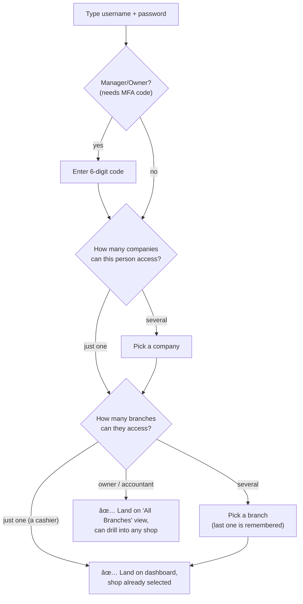

After login, a **branch switcher** sits in the top bar at all times. A cashier never sees it (they have one shop). An owner uses it to hop between shops. Switching shops is safe — the system re-checks permission every time, it never just trusts the screen.

**Why this matters:** a Dhanmondi cashier *cannot* accidentally sell Gulshan's stock or see Gulshan's numbers. The walls between shops are real, enforced by the system, not just hidden on the screen.

---

## 6. Buying goods (the Purchase journey)

This is how stock comes *into* the business and how you end up owing the supplier.

```mermaid
flowchart LR
    LOW["📉 Stock is low<br/>(system alerts)"] --> PO["📝 Purchase Order<br/>'Please send 100 boxes of tea'<br/>Draft → Approved"]
    PO --> RECV["🚚 Goods arrive<br/>Count them, note batch & expiry"]
    RECV --> UP["📦 Stock goes UP"]
    RECV --> BILL["🧾 Purchase Invoice<br/>(the supplier's bill)"]
    BILL --> OWE["💳 Now we OWE the supplier<br/>(a 'payable')"]
    OWE --> PAY["💵 Pay supplier<br/>(now or later)"]
    PAY --> CLEAR["✅ Payable cleared"]
```

**The story:** The tea is running low, so the purchaser raises a **Purchase Order** to ABC Distributors for 100 boxes. The manager approves it. A few days later the boxes arrive — the storekeeper counts them and records the batch number and expiry date. **Stock instantly goes up.** ABC's bill (the **Purchase Invoice**) says ৳50,000 — so now Rahim Stores **owes ৳50,000**. Later the accountant pays it (all at once, or in parts). Each payment reduces what's owed until it's cleared.

**Two ways to receive** (the system supports both):
- **Simple (most SMEs):** the bill *is* the receipt — goods in + amount owed, one step.
- **Careful (3-way match):** receive goods first (a "GRN"), then match the bill against the order and the receipt to catch price/quantity mistakes before paying.

**Returns to supplier:** if some boxes are damaged or expired, a **Purchase Return** sends them back, stock goes down, and what you owe is reduced (a "debit note").

---

## 7. The Inventory engine (the single most important idea)

Every other module talks *to* inventory; inventory never lets anyone change stock behind its back. Here's the idea that makes the whole ERP trustworthy:

```mermaid
flowchart TD
    EV["ANY event that changes stock:<br/>📥 buy · 📤 sell · 🔄 transfer · ✏️ adjust · ↩️ return"] --> ENG{{"📦 Stock Posting Engine<br/>(the ONLY thing allowed to change stock)"}}
    ENG --> LED["📜 LEDGER row<br/>a permanent diary entry:<br/>'+100 tea, ৳500 each, from invoice PI-001'<br/>NEVER edited or deleted"]
    ENG --> BAL["🔢 BALANCE updated<br/>'tea on hand = 100'<br/>the live count"]
    ENG --> COST["🧮 COST recalculated<br/>weighted-average or FIFO"]
    LED --> RPT["📊 Every report reads from here"]
    BAL --> RPT
```

Two records, two jobs:
- **The Ledger** is a permanent diary. Every single movement (+ or −) is written down forever and *never changed*. If someone makes a mistake, you don't erase it — you add a correcting entry. This is what makes the system audit-proof: you can always see *exactly* what happened, when, and because of which document.
- **The Balance** is the live "how much do I have right now" number, kept in sync with the diary.

**Why one engine?** Because if sales could change stock one way and purchases another way, the numbers would drift apart. Funnelling *everything* through one engine means the count is always right — even when two cashiers sell the last item at the exact same second (the system locks that item for a split second so only one sale wins).

**What it also handles automatically:**
- **Cost & profit:** it remembers what each item *cost*, so when you sell, it knows your profit.
- **Batch & expiry:** for tea, medicine, food — it tracks expiry dates and sells the **soonest-to-expire first**.
- **Units:** buy in *cartons*, sell in *pieces* — it converts automatically, always storing the base unit.
- **Low-stock alerts:** when tea drops below the reorder level, it flags "time to buy more."

---

## 8. Selling goods (the Sales / POS journey)

This is the busiest screen in the business — the checkout counter.

```mermaid
flowchart LR
    SCAN["📷 Scan barcode<br/>(or search)"] --> CART["🧺 Cart builds<br/>price + discount + VAT calculated"]
    CART --> TENDER["💳 Customer pays<br/>cash / card / bKash / credit<br/>(can split across several)"]
    TENDER --> DOWN["📦 Stock goes DOWN<br/>(through the engine)"]
    TENDER --> RCPT["🧾 Print receipt"]
    TENDER --> BOOKS["📚 Books updated:<br/>sales + VAT + cost of goods"]
    TENDER -->|"if paying later"| DUE["💳 Customer OWES us<br/>(a 'due')"]
```

**The story:** A customer brings tea and biscuits to the Dhanmondi counter. The cashier scans them — prices, any discount, and VAT are added up instantly. The customer pays ৳800: maybe ৳500 cash + ৳300 bKash (the system allows **split payment**). The moment payment is confirmed: **stock drops**, a **receipt prints**, and the **accounting books record the sale, the VAT, and the cost** — all automatically.

**Extra real-world bits the POS handles:**
- **Hold & resume:** a customer forgets their wallet — "hold" the cart, serve the next person, resume later.
- **Credit sale:** a regular customer (Karim) takes goods now and pays later — the unpaid part becomes his **due**, checked against his credit limit.
- **Promotions:** "Buy 2 Get 1", category discounts, happy-hour pricing — applied automatically.
- **Day close:** at end of shift, the cashier counts the cash drawer; the system compares it to expected cash and flags any shortage.
- **Works offline:** if internet drops, the POS keeps selling and syncs safely when it's back (no double-counting).

---

## 9. Returns — goods coming back

Returns happen in both directions. The system reverses everything cleanly.

```mermaid
flowchart LR
    subgraph SR["↩️ Customer returns to us (Sales Return)"]
        direction LR
        C1["Customer brings item back"] --> C2["Stock goes UP again"]
        C2 --> C3["Refund cash OR reduce their due"]
        C3 --> C4["Sale + VAT + profit reversed"]
    end
    subgraph PR["↪️ We return to supplier (Purchase Return)"]
        direction LR
        P1["Send damaged goods back"] --> P2["Stock goes DOWN"]
        P2 --> P3["What we owe supplier reduced"]
    end
```

The key point: a return is not a delete. The original sale stays in history; the return is a *new* event that undoes its effect on stock, money, and the books. Batch/expiry items go back to the *same* batch they came from.

---

## 10. Tracking money: who owes whom (Dues & Payments)

Two simple "tabs" run quietly in the background:

```mermaid
flowchart TD
    subgraph AR["📈 Money customers owe US (Receivables)"]
        direction TB
        SALE["Credit sale<br/>→ Karim owes ৳1,000"] --> COLLECT["Karim pays ৳600<br/>→ now owes ৳400"]
    end
    subgraph AP["📉 Money WE owe suppliers (Payables)"]
        direction TB
        BUY["Purchase invoice<br/>→ we owe ABC ৳50,000"] --> PAYS["We pay ৳30,000<br/>→ now owe ৳20,000"]
    end
```

- **Receivables (AR):** every credit sale adds to a customer's running balance; every payment they make reduces it. The system shows **aging** — who's 30 / 60 / 90+ days overdue — so collection isn't guesswork.
- **Payables (AP):** every supplier bill adds to what you owe; every payment reduces it. Same aging view, so you pay the right suppliers on time.

Each customer and supplier has a running **statement** (like a bank passbook) you can open any time.

---

## 11. Moving stock between shops (Inter-Branch Transfer)

When Gulshan runs out of tea but Dhanmondi has plenty:

```mermaid
flowchart LR
    A["🏪 Dhanmondi<br/>(has surplus)"] -->|"1. Dispatch 20 boxes"| TRANSIT["🚚 In Transit<br/>(stock is 'on the road' —<br/>visible, never lost)"]
    TRANSIT -->|"2. Gulshan receives"| B["🏪 Gulshan<br/>(needs stock)"]
    A -. "stock −20" .-> A
    B -. "stock +20" .-> B
```

The clever part is the **In-Transit** step. When goods leave Dhanmondi they don't vanish from the books — they sit in a virtual "in transit" location until Gulshan confirms receipt. If only 18 of 20 boxes arrive, the 2 missing are flagged, not silently lost. No money/profit is involved — it's the *same company* just moving its own goods.

---

## 12. How the books stay correct (accounting, simply)

You don't need to be an accountant to get this. Every important action automatically writes a **balanced** accounting entry — for every taka that goes one place, an equal taka is accounted for somewhere else. The system does this for you:

| When this happens... | The books record... |
|---|---|
| You **sell** ৳800 of goods (cost ৳600) | Money/Due **+৳800**, Sales income **+৳800**, VAT collected noted, Stock value **−৳600**, Profit (cost) **+৳600** |
| You **buy** ৳50,000 of goods | Stock value **+৳50,000**, "We owe supplier" **+৳50,000** |
| You **pay** the supplier ৳30,000 | "We owe supplier" **−৳30,000**, Cash/Bank **−৳30,000** |
| Customer **pays** their due ৳600 | Cash/Bank **+৳600**, "Customer owes us" **−৳600** |
| Stock **damaged** in store | Stock value **down**, Loss expense **up** |

The owner never has to make these entries — selling, buying, and paying *create them automatically*. At month end, the profit, the stock value, and the cash position all tie out, because they all came from the same events.

---

## 13. A full day at Rahim Stores (everything working together)

```mermaid
sequenceDiagram
    actor Owner
    actor Cashier
    actor Store as Storekeeper
    participant SYS as ⚙️ Login/Rules
    participant PUR as 📥 Purchase
    participant INV as 📦 Inventory
    participant SAL as 📤 Sales/POS
    participant FIN as 📚 Books

    Note over Cashier,SYS: 9:00 AM — shop opens
    Cashier->>SYS: Log in (auto-locked to Dhanmondi)
    Cashier->>SAL: Open cash drawer / start shift

    Note over Store,INV: 10:00 AM — delivery van arrives
    Store->>PUR: Receive 100 tea boxes from ABC
    PUR->>INV: Stock +100 (batch + expiry recorded)
    PUR->>FIN: We now owe ABC ৳50,000

    Note over Cashier,FIN: All day — customers buy
    Cashier->>SAL: Scan + take payment (৳800)
    SAL->>INV: Stock −1 tea (cost ৳600)
    SAL->>FIN: Sale ৳800, VAT, profit ৳200
    SAL-->>Cashier: Print receipt

    Note over INV: 2:00 PM — Gulshan is short
    Store->>INV: Transfer 20 boxes Dhanmondi → Gulshan

    Note over Cashier,FIN: 9:00 PM — close
    Cashier->>SAL: Count drawer (day close)
    SAL->>FIN: Cash matches expected ✅
    Owner->>FIN: Check today: sales, profit, stock, dues (all shops)
```

By 9 PM, without anyone touching a calculator, the owner can see: today's sales per shop, the profit, the current stock everywhere, what's owed to ABC, what customers owe, and whether every drawer balanced.

---

## 14. What the owner can actually see (reports)

Because every event is recorded once and cleanly, reports are instant and trustworthy:

- **Sales:** by shop, by cashier, by product, by hour; today vs. last month.
- **Stock:** what's on hand everywhere, what's running low, what's expiring soon, slow/dead stock.
- **Profit:** margin per product/category (selling price minus real cost).
- **Money:** who owes us (and how overdue), who we owe, cash position.
- **Compare branches:** which shop sells more, which has dead stock, which to restock.
- **Tax:** VAT collected vs. paid, ready for filing.

---

## 15. Why it's built this way (the promises)

| The promise | How it's kept |
|---|---|
| **Numbers are always right** | One stock engine + a permanent ledger; nothing edits stock secretly |
| **Shops stay separate** | Every record is tagged to a company & branch; users only see theirs |
| **Nothing gets lost** | Soft-delete (records are hidden, never truly erased) + full audit trail |
| **It scales** | Same design works for 1 shop or 100 — stock is per-warehouse, not hard-wired to branches |
| **It's safe** | Roles decide who can do what; sensitive actions need a manager's approval and are logged |
| **It survives bad internet** | POS works offline and syncs without double-counting |
| **Mistakes are reversible** | Returns and corrections reverse cleanly; history is preserved |

---

## 16. Plain-English glossary

| Term | What it really means |
|---|---|
| **Company** | The legal business that files taxes and owns the profit |
| **Branch** | A physical shop or location |
| **Warehouse** | Where stock physically sits (a shop can have several) |
| **SKU / Product** | A specific item you sell (e.g., Aarong Tea 500g) |
| **Variant** | A version of a product (Red/Medium T-shirt) |
| **Batch** | A specific lot of goods with one expiry date |
| **Stock Ledger** | The permanent diary of every stock movement |
| **Balance / On Hand** | How much you have right now |
| **Cost (Weighted-Avg / FIFO)** | What your stock is worth / what it cost you |
| **POS** | Point of Sale — the checkout screen |
| **PO (Purchase Order)** | A request to a supplier to send goods |
| **GRN** | Goods Receipt Note — proof goods arrived |
| **Invoice** | A bill (purchase = supplier's bill; sales = customer's bill) |
| **Receivable (AR)** | Money customers owe you |
| **Payable (AP)** | Money you owe suppliers |
| **Due** | Unpaid balance (customer or supplier) |
| **Return** | Goods coming back (reverses a sale or purchase) |
| **Transfer** | Moving your own stock between warehouses/shops |
| **Adjustment** | A manual stock correction (with a reason) |
| **VAT** | The tax added on sales and paid on purchases |
| **Role / Permission** | What a user is allowed to do |
| **Approval** | A manager's sign-off for sensitive actions |
| **Soft-delete** | Hiding a record instead of erasing it (so history is safe) |
| **Audit trail** | The record of who did what, when |

---

### Where to go deeper
- Foundation, login, users, permissions, companies, branches → **`sys-db.md`**
- Stock, products, warehouses, batches, the posting engine → **`inv-db.md`**
- POS, customers, sales, returns, dues → **`sal-db.md`**
- Suppliers, purchase orders, receiving, payables → **`pur-db.md`**

*This document explains the "why" and "how" in business terms; those four explain the exact tables, APIs, and rules engineers build from.*


## SYS Database and Backend Blueprint

# SYS — System / Platform Foundation Module (Re-Plan / Production Blueprint)

> **Module prefix:** `sys_` · **Backend package:** `com.infoaidtech.aidly.sys` + `com.infoaidtech.aidly.core` (auth/security/audit) · **Frontend feature:** `apps/web-client/src/app/features/sys` + `core/` + `layout/`
> **Forms covered:** SYS_1001 Company · SYS_1002 Branch · SYS_1003 Financial Year · SYS_1004 Currency · SYS_1005 VAT/Tax · SYS_1101 User Management · SYS_1102 Role Management · SYS_1103 Role Permission Matrix · SYS_1104 User Branch Mapping · SYS_1105 Activity Log Viewer · SYS_1201 Dynamic Menu Builder · (+ NEW: SYS_1006 Exchange Rate · SYS_1007 Cost Center · SYS_1008 System Settings · SYS_1106 User Warehouse Mapping · SYS_1107 User Company Mapping · SYS_1108 Approval Workflow Setup · SYS_1109 Session Monitor · SYS_1202 Menu Enrollment · SYS_1203 File/Image Manager — see **Appendix C** for the ready-to-insert menu seed).
> **Status:** this is a **re-plan of the existing SYS module**. §0 lists every delta against the current `db-updated.md` schema. Decisions taken: **clean redesign**, **`sys_company` remains the apex** (the Tenant layer is *deferred* — the slot is reserved and multi-company users are handled by `sys_user_company`), **full RBAC restructure** (company-scoped role templates assigned per-branch via `sys_user_branch.role_no`).
> **Why this module first:** it is the access + isolation skeleton every other module (`inv_*`, `sal_*`, `pur_*`, `fin_*`, `hr_*`) inherits. A missing `WHERE company_no` here is a cross-tenant data leak everywhere. Get §3 (auth/isolation) and §5 (filter/interceptor) right before any business module relies on them.

---

## Conventions
Identical to `inv-db.md` → "Conventions inherited from the existing codebase": `_no BIGSERIAL` PKs, `_id VARCHAR` business codes with partial-unique `WHERE is_deleted = 0`, the standard audit block (`-- << AUDIT BLOCK >>` = `is_active, is_deleted, created_by/at, updated_by/at, deleted_by/at, row_version` + the two CHECKs), `SMALLINT` booleans/enums with `CHECK`, soft delete via `performSoftDelete()` + `nullifyBusinessId()`, optimistic `row_version` (`@Version`), `ApiResponse<T>` with `status_code` (snake_case), form-wise controllers, snake_case DTOs, MapStruct audit-ignore, Angular 21 signals + `model.service.ts`/`data.service.ts`.

## MANDATORY API ISOLATION RULE (CRITICAL — NO EXCEPTIONS)

**Every API in this ERP must enforce 4 dimensions. This is non-negotiable.**

| # | Dimension | Source | Required | Notes |
|---|-----------|--------|----------|-------|
| 1 | `company_no` | `CompanyBranchContext.getCompanyNo()` | **ALWAYS** | Company isolation — NEVER from DTO |
| 2 | `branch_no` | `CompanyBranchContext.getBranchNo()` | **ALWAYS** (nullable for company-scoped entities) | Branch isolation — NEVER from DTO |
| 3 | `is_deleted` | `WHERE is_deleted = 0` | **ALWAYS** | Soft-delete filter on EVERY query |
| 4 | `role_no` | JWT claims / `sys_user_branch.role_no` | **ALWAYS** | Role-based permission — determines what the user can do |

### Business Rule:
- **Every list query** MUST filter by `company_no` AND `is_deleted` at minimum
- **Every list query** MUST filter by `branch_no` if the entity is branch-scoped
- **All Branches pattern** — for setup forms (fin_year, currency, vat_tax, cost_center): `branch_no = NULL` means company-wide (applies to all branches). Query returns branch-specific + company-wide (NULL) records combined. Save with "All Branches" → `branch_no = NULL`. Save with specific branches → one record per branch.
- **Every write operation** (insert/update/delete) MUST verify the current user's role has permission for that form (`SYS_{FORM_ID}`)
- **`role_no` comes from the login branch** — each user has a role per branch via `sys_user_branch.role_no`
- **Permission is checked by `RbacAuthorizationInterceptor`** at the request level via `X-Form-Id` header
- **Frontend MUST send these headers on every API call:**
  ```
  X-Company-No: {company_no}
  X-Branch-No:  {branch_no}
  X-User-No:    {user_no}
  X-Form-Id:    SYS_{FORM_ID}
  ```

### Why this matters:
This is a **company-branch isolated, role-based ERP**. Multiple companies share one database. A data leak between companies is a **critical security violation**. The 4 dimensions ensure:
1. **Company isolation** — users only see their company's data
2. **Branch isolation** — users only see their branch's data (unless they have company-wide access)
3. **Soft-delete safety** — deleted records never appear in queries
4. **Role-based access** — users can only perform actions their role permits

---

# 0. RE-PLAN DELTA — what changes vs. the current `db-updated.md`

| Area | Current | Re-planned | Migration action |
|---|---|---|---|
| **Apex** | `sys_company` | `sys_company` (unchanged); **Tenant deferred** — `tenant_no` slot reserved as a nullable column for forward-compat | add nullable `tenant_no BIGINT` to `sys_company` (unused for now) |
| **User scope** | `sys_user.branch_no BIGINT NOT NULL` (user bound to one branch) | user is **company-scoped**; `branch_no` removed; access via `sys_user_branch`; `default_branch_no` nullable | drop NOT NULL; backfill `sys_user_branch` from old `branch_no`; set `default_branch_no` |
| **Access scope** | `sys_user.has_global_access SMALLINT` | `sys_user.access_scope SMALLINT` ∈ 1=BRANCH·2=COMPANY·3=GLOBAL | map `has_global_access=1 → access_scope=3 (GLOBAL)`, else 1 (BRANCH); keep `has_global_access` as deprecated generated mirror for one release |
| **Role scope** | `sys_role` **branch-scoped** (`uq_branch_role (branch_no, role_id)`); also a duplicate `branch_no` column bug | `sys_role` **company-scoped templates** (`uq (company_no, role_id)`); reusable across branches; `default_access_scope` removed; branch applicability via `sys_role_branch` junction (empty = all branches) | dedupe branch roles into company templates; remap assignments; fix the duplicate-column defect; drop `default_access_scope` |
| **User↔Role↔Branch** | three tables: `sys_user_branch` + `sys_user_role` + `sys_role_permission(branch_no)` | **role-per-branch** on `sys_user_branch (user_no, branch_no, role_no, is_default)`; `sys_user_role` **dropped**; permissions on the role template (no branch_no) | merge `sys_user_role` into `sys_user_branch`; move `can_*` to template; drop `sys_role_permission.branch_no` |
| **Permission granularity** | `sys_role_permission` has `can_view/insert/update/delete/approve` only | add `perm_scope SMALLINT` (COMPANY/BRANCH/OWN) + `record_filter SMALLINT` (ALL/OWN) + `can_export/can_post/can_cancel` | add columns, default ALL/BRANCH |
| **Multi-company user** | none (one company implied) | `sys_user_company (user_no, company_no, is_default, is_owner)` | new table; seed one row per existing user |
| **Warehouse access** | none | `sys_user_warehouse (user_no, warehouse_no, can_receive/issue/adjust)` | new |
| **Approvals** | none | `sys_approval_workflow` + `sys_approval_request` + `sys_approval_request_step` | new (powers inv/sal/pur approval gates) |
| **System config** | none (configs implied/hardcoded) | `sys_setting (company_no, branch_no?, setting_key, setting_value)` | new — home of `costing_method`, `allow_negative_stock`, `is_grn_required`, tolerances, number formats |
| **Session** | `sys_session(active_branch_no, branch_no dup)` | `sys_session` + `active_company_no` + `access_scope` snapshot + refresh-token hash; fix duplicate `branch_no` | extend; drop dup column |
| **Numbering / events** | none | `sys_doc_sequence`, `sys_event_outbox` (defined in `inv-db.md`, **owned by SYS**) | new (already specced) |
| **Platform admin** | none (vendor would log in as a tenant user — unsafe) | `sys_platform_admin` in a **separate auth realm** | new |
| **FX history** | single `sys_currency.exchange_rate` | optional `sys_exchange_rate(currency_no, rate_date, rate)` | new (optional) |
| **Cost center** | `hrm_department.cost_center_no` references a non-existent table | `sys_cost_center` (optional accounting dimension) | new (optional) |
| **Module/Submodule/Menu** | global vendor catalog | **FIXED — NOT redesigned.** Global, shared across all client companies in the DB; each client is granted the forms they bought via `sys_enroll_menu` | none — do not modify; only **add rows** (Appendix C) |
| **User ↔ Employee** | `sys_user.employee_no` nullable | **`employee_no NOT NULL`** — a user *must* be an `hrm_employee`; the user is **auto-created when the employee is created** (`user_id = employee_id`) | make required; auto-create on employee insert (§3.9) |
| **Password** | `sys_user.password_hash NOT NULL` | **nullable** — admin sets/resets later; login blocked while NULL | drop NOT NULL |
| **Binary files** | `*_path`/`*_url` VARCHAR columns only | new **`sys_file` (BYTEA)** stores company logo, employee photo/signature, user avatar, product image, etc.; owners keep a nullable FK to it | new table (§2.26) |

**access_scope mapping to the reference's hierarchy:** reference `BRANCH→1`, `COMPANY→2`, `TENANT→3 GLOBAL` (since company is our apex, "GLOBAL" = every company the user is granted via `sys_user_company`, used by owners of sister concerns / auditors). When a real `sys_tenant` is later introduced, `GLOBAL` narrows to "all companies within the tenant" with no table churn.

---

# 1. BUSINESS MODULE OVERVIEW

## 1.1 What this module does
SYS is the foundation: **organizational hierarchy** (company → branch → warehouse), **identity & authentication** (login, sessions, JWT, company/branch switching), **authorization** (company-scoped role templates, role-per-branch assignment, form-level + record-level permissions, approval workflows), **tenant isolation** (every business row carries `company_no`; an automatic filter scopes all queries), and **platform configuration** (financial year, currency, tax, system settings, dynamic menu, audit/activity log). No selling, buying, or stock — it is the trust and context layer the retail modules run inside.

## 1.2 Organizational hierarchy (company-apex)
```
sys_company  (legal entity — TIN/BIN/VAT, chart of accounts, files taxes)   [apex]
 ├── sys_branch (operational outlet — manager, POS, stock)                  [1..N]
 │     └── inv_warehouse (physical stock container; may be branch- or company-level/central) [1..N]
 │           └── inv_rack (bin/shelf)                                        [optional]
 ├── sys_department / sys_cost_center                                        [optional dims]
 └── sys_fin_year · sys_currency · sys_vat_tax · sys_setting                 [company config; branch_no nullable = All Branches]
sys_user (company-scoped; access to branches via sys_user_branch)           [identity]
sys_role (company-scoped template; assigned per branch via sys_user_branch)  [authorization]
 └── sys_role_branch (branch applicability: specific branches or all)       [junction]
sys_platform_admin (InfoAidTech staff — SEPARATE realm)                     [vendor ops]
```
Rules: a **company** is the legal/accounting boundary (VAT consolidation, P&L, chart of accounts). A **branch** is operational (revenue recognition, day-close, attendance). **Stock is warehouse-scoped, never branch-scoped** — "branch stock" is a JOIN through `inv_warehouse.branch_no`. A **central warehouse** has `branch_no NULL` (company-level). Departments/cost-centers are optional reporting/accounting dimensions present from day one.

## 1.3 Actors / user archetypes
| Archetype | access_scope | Branch reach | Typical rights |
|---|---|---|---|
| Cashier | BRANCH | 1 (default) | POS, view own sessions/sales; no master edits |
| Branch Manager | BRANCH | 1 | POS + stock adjust + day-close + branch P&L |
| Area Manager | BRANCH | N assigned | read all assigned branches, approve transfers/returns |
| HO Accountant | COMPANY | all of company (read+post) | GL, AP/AR, consolidated reports |
| Warehouse Manager | COMPANY | warehouse-scoped (`sys_user_warehouse`) | receive/transfer/issue; no POS |
| Auditor | COMPANY/GLOBAL | read-only | read everything, write nothing |
| Owner / Super Admin | GLOBAL | all companies (`sys_user_company`) | everything incl. settings, users |
| **Platform Admin (InfoAidTech)** | — (separate realm) | cross-company ops | provisioning, support, billing — **never a `sys_user`** |

## 1.4 Login & context lifecycle (hybrid — the production standard)
`authenticate → resolve company access → resolve branch access → establish context → work → switch freely`. Detailed in §3.1. The principle: single-branch users get zero friction (auto-selected); multi-branch users pick (last-used remembered); company/global users default to "all branches" with a persistent switcher.

## 1.5 Approval lifecycle
Sensitive documents (PO over threshold, stock adjustment over value, discount over cap, return, expense) route through `sys_approval_workflow` → `sys_approval_request` (escalation by amount/document-type/branch). The retail modules call the SYS approval engine rather than hardcoding approver logic.

## 1.6 Edge cases
Cross-company data leak (the cardinal sin — defended by mandatory `company_no` + auto-filter, §3.4); a user removed from a branch mid-session (next request re-validates access from cache/DB, not JWT alone); branch switch in one tab affecting another (per-tab `sessionStorage`, §4.5); soft-deleted role still referenced by assignments (RESTRICT); last owner of a company deactivated (block — at least one active GLOBAL/owner must remain); financial year/period closed during posting (rejected by period guard); JWT replay after logout (server-side session revocation list + `tokenVersion`); permission cache staleness after a role edit (event-driven cache bust); platform admin credential compromise (isolated realm limits blast radius).

## 1.7 SME real-world examples
A Dhaka owner with 3 grocery outlets + 1 wholesale depot under one company: one login, branch switcher, cashiers locked to their shop, owner sees all. A group owning a pharmacy company **and** an electronics company (sister concerns, separate TIN/BIN): the owner is one `sys_user` with two `sys_user_company` rows + a company switcher; the shared accountant likewise. An area manager over 5 branches: BRANCH scope with 5 `sys_user_branch` rows, switches branch per visit.

---

# 2. DATABASE DESIGN

> Order: org (§2.1–2.4) → identity & access (§2.5–2.11) → menu/RBAC targets (§2.12–2.15) → approvals (§2.16) → config (§2.17–2.21) → session/audit (§2.22–2.25) → platform realm (§2.26).

## 2.1 `sys_company` — legal entity (apex) (SYS_1001)
**Purpose:** the legal/accounting boundary. Owns branches, chart of accounts, tax registration, fiscal config.
```sql
CREATE TABLE sys_company (
    company_no       BIGSERIAL PRIMARY KEY,
    tenant_no        BIGINT,                         -- RESERVED for future sys_tenant; nullable, unused now
    company_id       VARCHAR(15) NOT NULL,
    company_name     VARCHAR(250) NOT NULL,
    company_name_nls VARCHAR(250),
    company_type     VARCHAR(50),
    trade_license_no VARCHAR(100), vat_reg_no VARCHAR(100), tin_no VARCHAR(100), bin_no VARCHAR(100), reg_no VARCHAR(100),
    company_addr1 VARCHAR(250), company_addr2 VARCHAR(250),
    city VARCHAR(100), state_province VARCHAR(100), post_code VARCHAR(20), country_code VARCHAR(10),
    mobile_no VARCHAR(20), contact_no VARCHAR(25), email VARCHAR(250), website VARCHAR(250),
    base_currency_no BIGINT,                          -- FK sys_currency (reporting currency)
    costing_method   SMALLINT NOT NULL DEFAULT 1,     -- 1=WeightedAvg,2=FIFO,3=LIFO,4=Standard (company-wide; immutable once movements exist)
    logo_path VARCHAR(255),
    -- << AUDIT BLOCK >>
    is_active SMALLINT NOT NULL DEFAULT 1, is_deleted SMALLINT NOT NULL DEFAULT 0,
    created_by BIGINT, created_at TIMESTAMPTZ NOT NULL DEFAULT NOW(),
    updated_by BIGINT, updated_at TIMESTAMPTZ, deleted_by BIGINT, deleted_at TIMESTAMPTZ,
    row_version BIGINT NOT NULL DEFAULT 1,
    CONSTRAINT chk_sys_company_costing CHECK (costing_method IN (1,2,3,4)),
    CONSTRAINT chk_sys_company_active  CHECK (is_active IN (0,1)),
    CONSTRAINT chk_sys_company_deleted CHECK (is_deleted IN (0,1))
);
CREATE UNIQUE INDEX uq_sys_company_id ON sys_company(company_id) WHERE is_deleted = 0;
CREATE INDEX idx_sys_company_tenant ON sys_company(tenant_no);
```
**Rules:** `costing_method` frozen once any `inv_stock_ledger` row exists for the company. Delete forbidden when live branches/users exist. `nullifyBusinessId()` clears `company_id` on soft-delete.

## 2.2 `sys_branch` — operational outlet (SYS_1002)
```sql
CREATE TABLE sys_branch (
    branch_no       BIGSERIAL PRIMARY KEY,
    company_no      BIGINT NOT NULL REFERENCES sys_company(company_no) ON DELETE RESTRICT,
    branch_id       VARCHAR(15) NOT NULL,
    branch_name     VARCHAR(250) NOT NULL,
    branch_name_nls VARCHAR(250),
    branch_type     SMALLINT NOT NULL DEFAULT 1,   -- 1=Outlet,2=HeadOffice,3=Warehouse-Hub,4=Online
    branch_addr1 VARCHAR(250), branch_addr2 VARCHAR(250),
    city VARCHAR(100), post_code VARCHAR(20), mobile_no VARCHAR(20), contact_no VARCHAR(25), email VARCHAR(250),
    manager_employee_no BIGINT REFERENCES hrm_employee(employee_no) ON DELETE SET NULL,
    department_no   BIGINT,                          -- optional FK sys_department
    cost_center_no  BIGINT,                          -- optional FK sys_cost_center
    is_main_branch  SMALLINT NOT NULL DEFAULT 0,
    -- << AUDIT BLOCK >>
    is_active SMALLINT NOT NULL DEFAULT 1, is_deleted SMALLINT NOT NULL DEFAULT 0,
    created_by BIGINT, created_at TIMESTAMPTZ NOT NULL DEFAULT NOW(),
    updated_by BIGINT, updated_at TIMESTAMPTZ, deleted_by BIGINT, deleted_at TIMESTAMPTZ,
    row_version BIGINT NOT NULL DEFAULT 1,
    CONSTRAINT chk_sys_branch_type CHECK (branch_type IN (1,2,3,4)),
    CONSTRAINT chk_sys_branch_active CHECK (is_active IN (0,1)),
    CONSTRAINT chk_sys_branch_deleted CHECK (is_deleted IN (0,1))
);
CREATE UNIQUE INDEX uq_sys_branch_company ON sys_branch(company_no, branch_id) WHERE is_deleted = 0;
CREATE UNIQUE INDEX uq_sys_branch_main ON sys_branch(company_no) WHERE is_main_branch = 1 AND is_deleted = 0;  -- one main per company
CREATE INDEX idx_sys_branch_company ON sys_branch(company_no) WHERE is_deleted = 0;
```

## 2.3 `sys_department` — org/HRM dimension (optional)
```sql
CREATE TABLE sys_department (
    department_no   BIGSERIAL PRIMARY KEY,
    company_no      BIGINT NOT NULL REFERENCES sys_company(company_no) ON DELETE RESTRICT,
    branch_no       BIGINT REFERENCES sys_branch(branch_no) ON DELETE RESTRICT,   -- NULL = company-wide
    department_id   VARCHAR(20) NOT NULL,
    department_name VARCHAR(150) NOT NULL,
    parent_department_no BIGINT REFERENCES sys_department(department_no) ON DELETE RESTRICT,
    cost_center_no  BIGINT,
    -- << AUDIT BLOCK >>
    is_active SMALLINT NOT NULL DEFAULT 1, is_deleted SMALLINT NOT NULL DEFAULT 0,
    created_by BIGINT NOT NULL, created_at TIMESTAMPTZ NOT NULL DEFAULT CURRENT_TIMESTAMP,
    updated_by BIGINT, updated_at TIMESTAMPTZ, deleted_by BIGINT, deleted_at TIMESTAMPTZ,
    row_version BIGINT NOT NULL DEFAULT 1,
    CONSTRAINT chk_sys_dept_active CHECK (is_active IN (0,1)),
    CONSTRAINT chk_sys_dept_deleted CHECK (is_deleted IN (0,1))
);
CREATE UNIQUE INDEX uq_sys_dept_id ON sys_department(company_no, department_id) WHERE is_deleted = 0;
```
> The existing `hrm_department` may either be folded into this or kept as the HRM-specific org tree; pick one to avoid two department concepts. Recommendation: keep HRM's `hrm_department` for payroll org, use `sys_cost_center` (below) for the accounting dimension, and reference whichever the branch needs.

## 2.4 `sys_cost_center` — accounting dimension (optional)
```sql
CREATE TABLE sys_cost_center (
    cost_center_no  BIGSERIAL PRIMARY KEY,
    company_no      BIGINT NOT NULL REFERENCES sys_company(company_no) ON DELETE RESTRICT,
    cost_center_id  VARCHAR(20) NOT NULL,
    cost_center_name VARCHAR(150) NOT NULL,
    branch_no       BIGINT REFERENCES sys_branch(branch_no) ON DELETE RESTRICT,
    parent_cost_center_no BIGINT REFERENCES sys_cost_center(cost_center_no) ON DELETE RESTRICT,
    -- << AUDIT BLOCK >>
    is_active SMALLINT NOT NULL DEFAULT 1, is_deleted SMALLINT NOT NULL DEFAULT 0,
    created_by BIGINT NOT NULL, created_at TIMESTAMPTZ NOT NULL DEFAULT CURRENT_TIMESTAMP,
    updated_by BIGINT, updated_at TIMESTAMPTZ, deleted_by BIGINT, deleted_at TIMESTAMPTZ,
    row_version BIGINT NOT NULL DEFAULT 1,
    CONSTRAINT chk_sys_cc_active CHECK (is_active IN (0,1)),
    CONSTRAINT chk_sys_cc_deleted CHECK (is_deleted IN (0,1))
);
CREATE UNIQUE INDEX uq_sys_cc_id ON sys_cost_center(company_no, cost_center_id) WHERE is_deleted = 0;
```

## 2.5 `sys_user` — identity (company-scoped) (SYS_1101)
**Purpose:** the login principal. Belongs to a "home" company; reaches branches via `sys_user_branch`, other companies via `sys_user_company`. **`access_scope`** is the master switch for data reach.
```sql
CREATE TABLE sys_user (
    user_no          BIGSERIAL PRIMARY KEY,
    company_no       BIGINT NOT NULL REFERENCES sys_company(company_no) ON DELETE RESTRICT,  -- home company
    employee_no      BIGINT NOT NULL REFERENCES hrm_employee(employee_no) ON DELETE RESTRICT,  -- a user MUST be an employee
    user_id          VARCHAR(50) NOT NULL,           -- = hrm_employee.employee_id (auto-set when the employee is created)
    email            VARCHAR(250),
    password_hash    VARCHAR(255),                   -- BCrypt; NULL until admin sets/resets — login is BLOCKED while NULL
    avatar_file_no   BIGINT,                          -- FK → sys_file(file_no) added once sys_file exists (§2.26); usually the employee photo
    user_name        VARCHAR(150) NOT NULL,
    access_scope     SMALLINT NOT NULL DEFAULT 1,    -- 1=BRANCH,2=COMPANY,3=GLOBAL
    default_branch_no BIGINT REFERENCES sys_branch(branch_no) ON DELETE SET NULL,  -- preferred branch at login
    -- security
    is_mfa_enabled   SMALLINT NOT NULL DEFAULT 0,
    mfa_secret       VARCHAR(255),
    failed_login_count INTEGER NOT NULL DEFAULT 0,
    is_locked        SMALLINT NOT NULL DEFAULT 0,
    locked_until     TIMESTAMPTZ,
    must_change_password SMALLINT NOT NULL DEFAULT 0,
    password_changed_at TIMESTAMPTZ,
    last_login_at    TIMESTAMPTZ,
    token_version    INTEGER NOT NULL DEFAULT 1,     -- bump to invalidate all outstanding JWTs
    -- << AUDIT BLOCK >>
    is_active SMALLINT NOT NULL DEFAULT 1, is_deleted SMALLINT NOT NULL DEFAULT 0,
    created_by BIGINT, created_at TIMESTAMPTZ NOT NULL DEFAULT NOW(),
    updated_by BIGINT, updated_at TIMESTAMPTZ, deleted_by BIGINT, deleted_at TIMESTAMPTZ,
    row_version BIGINT NOT NULL DEFAULT 1,
    CONSTRAINT chk_sys_user_scope   CHECK (access_scope IN (1,2,3)),
    CONSTRAINT chk_sys_user_active  CHECK (is_active IN (0,1)),
    CONSTRAINT chk_sys_user_deleted CHECK (is_deleted IN (0,1))
);
CREATE UNIQUE INDEX uq_sys_user_id    ON sys_user(user_id) WHERE is_deleted = 0;
CREATE UNIQUE INDEX uq_sys_user_email ON sys_user(email) WHERE is_deleted = 0 AND email IS NOT NULL;
CREATE INDEX idx_sys_user_company ON sys_user(company_no) WHERE is_deleted = 0;
CREATE UNIQUE INDEX uq_sys_user_employee ON sys_user(employee_no) WHERE is_deleted = 0;  -- exactly one live user per employee
```
**Rules:** never store plaintext password (BCrypt). **A user must be an employee** — `employee_no` is mandatory and the user is auto-provisioned from HRM (§3.9); `user_id` = the employee's `employee_id`. `password_hash` is NULL on auto-create and **the user cannot log in until an admin sets it** (or triggers a reset) — password handling is deliberately an admin action, not part of provisioning. Exactly one live user per employee (`uq_sys_user_employee`). `default_branch_no` (seeded from the employee's branch) must be a branch the user can access. Deactivating the last active `access_scope=3` owner of a company is blocked. `nullifyBusinessId()` clears `user_id`/`email` on soft-delete.

## 2.6 `sys_user_company` — multi-company access (replaces implicit single-company)
**Purpose:** which companies a user can switch into; supports owners of sister concerns and shared HO staff without a Tenant table.
```sql
CREATE TABLE sys_user_company (
    user_company_no BIGSERIAL PRIMARY KEY,
    user_no    BIGINT NOT NULL REFERENCES sys_user(user_no) ON DELETE RESTRICT,
    company_no BIGINT NOT NULL REFERENCES sys_company(company_no) ON DELETE RESTRICT,
    is_default SMALLINT NOT NULL DEFAULT 0,
    is_owner   SMALLINT NOT NULL DEFAULT 0,
    -- << AUDIT BLOCK >>
    is_active SMALLINT NOT NULL DEFAULT 1, is_deleted SMALLINT NOT NULL DEFAULT 0,
    created_by BIGINT, created_at TIMESTAMPTZ NOT NULL DEFAULT NOW(),
    updated_by BIGINT, updated_at TIMESTAMPTZ, deleted_by BIGINT, deleted_at TIMESTAMPTZ,
    row_version BIGINT NOT NULL DEFAULT 1,
    CONSTRAINT uq_sys_user_company UNIQUE (user_no, company_no),
    CONSTRAINT chk_sys_usercomp_active CHECK (is_active IN (0,1)),
    CONSTRAINT chk_sys_usercomp_deleted CHECK (is_deleted IN (0,1))
);
CREATE UNIQUE INDEX uq_sys_usercomp_default ON sys_user_company(user_no) WHERE is_default = 1 AND is_deleted = 0;
CREATE INDEX idx_sys_usercomp_user ON sys_user_company(user_no);
```

## 2.7 `sys_role` — role template (company-scoped) (SYS_1102)
**Purpose:** a reusable permission template (Cashier, Branch Manager, Accountant) defined once per company and assigned to users per branch. **No longer branch-scoped.** Branch applicability is stored in `sys_role_branch`: specific branches or company-wide (no rows = all branches).
```sql
CREATE TABLE sys_role (
    role_no     BIGSERIAL PRIMARY KEY,
    company_no  BIGINT NOT NULL REFERENCES sys_company(company_no) ON DELETE RESTRICT,
    role_id     VARCHAR(20) NOT NULL,
    role_name   VARCHAR(150) NOT NULL,
    role_desc   VARCHAR(500),
    is_system_role SMALLINT NOT NULL DEFAULT 0,        -- seeded, non-deletable
    -- << AUDIT BLOCK >>
    is_active SMALLINT NOT NULL DEFAULT 1, is_deleted SMALLINT NOT NULL DEFAULT 0,
    created_by BIGINT, created_at TIMESTAMPTZ NOT NULL DEFAULT NOW(),
    updated_by BIGINT, updated_at TIMESTAMPTZ, deleted_by BIGINT, deleted_at TIMESTAMPTZ,
    row_version BIGINT NOT NULL DEFAULT 1,
    CONSTRAINT chk_sys_role_active CHECK (is_active IN (0,1)),
    CONSTRAINT chk_sys_role_deleted CHECK (is_deleted IN (0,1))
);
CREATE UNIQUE INDEX uq_sys_role_company ON sys_role(company_no, role_id) WHERE is_deleted = 0;
CREATE INDEX idx_sys_role_company ON sys_role(company_no) WHERE is_deleted = 0;
```

### 2.7a `sys_role_branch` — role-branch applicability (junction)
**Purpose:** which branches a role template applies to. One row = "role R applies to branch B". When no rows exist for a role, the role applies to **all branches** of the company (company-wide).
```sql
CREATE TABLE sys_role_branch (
    role_branch_no BIGSERIAL PRIMARY KEY,
    role_no    BIGINT NOT NULL REFERENCES sys_role(role_no) ON DELETE RESTRICT,
    branch_no  BIGINT NOT NULL REFERENCES sys_branch(branch_no) ON DELETE RESTRICT,
    -- << AUDIT BLOCK >>
    is_active SMALLINT NOT NULL DEFAULT 1, is_deleted SMALLINT NOT NULL DEFAULT 0,
    created_by BIGINT, created_at TIMESTAMPTZ NOT NULL DEFAULT NOW(),
    updated_by BIGINT, updated_at TIMESTAMPTZ, deleted_by BIGINT, deleted_at TIMESTAMPTZ,
    row_version BIGINT NOT NULL DEFAULT 1,
    CONSTRAINT uq_role_branch UNIQUE (role_no, branch_no),
    CONSTRAINT chk_sys_role_branch_active CHECK (is_active IN (0,1)),
    CONSTRAINT chk_sys_role_branch_deleted CHECK (is_deleted IN (0,1))
);
CREATE INDEX idx_rolebranch_role_deleted ON sys_role_branch(role_no, is_deleted);
```
**Design:** Empty junction = role is available at all branches. Specific rows = role restricted to those branches. The "All Branches" button in SYS1102 clears all rows (or inserts none).

## 2.8 `sys_user_branch` — branch access **carrying the role** (SYS_1104)
**Purpose:** the heart of the re-plan. One row = "user U has role R at branch B". Replaces the old `sys_user_branch` + `sys_user_role` pair. A user can hold different roles at different branches.
```sql
CREATE TABLE sys_user_branch (
    user_branch_no BIGSERIAL PRIMARY KEY,
    user_no    BIGINT NOT NULL REFERENCES sys_user(user_no) ON DELETE RESTRICT,
    branch_no  BIGINT NOT NULL REFERENCES sys_branch(branch_no) ON DELETE RESTRICT,
    role_no    BIGINT NOT NULL REFERENCES sys_role(role_no) ON DELETE RESTRICT,   -- role at THIS branch
    is_default SMALLINT NOT NULL DEFAULT 0,           -- default working branch
    -- << AUDIT BLOCK >>
    is_active SMALLINT NOT NULL DEFAULT 1, is_deleted SMALLINT NOT NULL DEFAULT 0,
    created_by BIGINT, created_at TIMESTAMPTZ NOT NULL DEFAULT NOW(),
    updated_by BIGINT, updated_at TIMESTAMPTZ, deleted_by BIGINT, deleted_at TIMESTAMPTZ,
    row_version BIGINT NOT NULL DEFAULT 1,
    CONSTRAINT uq_sys_user_branch UNIQUE (user_no, branch_no),   -- one role per (user,branch); use multiple roles via a second junction if ever needed
    CONSTRAINT chk_sys_userbr_active CHECK (is_active IN (0,1)),
    CONSTRAINT chk_sys_userbr_deleted CHECK (is_deleted IN (0,1))
);
CREATE UNIQUE INDEX uq_sys_userbr_default ON sys_user_branch(user_no) WHERE is_default = 1 AND is_deleted = 0;
CREATE INDEX idx_sys_userbr_user   ON sys_user_branch(user_no) WHERE is_deleted = 0;
CREATE INDEX idx_sys_userbr_branch ON sys_user_branch(branch_no) WHERE is_deleted = 0;
CREATE INDEX idx_sys_userbr_role   ON sys_user_branch(role_no);
```
> If a user genuinely needs **multiple roles at one branch**, add `sys_user_branch_role (user_branch_no, role_no)` and drop the single `role_no` — but for SME retail one-role-per-branch is the right default and keeps permission resolution O(1).

## 2.9 `sys_user_warehouse` — warehouse-staff access
**Purpose:** warehouse operators aren't tied to a sales branch; grant per-warehouse capabilities directly.
```sql
CREATE TABLE sys_user_warehouse (
    user_warehouse_no BIGSERIAL PRIMARY KEY,
    user_no      BIGINT NOT NULL REFERENCES sys_user(user_no) ON DELETE RESTRICT,
    warehouse_no BIGINT NOT NULL REFERENCES inv_warehouse(warehouse_no) ON DELETE RESTRICT,
    can_receive  SMALLINT NOT NULL DEFAULT 0,
    can_issue    SMALLINT NOT NULL DEFAULT 0,
    can_adjust   SMALLINT NOT NULL DEFAULT 0,
    can_transfer SMALLINT NOT NULL DEFAULT 0,
    -- << AUDIT BLOCK >>
    is_active SMALLINT NOT NULL DEFAULT 1, is_deleted SMALLINT NOT NULL DEFAULT 0,
    created_by BIGINT, created_at TIMESTAMPTZ NOT NULL DEFAULT NOW(),
    updated_by BIGINT, updated_at TIMESTAMPTZ, deleted_by BIGINT, deleted_at TIMESTAMPTZ,
    row_version BIGINT NOT NULL DEFAULT 1,
    CONSTRAINT uq_sys_user_warehouse UNIQUE (user_no, warehouse_no),
    CONSTRAINT chk_sys_userwh_active CHECK (is_active IN (0,1)),
    CONSTRAINT chk_sys_userwh_deleted CHECK (is_deleted IN (0,1))
);
CREATE INDEX idx_sys_userwh_user ON sys_user_warehouse(user_no) WHERE is_deleted = 0;
```

## 2.10 `sys_module` / `sys_submodule` — app structure (RBAC grouping)
```sql
CREATE TABLE sys_module (
    module_no   SERIAL PRIMARY KEY,
    module_code VARCHAR(10) NOT NULL,         -- 'SYS','INV','SAL','PUR','FIN','HRM','RPT'
    module_name VARCHAR(250) NOT NULL,
    module_desc VARCHAR(500), module_icon VARCHAR(100), module_route VARCHAR(50),
    order_sl INTEGER NOT NULL DEFAULT 0,
    is_active SMALLINT NOT NULL DEFAULT 1, is_deleted SMALLINT NOT NULL DEFAULT 0,
    created_by BIGINT, created_at TIMESTAMPTZ NOT NULL DEFAULT NOW(),
    updated_by BIGINT, updated_at TIMESTAMPTZ, row_version BIGINT NOT NULL DEFAULT 1,
    CONSTRAINT chk_sys_module_active CHECK (is_active IN (0,1)),
    CONSTRAINT chk_sys_module_deleted CHECK (is_deleted IN (0,1))
);
CREATE UNIQUE INDEX uq_sys_module_code ON sys_module(module_code) WHERE is_deleted = 0;

CREATE TABLE sys_submodule (
    submodule_no   BIGSERIAL PRIMARY KEY,
    module_no      BIGINT NOT NULL REFERENCES sys_module(module_no) ON DELETE RESTRICT,
    submodule_code VARCHAR(20) NOT NULL,
    submodule_name VARCHAR(250) NOT NULL,
    submodule_icon VARCHAR(100), submodule_route VARCHAR(100),
    order_sl INTEGER NOT NULL DEFAULT 0,
    is_active SMALLINT NOT NULL DEFAULT 1, is_deleted SMALLINT NOT NULL DEFAULT 0,
    created_at TIMESTAMPTZ NOT NULL DEFAULT NOW(), updated_at TIMESTAMPTZ, row_version BIGINT NOT NULL DEFAULT 1,
    CONSTRAINT uq_sys_submodule UNIQUE (module_no, submodule_code),
    CONSTRAINT chk_sys_submodule_active CHECK (is_active IN (0,1)),
    CONSTRAINT chk_sys_submodule_deleted CHECK (is_deleted IN (0,1))
);
```
> **FIXED tables — do not redesign.** `sys_module` / `sys_submodule` / `sys_menu` are the vendor-owned, **global** application form registry, **shared by every client company in the database** (this is a multi-tenant ERP sold to many clients). They are reproduced here for completeness only — no structural change. Per-client *availability* is granted through `sys_enroll_menu` based on **what each company purchased**; menus are **never** duplicated or scoped per company. New screens are added by **inserting catalog rows** (see Appendix C), not by altering structure.

## 2.11 `sys_menu` — form / screen registry (FIXED — global catalog; rows managed via SYS_1201 Dynamic Menu Builder)
```sql
CREATE TABLE sys_menu (
    menu_no      BIGSERIAL PRIMARY KEY,
    submodule_no BIGINT NOT NULL REFERENCES sys_submodule(submodule_no) ON DELETE RESTRICT,
    form_id      VARCHAR(30) NOT NULL,          -- 'SYS_1101','INV_1102','SAL_1001' — RBAC key
    form_name    VARCHAR(250) NOT NULL,
    menu_desc    VARCHAR(500),
    menu_type    VARCHAR(50),                   -- 'FORM','REPORT','DASHBOARD','ACTION'
    route_path   VARCHAR(250), icon_name VARCHAR(100),
    order_sl INTEGER NOT NULL DEFAULT 0,
    is_visible SMALLINT NOT NULL DEFAULT 1,
    is_active SMALLINT NOT NULL DEFAULT 1, is_deleted SMALLINT NOT NULL DEFAULT 0,
    created_by BIGINT, created_at TIMESTAMPTZ NOT NULL DEFAULT NOW(),
    updated_by BIGINT, updated_at TIMESTAMPTZ, row_version BIGINT NOT NULL DEFAULT 1,
    CONSTRAINT chk_sys_menu_active CHECK (is_active IN (0,1)),
    CONSTRAINT chk_sys_menu_deleted CHECK (is_deleted IN (0,1))
);
CREATE UNIQUE INDEX uq_sys_menu_form ON sys_menu(form_id) WHERE is_deleted = 0;
CREATE INDEX idx_sys_menu_submodule ON sys_menu(submodule_no);
-- (no parent_menu_no — the catalog is a flat module→submodule→menu tree; FIXED structure)
```

## 2.12 `sys_role_permission` — permission grant (enriched)
**Purpose:** what a role template can do on each form, **plus** the scope and record-filter dimensions from the reference. No `branch_no` (the branch comes from the assignment).
```sql
CREATE TABLE sys_role_permission (
    role_permission_no BIGSERIAL PRIMARY KEY,
    role_no    BIGINT NOT NULL REFERENCES sys_role(role_no) ON DELETE RESTRICT,
    menu_no    BIGINT NOT NULL REFERENCES sys_menu(menu_no) ON DELETE RESTRICT,
    can_view   SMALLINT NOT NULL DEFAULT 0,
    can_insert SMALLINT NOT NULL DEFAULT 0,
    can_update SMALLINT NOT NULL DEFAULT 0,
    can_delete SMALLINT NOT NULL DEFAULT 0,
    can_approve SMALLINT NOT NULL DEFAULT 0,
    can_post   SMALLINT NOT NULL DEFAULT 0,    -- finalize/post a document
    can_cancel SMALLINT NOT NULL DEFAULT 0,
    can_export SMALLINT NOT NULL DEFAULT 0,
    perm_scope SMALLINT NOT NULL DEFAULT 2,    -- 1=COMPANY (all branches), 2=BRANCH (active branch only)
    record_filter SMALLINT NOT NULL DEFAULT 1, -- 1=ALL, 2=OWN (created_by = current user)
    is_active SMALLINT NOT NULL DEFAULT 1, is_deleted SMALLINT NOT NULL DEFAULT 0,
    created_by BIGINT, created_at TIMESTAMPTZ NOT NULL DEFAULT CURRENT_TIMESTAMP,
    updated_by BIGINT, updated_at TIMESTAMPTZ, row_version BIGINT NOT NULL DEFAULT 1,
    CONSTRAINT chk_sys_rp_scope  CHECK (perm_scope IN (1,2)),
    CONSTRAINT chk_sys_rp_filter CHECK (record_filter IN (1,2)),
    CONSTRAINT chk_sys_rp_active CHECK (is_active IN (0,1)),
    CONSTRAINT chk_sys_rp_deleted CHECK (is_deleted IN (0,1))
);
CREATE UNIQUE INDEX uq_sys_rp_role_menu ON sys_role_permission(role_no, menu_no) WHERE is_deleted = 0;
CREATE INDEX idx_sys_rp_role ON sys_role_permission(role_no) WHERE is_deleted = 0;
```
> **Example:** Cashier role on `SAL_1001`: `can_view=1, can_insert=1, perm_scope=2 (BRANCH), record_filter=2 (OWN)` → can create POS sales at their active branch and only see their own. Manager: `record_filter=1 (ALL)`, `can_approve=1, can_cancel=1`.

## 2.13 `sys_enroll_menu` — per-company/branch feature enrollment (licensing)
```sql
CREATE TABLE sys_enroll_menu (
    enroll_menu_no BIGSERIAL PRIMARY KEY,
    company_no BIGINT NOT NULL REFERENCES sys_company(company_no) ON DELETE RESTRICT,
    branch_no  BIGINT REFERENCES sys_branch(branch_no) ON DELETE RESTRICT,   -- NULL = whole company
    menu_no    BIGINT NOT NULL REFERENCES sys_menu(menu_no) ON DELETE RESTRICT,
    is_lifetime SMALLINT NOT NULL DEFAULT 0,
    enroll_start_date DATE, enroll_end_date DATE,
    is_active SMALLINT NOT NULL DEFAULT 1, is_deleted SMALLINT NOT NULL DEFAULT 0,
    created_by BIGINT, created_at TIMESTAMPTZ NOT NULL DEFAULT NOW(), row_version BIGINT NOT NULL DEFAULT 1,
    CONSTRAINT uq_sys_enroll UNIQUE (company_no, COALESCE(branch_no,0), menu_no),
    CONSTRAINT chk_sys_enroll_active CHECK (is_active IN (0,1)),
    CONSTRAINT chk_sys_enroll_deleted CHECK (is_deleted IN (0,1))
);
```
**SaaS sharing model (the point of this table):** Aidly is one ERP database serving **many client companies**. The `sys_module`/`sys_submodule`/`sys_menu` catalog is global; a client company only *gets* the forms it **purchased**, expressed as `sys_enroll_menu` rows (per company, optionally per branch, with validity dates for subscriptions/trials). Onboarding a new client = creating the company + a set of enrollment rows for its plan; no schema or menu duplication. **Effective permission** = enrollment (`what they bought`) `∩` role grants `∩` `access_scope`. A form the company isn't enrolled in is invisible even if a role grants it.

## 2.14 `sys_approval_scope` — approval routing rules (SYS_1108)
```sql
CREATE TABLE sys_approval_scope (
    scope_no      BIGSERIAL PRIMARY KEY,
    workflow_name VARCHAR(100) NOT NULL,
    company_no    BIGINT NOT NULL REFERENCES sys_company(company_no) ON DELETE RESTRICT,
    branch_no     BIGINT REFERENCES sys_branch(branch_no) ON DELETE RESTRICT,
    department_no BIGINT REFERENCES sys_department(department_no) ON DELETE RESTRICT,
    menu_no       BIGINT NOT NULL REFERENCES sys_menu(menu_no) ON DELETE RESTRICT,
    is_active     SMALLINT NOT NULL DEFAULT 1,
    is_deleted    SMALLINT NOT NULL DEFAULT 0,
    created_by    BIGINT NOT NULL, created_at TIMESTAMPTZ NOT NULL DEFAULT CURRENT_TIMESTAMP,
    updated_by    BIGINT, updated_at TIMESTAMPTZ,
    deleted_by    BIGINT, deleted_at TIMESTAMPTZ,
    row_version   BIGINT NOT NULL DEFAULT 1
);

CREATE TABLE sys_approval_step (
    step_no      BIGSERIAL PRIMARY KEY,
    scope_no     BIGINT NOT NULL REFERENCES sys_approval_scope(scope_no) ON DELETE RESTRICT,
    step_number  SMALLINT NOT NULL,
    step_name    VARCHAR(150),
    step_type    SMALLINT NOT NULL DEFAULT 1,
    next_step_no SMALLINT,
    is_final     SMALLINT NOT NULL DEFAULT 0,
    is_active    SMALLINT NOT NULL DEFAULT 1,
    is_deleted   SMALLINT NOT NULL DEFAULT 0,
    created_by   BIGINT NOT NULL, created_at TIMESTAMPTZ NOT NULL DEFAULT CURRENT_TIMESTAMP,
    updated_by   BIGINT, updated_at TIMESTAMPTZ,
    deleted_by   BIGINT, deleted_at TIMESTAMPTZ,
    row_version  BIGINT NOT NULL DEFAULT 1
);

CREATE TABLE sys_approval_step_approver (
    approver_no  BIGSERIAL PRIMARY KEY,
    step_no      BIGINT NOT NULL REFERENCES sys_approval_step(step_no) ON DELETE RESTRICT,
    emp_no       BIGINT NOT NULL,
    is_active    SMALLINT NOT NULL DEFAULT 1,
    is_deleted   SMALLINT NOT NULL DEFAULT 0,
    created_by   BIGINT NOT NULL, created_at TIMESTAMPTZ NOT NULL DEFAULT CURRENT_TIMESTAMP,
    updated_by   BIGINT, updated_at TIMESTAMPTZ,
    deleted_by   BIGINT, deleted_at TIMESTAMPTZ,
    row_version  BIGINT NOT NULL DEFAULT 1
);
```

## 2.15 `sys_approval_request` (+ `_step`) — runtime approval instances
```sql
CREATE TABLE sys_approval_request (
    approval_request_no BIGSERIAL PRIMARY KEY,
    company_no  BIGINT NOT NULL,
    branch_no   BIGINT,
    document_type VARCHAR(30) NOT NULL,
    document_no   VARCHAR(40) NOT NULL,    -- business id of the doc being approved
    document_pk   BIGINT,
    amount        NUMERIC(20,4) NOT NULL DEFAULT 0,
    current_step  SMALLINT NOT NULL DEFAULT 1,
    status        SMALLINT NOT NULL DEFAULT 1,  -- 1=Pending,2=Approved,3=Rejected,4=Cancelled
    requested_by  BIGINT NOT NULL, requested_at TIMESTAMPTZ NOT NULL DEFAULT CURRENT_TIMESTAMP,
    completed_at  TIMESTAMPTZ,
    row_version BIGINT NOT NULL DEFAULT 1,
    CONSTRAINT chk_sys_ar_status CHECK (status IN (1,2,3,4))
);
CREATE INDEX idx_sys_ar_doc ON sys_approval_request(document_type, document_no);
CREATE INDEX idx_sys_ar_pending ON sys_approval_request(company_no, status) WHERE status = 1;

CREATE TABLE sys_approval_request_step (
    approval_step_no BIGSERIAL PRIMARY KEY,
    approval_request_no BIGINT NOT NULL REFERENCES sys_approval_request(approval_request_no) ON DELETE CASCADE,
    step_number  SMALLINT NOT NULL,
    approver_role_no BIGINT NOT NULL REFERENCES sys_role(role_no) ON DELETE RESTRICT,
    action       SMALLINT NOT NULL DEFAULT 1,  -- 1=Pending,2=Approved,3=Rejected
    acted_by     BIGINT, acted_at TIMESTAMPTZ, remarks VARCHAR(250),
    row_version BIGINT NOT NULL DEFAULT 1,
    CONSTRAINT uq_sys_ar_step UNIQUE (approval_request_no, step_number),
    CONSTRAINT chk_sys_arstep_action CHECK (action IN (1,2,3))
);
```

## 2.16 `sys_setting` — system / company configuration (SYS_1108)
**Purpose:** typed key-value config at company (and optional branch) level — the home of every "company config" referenced by inv/sal/pur (`allow_negative_stock`, `is_grn_required`, `po_required`, receipt tolerances, round-off policy, number formats, default warehouse, session timeout).
```sql
CREATE TABLE sys_setting (
    setting_no   BIGSERIAL PRIMARY KEY,
    company_no   BIGINT NOT NULL REFERENCES sys_company(company_no) ON DELETE RESTRICT,
    branch_no    BIGINT REFERENCES sys_branch(branch_no) ON DELETE RESTRICT,  -- NULL = company default
    setting_key  VARCHAR(80) NOT NULL,        -- 'INV.ALLOW_NEGATIVE_STOCK','PUR.GRN_REQUIRED','POS.SESSION_TIMEOUT_MIN'
    setting_value VARCHAR(500) NOT NULL,
    value_type   SMALLINT NOT NULL DEFAULT 1, -- 1=String,2=Number,3=Boolean(0/1),4=JSON,5=Date
    setting_group VARCHAR(40),                 -- 'Inventory','Sales','Purchase','Security','Localization'
    description  VARCHAR(250),
    -- << AUDIT BLOCK >>
    is_active SMALLINT NOT NULL DEFAULT 1, is_deleted SMALLINT NOT NULL DEFAULT 0,
    created_by BIGINT NOT NULL, created_at TIMESTAMPTZ NOT NULL DEFAULT CURRENT_TIMESTAMP,
    updated_by BIGINT, updated_at TIMESTAMPTZ, deleted_by BIGINT, deleted_at TIMESTAMPTZ,
    row_version BIGINT NOT NULL DEFAULT 1,
    CONSTRAINT chk_sys_setting_type CHECK (value_type IN (1,2,3,4,5)),
    CONSTRAINT chk_sys_setting_active CHECK (is_active IN (0,1)),
    CONSTRAINT chk_sys_setting_deleted CHECK (is_deleted IN (0,1))
);
CREATE UNIQUE INDEX uq_sys_setting ON sys_setting(company_no, COALESCE(branch_no,0), setting_key) WHERE is_deleted = 0;
```
Resolution: branch-level value overrides company default; cached in Redis per company.

## 2.17 `sys_fin_year` (+ `sys_fin_year_dtl`) — period control (SYS_1003)
**All Branches pattern applied.** `company_no` added, `branch_no` made nullable. A fiscal calendar is a *company* policy, optionally branch-overridable. `branch_no = NULL` means company-wide (applies to all branches); a specific `branch_no` overrides for that branch only. Query returns branch-specific + company-wide records combined. All postings in inv/sal/pur validate the open period here. Master `fin_year_id` auto-derives `FY-{MMM}{YY}-{MMM}{YY}` from the date range when blank; detail `fin_period_id` is user-entered; period_status 1=Open/2=Closed/3=Locked.
```sql
-- Schema change: add company_no, make branch_no nullable
ALTER TABLE sys_fin_year ADD COLUMN company_no BIGINT NOT NULL DEFAULT 0;
ALTER TABLE sys_fin_year ALTER COLUMN branch_no DROP NOT NULL;
-- Unique on (fin_year_id, company_no) instead of (fin_year_id, branch_no)
CREATE UNIQUE INDEX uq_fin_year_id_company ON sys_fin_year(fin_year_id, company_no) WHERE is_deleted = 0;
CREATE UNIQUE INDEX uq_fin_year_name_company ON sys_fin_year(fin_year_name, company_no) WHERE is_deleted = 0;
CREATE INDEX idx_fin_year_company_deleted ON sys_fin_year(company_no, is_deleted);
```

## 2.18 `sys_currency` (SYS_1004) + optional `sys_exchange_rate`
**All Branches pattern applied.** `company_no` added, `branch_no` made nullable. `branch_no = NULL` means company-wide (applies to all branches); a specific `branch_no` overrides for that branch only. `is_base_currency = 1` is scoped per branch (NULL branch = company-wide base). Query returns branch-specific + company-wide records combined. For correct historical FX, add:
```sql
-- Schema change: add company_no, make branch_no nullable
ALTER TABLE sys_currency ADD COLUMN company_no BIGINT NOT NULL DEFAULT 0;
ALTER TABLE sys_currency ALTER COLUMN branch_no DROP NOT NULL;
CREATE UNIQUE INDEX uq_currency_code_company ON sys_currency(currency_code, company_no) WHERE is_deleted = 0;
CREATE INDEX idx_currency_company_deleted ON sys_currency(company_no, is_deleted);
```
```sql
CREATE TABLE sys_exchange_rate (
    exchange_rate_no BIGSERIAL PRIMARY KEY,
    company_no  BIGINT NOT NULL REFERENCES sys_company(company_no) ON DELETE RESTRICT,
    currency_no BIGINT NOT NULL REFERENCES sys_currency(currency_no) ON DELETE RESTRICT,
    rate_date   DATE NOT NULL,
    rate        NUMERIC(15,6) NOT NULL,
    is_active SMALLINT NOT NULL DEFAULT 1, is_deleted SMALLINT NOT NULL DEFAULT 0,
    created_by BIGINT NOT NULL, created_at TIMESTAMPTZ NOT NULL DEFAULT CURRENT_TIMESTAMP,
    row_version BIGINT NOT NULL DEFAULT 1,
    CONSTRAINT uq_sys_fx UNIQUE (company_no, currency_no, rate_date),
    CONSTRAINT chk_sys_fx_rate CHECK (rate > 0)
);
```
Documents (sal/pur/fin) resolve dated rates from `sys_exchange_rate` when a transaction needs historical conversion. `sys_currency.exchange_rate` is the current convenience value and must be kept in sync by SYS_1006: every exchange-rate insert/update recalculates the latest active non-deleted rate for that currency and writes it to `sys_currency.exchange_rate`; deleting a rate falls back to the next latest active rate, or `1` when no active history remains.

## 2.19 `sys_vat_tax` (SYS_1005) — All Branches pattern applied
`company_no` added, `branch_no` made nullable. `branch_no = NULL` means company-wide (applies to all branches); a specific `branch_no` overrides for that branch only. Query returns branch-specific + company-wide records combined.
```sql
-- Schema change: add company_no, make branch_no nullable
ALTER TABLE sys_vat_tax ADD COLUMN company_no BIGINT NOT NULL DEFAULT 0;
ALTER TABLE sys_vat_tax ALTER COLUMN branch_no DROP NOT NULL;
CREATE UNIQUE INDEX uq_vat_tax_code_company ON sys_vat_tax(tax_code, company_no) WHERE is_deleted = 0;
CREATE INDEX idx_vat_tax_company_deleted ON sys_vat_tax(company_no, is_deleted);
```
Keep as-is (tax_code, tax_type, rate_percentage, effective_from/to, `gl_account_no`, authority_name). Add `company_no` scoping (tax regimes are per legal entity). `gl_account_no` now resolves to the FIN module's `fin_account`.

## 2.20 `sys_doc_sequence` & `sys_event_outbox` — owned by SYS
Defined in `inv-db.md` §2.23–2.24; they are **SYS-owned shared infrastructure** used by inv/sal/pur for document numbering and the transactional outbox. No redefinition here — single source of truth.

## 2.21 `sys_session` — login session / context (extended)
```sql
CREATE TABLE sys_session (
    session_no    BIGSERIAL PRIMARY KEY,
    user_no       BIGINT NOT NULL REFERENCES sys_user(user_no) ON DELETE RESTRICT,
    session_uuid  UUID NOT NULL DEFAULT uuid_generate_v4(),
    active_company_no BIGINT REFERENCES sys_company(company_no) ON DELETE RESTRICT,
    active_branch_no  BIGINT REFERENCES sys_branch(branch_no) ON DELETE RESTRICT,
    access_scope  SMALLINT NOT NULL DEFAULT 1,        -- snapshot at session establish
    access_token_hash  VARCHAR(255) UNIQUE,           -- SHA-256 of issued JWT id (jti) for revocation
    refresh_token_hash VARCHAR(255) UNIQUE,           -- SHA-256 of opaque refresh token
    token_version INTEGER NOT NULL DEFAULT 1,
    ip_address    INET, user_agent TEXT, device_uuid VARCHAR(80),
    login_at      TIMESTAMPTZ NOT NULL DEFAULT NOW(),
    last_seen_at  TIMESTAMPTZ,
    logout_at     TIMESTAMPTZ, expired_at TIMESTAMPTZ,
    is_revoked    SMALLINT NOT NULL DEFAULT 0, revoked_at TIMESTAMPTZ,
    row_version BIGINT NOT NULL DEFAULT 1,
    CONSTRAINT chk_sys_session_scope CHECK (access_scope IN (1,2,3)),
    CONSTRAINT chk_sys_session_revoked CHECK (is_revoked IN (0,1))
);
CREATE INDEX idx_sys_session_user ON sys_session(user_no);
CREATE INDEX idx_sys_session_uuid ON sys_session(session_uuid);
CREATE INDEX idx_sys_session_active ON sys_session(user_no) WHERE is_revoked = 0;
```
On company/branch switch, the session row is updated (`active_company_no`/`active_branch_no`/`access_scope`) and a fresh JWT issued; old `jti` revoked.

## 2.22 `sys_audit_log` — data-change trail (kept) + `company_no`
```sql
CREATE TABLE sys_audit_log (
    audit_log_no BIGSERIAL PRIMARY KEY,
    company_no  BIGINT, branch_no BIGINT, user_no BIGINT, session_no BIGINT,
    table_name  VARCHAR(150) NOT NULL,
    record_pk   VARCHAR(100) NOT NULL,
    action_type VARCHAR(20) NOT NULL,        -- INSERT, UPDATE, DELETE, SOFT_DELETE, APPROVE, POST, LOGIN, SWITCH
    old_data    JSONB, new_data JSONB,
    ip_address  INET,
    action_at   TIMESTAMPTZ NOT NULL DEFAULT NOW()
);
CREATE INDEX idx_sys_audit_target ON sys_audit_log(table_name, record_pk);
CREATE INDEX idx_sys_audit_time   ON sys_audit_log(action_at DESC);
CREATE INDEX idx_sys_audit_user   ON sys_audit_log(company_no, user_no, action_at DESC);
```
**Partitioning:** range-partition by `action_at` (monthly) at scale.

## 2.23 `sys_log` — request/traffic log (kept) + `company_no`
Unchanged structure (`response_status, duration_ms, http_method, request_uri, request_at`) + `company_no` for tenant-scoped traffic analytics. Time-indexed; monthly partition at scale.

## 2.24 `sys_login_attempt` — brute-force tracking (backs `LoginAttemptLimiter`)
```sql
CREATE TABLE sys_login_attempt (
    login_attempt_no BIGSERIAL PRIMARY KEY,
    user_id    VARCHAR(50) NOT NULL,   -- attempted login id (may not resolve to a user)
    ip_address INET,
    is_success SMALLINT NOT NULL DEFAULT 0,
    fail_reason VARCHAR(60),           -- 'BAD_PASSWORD','LOCKED','NO_USER','MFA_FAIL'
    attempted_at TIMESTAMPTZ NOT NULL DEFAULT NOW(),
    CONSTRAINT chk_sys_login_attempt CHECK (is_success IN (0,1))
);
CREATE INDEX idx_sys_login_attempt ON sys_login_attempt(user_id, attempted_at DESC);
CREATE INDEX idx_sys_login_attempt_ip ON sys_login_attempt(ip_address, attempted_at DESC);
```

## 2.25 `sys_platform_admin` — SaaS vendor realm (SEPARATE auth)
**Purpose:** InfoAidTech staff (provisioning, support, billing). **Deliberately not a `sys_user`** — separate table, separate login app, separate JWT audience — so a tenant-side compromise can never escalate to platform control, and vice-versa.
```sql
CREATE TABLE sys_platform_admin (
    platform_admin_no BIGSERIAL PRIMARY KEY,
    admin_login   VARCHAR(60) NOT NULL,
    email         VARCHAR(250) NOT NULL,
    password_hash VARCHAR(255) NOT NULL,
    admin_name    VARCHAR(150) NOT NULL,
    admin_role    SMALLINT NOT NULL DEFAULT 1,  -- 1=Support,2=Provisioning,3=Billing,4=SuperAdmin
    is_mfa_enabled SMALLINT NOT NULL DEFAULT 1, mfa_secret VARCHAR(255),
    failed_login_count INTEGER NOT NULL DEFAULT 0, is_locked SMALLINT NOT NULL DEFAULT 0,
    last_login_at TIMESTAMPTZ,
    is_active SMALLINT NOT NULL DEFAULT 1, is_deleted SMALLINT NOT NULL DEFAULT 0,
    created_by BIGINT, created_at TIMESTAMPTZ NOT NULL DEFAULT NOW(),
    updated_by BIGINT, updated_at TIMESTAMPTZ, row_version BIGINT NOT NULL DEFAULT 1,
    CONSTRAINT chk_sys_padmin_role CHECK (admin_role IN (1,2,3,4)),
    CONSTRAINT chk_sys_padmin_active CHECK (is_active IN (0,1)),
    CONSTRAINT chk_sys_padmin_deleted CHECK (is_deleted IN (0,1))
);
CREATE UNIQUE INDEX uq_sys_padmin_login ON sys_platform_admin(admin_login) WHERE is_deleted = 0;
CREATE UNIQUE INDEX uq_sys_padmin_email ON sys_platform_admin(email) WHERE is_deleted = 0;
```

## 2.26 `sys_file` — centralized binary storage (logos, photos, signatures, images)
**Purpose:** **one table for every binary asset stored as bytes** — company logo, employee photo & signature, user avatar, product image, branch logo, scanned documents. Keeps large binaries out of frequently-scanned business rows; owners reference it by a nullable FK, and a polymorphic `(entity_type, entity_no)` locator powers the File/Image Manager (SYS_1203).
```sql
CREATE TABLE sys_file (
    file_no        BIGSERIAL PRIMARY KEY,
    company_no     BIGINT REFERENCES sys_company(company_no) ON DELETE RESTRICT,   -- NULL = platform-level asset
    entity_type    SMALLINT NOT NULL,        -- 1=CompanyLogo,2=EmployeePhoto,3=EmployeeSignature,4=UserAvatar,5=ProductImage,6=BranchLogo,7=Document,8=Other
    entity_no      BIGINT,                    -- PK of the owning row (e.g. employee_no) — polymorphic locator
    file_name      VARCHAR(255) NOT NULL,
    content_type   VARCHAR(100) NOT NULL,     -- MIME, e.g. image/png, image/jpeg
    file_extension VARCHAR(10),
    file_size      BIGINT NOT NULL,           -- bytes
    storage_type   SMALLINT NOT NULL DEFAULT 1,  -- 1=DB(bytea), 2=ExternalURL(object storage)
    file_bytes     BYTEA,                     -- set when storage_type=1 (the requested "image as bytes")
    external_url   VARCHAR(500),              -- set when storage_type=2
    checksum_sha256 VARCHAR(64),              -- dedupe / integrity
    width_px       INTEGER, height_px INTEGER,
    is_primary     SMALLINT NOT NULL DEFAULT 1,
    -- << AUDIT BLOCK >>
    is_active SMALLINT NOT NULL DEFAULT 1, is_deleted SMALLINT NOT NULL DEFAULT 0,
    created_by BIGINT, created_at TIMESTAMPTZ NOT NULL DEFAULT NOW(),
    updated_by BIGINT, updated_at TIMESTAMPTZ, deleted_by BIGINT, deleted_at TIMESTAMPTZ,
    row_version BIGINT NOT NULL DEFAULT 1,
    CONSTRAINT chk_sys_file_entity  CHECK (entity_type IN (1,2,3,4,5,6,7,8)),
    CONSTRAINT chk_sys_file_storage CHECK (storage_type IN (1,2)),
    CONSTRAINT chk_sys_file_payload CHECK ((storage_type = 1 AND file_bytes IS NOT NULL)
                                        OR (storage_type = 2 AND external_url IS NOT NULL)),
    CONSTRAINT chk_sys_file_active  CHECK (is_active IN (0,1)),
    CONSTRAINT chk_sys_file_deleted CHECK (is_deleted IN (0,1))
);
CREATE INDEX idx_sys_file_entity   ON sys_file(entity_type, entity_no) WHERE is_deleted = 0;
CREATE INDEX idx_sys_file_company  ON sys_file(company_no);
CREATE INDEX idx_sys_file_checksum ON sys_file(checksum_sha256);
```
**Owner integration (nullable FK + polymorphic locator — use both).** Add a direct FK on each owner for clean joins and referential integrity, and keep `(entity_type, entity_no)` for generic listing in the File Manager:
- `sys_company.logo_file_no → sys_file` (replaces/augments the legacy `logo_path`)
- `sys_branch.logo_file_no → sys_file`
- `hrm_employee.photo_file_no`, `hrm_employee.signature_file_no → sys_file` (replace `photo_url`/`signature_url`)
- `sys_user.avatar_file_no → sys_file` (usually the employee's photo)
- `inv_product.image_file_no → sys_file` (alongside `image_path` for external CDNs)

> These owner FKs are added by `ALTER TABLE` **after** `sys_file` exists (avoids a forward-reference at create time).

**Business rules:** Postgres stores `file_bytes` out-of-line automatically (TOAST), so the owner rows stay lean. **Cap binary size at the app layer** — recommend ≤ 2 MB for logo/photo/signature, ≤ 5 MB for documents; for larger or high-volume assets use `storage_type=2` with an object-storage URL (S3/MinIO) — the schema supports both transparently. `checksum_sha256` enables content dedupe. Soft-delete only. The serving endpoint streams bytes with the stored `content_type` and an immutable, long-cache header keyed by `file_no`.

## 2.27 Relationship summary
`sys_company` 1—N `sys_branch` 1—N `inv_warehouse`. `sys_user` N—N `sys_company` (`sys_user_company`), N—N `sys_branch` carrying role (`sys_user_branch → sys_role`), N—N `inv_warehouse` (`sys_user_warehouse`). `sys_role` (company) 1—N `sys_role_permission → sys_menu`. `sys_module`→`sys_submodule`→`sys_menu` (global registry); `sys_enroll_menu` gates menus per company/branch. `sys_approval_workflow` drives `sys_approval_request`(+steps). `sys_session` per login; `sys_audit_log`/`sys_log`/`sys_login_attempt` observ­ability. `sys_platform_admin` isolated.

---

# 3. BUSINESS LOGIC

## 3.1 Authentication & hybrid login flow (Option D)
```
POST /auth/login {user_id|email, password, [mfa_code]}
  1. LoginAttemptLimiter check (per user_id + IP); locked → 423.
  2. Load sys_user (live). If password_hash IS NULL → 403 "password not set — contact admin"
     (the user was auto-provisioned from HRM, §3.9). Verify BCrypt; if MFA enabled, verify TOTP.
     fail → increment failed_login_count, write sys_login_attempt, maybe lock; 401.
  3. Resolve companies = sys_user_company (active). 
        0 → 403 (no access). 1 → auto-select. N → return {needs_company_selection, companies[]} (interim token).
  4. Given active company, resolve branches = sys_user_branch (active, that company).
        access_scope=GLOBAL/COMPANY → context = "all branches", active_branch = default_branch or null.
        access_scope=BRANCH: 1 branch → auto-select; N → return {needs_branch_selection, branches[], last_used}.
  5. Establish sys_session (active_company_no, active_branch_no, access_scope snapshot).
  6. Issue JWT (access, 15 min) + opaque refresh token (7 d, SHA-256 hashed in session).
  7. Cache the user's access lists (companies/branches/warehouses + resolved permissions) in Redis (key user_no, TTL 5 min).
  8. Audit LOGIN.
```
Single-branch cashier hits exactly one path with zero pickers. Switching is always available afterward via §3.2.

## 3.2 Company / branch switching
```
POST /auth/switch-company {company_no}  → validate via sys_user_company → update session → re-issue JWT → bust Redis cache.
POST /auth/switch-branch  {branch_no}   → validate via sys_user_branch (must belong to active company; or access_scope≥COMPANY) → update session → re-issue JWT.
```
**Never trust a client-sent `branch_no`/`company_no` header.** The active context lives in the JWT and the server-side session; switching is an authenticated, validated, audited operation that mints a new token. Old token's `jti` is revoked.

## 3.3 Context propagation (extends existing `CompanyBranchContext`)
The current `CompanyBranchContext` (ThreadLocal: companyNo, branchNo, userNo, sessionNo) is **extended** with `accessScope` and `activeCompanyNo`. `JwtAuthenticationFilter` populates it from JWT claims per request; `CompanyBranchFilter` clears it after. Business code reads context, never client input, for tenant scoping (per backend `CLAUDE.md`).

## 3.4 Tenant isolation (the cardinal rule) — Hibernate `@Filter`
Every company-scoped entity carries `company_no NOT NULL` (first column of composite indexes). A single Hibernate filter is auto-applied to all queries:
```java
@FilterDef(name = "tenantFilter", parameters = {
    @ParamDef(name = "companyNo", type = Long.class),
    @ParamDef(name = "branchNo",  type = Long.class),
    @ParamDef(name = "companyScope", type = Boolean.class)   // true when access_scope ∈ {COMPANY, GLOBAL}
})
@Filter(name = "tenantFilter",
   condition = "company_no = :companyNo AND (:companyScope = true OR branch_no IS NULL OR branch_no = :branchNo)")
```
Activated in a `TenantContextInterceptor` (HandlerInterceptor) using `CompanyBranchContext`. Effects: a forgotten filter → **zero rows** (safest failure: no row has a NULL company_no), never a leak. Business/service code stays unaware of tenant filtering. Cross-company admin reports **explicitly disable** the filter (a deliberate, audited bypass).
- **BRANCH-scoped entities** (sal POS, day-close): filter narrows to the active branch.
- **COMPANY/GLOBAL scope**: branch predicate drops (sees all branches of the company).
- **GLOBAL across companies**: the interceptor iterates the user's `sys_user_company` set for cross-company consolidation paths (reporting only).
> RLS is intentionally **not** used for MVP (the backend `CLAUDE.md` stack is JPA-centric); revisit Postgres RLS as defense-in-depth past ~100 tenants.

## 3.5 RBAC resolution (effective permission)
For a request to form `F`, action `A`:
```
effective(F,A) = role_permission(user's role at active branch, menu(F)).A == 1
                 AND enrolled(active company/branch, menu(F))
                 AND access_scope allows the perm_scope
record visibility = if record_filter = OWN → add (created_by = current user)
                                   = ALL  → all rows within the active scope
```
Resolved once at login and cached (Redis); `RbacAuthorizationInterceptor` (existing) enforces per request by mapping route→`form_id` (or `X-Form-Id` header) and checking the cached grant. Cache busted on role/permission/assignment change via `sys_event_outbox` event.

## 3.6 Approval workflow engine
When a module posts a document needing approval (e.g. `pur_order`), it calls `SysApprovalService.raise(menuNo, documentNo, amount, branch)`:
```
1. Select matching sys_approval_scope rows (company, menu_no, branch/dept or NULL).
2. Materialize sys_approval_request + one sys_approval_request_step per step_approver (keyed by emp_no).
3. Document status stays SUBMITTED; cannot POST until request status = Approved.
4. The identified employee(s) (emp_no) for the current step call approve/reject.
   approve -> advance current_step once all approvers for step finish; last/is_final -> request Approved -> emit ApprovalCompleted.
   reject  -> request Rejected -> document returns to Draft with remarks.
```
Idempotent, audited, and the single approval mechanism across inv/sal/pur (no per-module hardcoding).

## 3.7 Session lifecycle, JWT, refresh, revocation
- Access JWT 15 min; refresh token 7 d (opaque random, SHA-256 in `sys_session.refresh_token_hash`).
- `token_version` on `sys_user` and `sys_session`: bumping it invalidates all outstanding JWTs (forced logout on password reset / role revoke / suspected compromise).
- Logout / switch / admin-revoke set `is_revoked=1`; `JwtAuthenticationFilter` rejects revoked `jti` (checked against a Redis revocation set for speed).
- Concurrency on switch: session row updated under optimistic `row_version`.

## 3.8 Transaction safety & validation
Org/identity writes are single-tx with optimistic locking. Critical invariants enforced in-service: a company keeps ≥1 active owner; a user keeps ≥1 active branch (unless GLOBAL/COMPANY); `default_branch_no`/`is_default` point to an accessible branch; role being deleted has no live assignments (RESTRICT); deleting a company/branch with live business data blocked. All money/threshold logic for approvals computed server-side.

## 3.9 Employee-first user provisioning (HRM → SYS)
`hrm_employee` is the **primary** people record; **a `sys_user` is never created standalone** — it is auto-provisioned from an employee:
```
On hrm_employee INSERT (HRM_1001 Employee Management), in the SAME transaction:
  1. Create sys_user with:
       employee_no       = the new employee_no                 (mandatory FK)
       user_id           = employee.employee_id                (login = employee id)
       user_name         = employee full name
       company_no        = company of the employee's branch
       default_branch_no = employee.branch_no
       password_hash     = NULL                                (no password yet)
       access_scope      = 1 (BRANCH)                          (admin may elevate later)
       is_active = 1, must_change_password = 1
  2. If the employee has a photo/signature in sys_file, set sys_user.avatar_file_no.
  3. Do NOT auto-assign roles/branches — the admin grants access later (SYS_1101 / SYS_1104).
```
- **Login is blocked while `password_hash IS NULL`** (§3.1 step 2) → the admin sets the initial password or sends a reset. Password handling is intentionally an admin action ("not our headache" at provisioning time).
- **One user per employee** (`uq_sys_user_employee`); soft-deleting/terminating frees the slot for a re-hire.
- **`user_id` uniqueness:** `employee_id` is unique per branch in HRM. If your `employee_id`s are not globally unique across branches, the provisioning service qualifies the login as `{branch_id}-{employee_id}` to satisfy `uq_sys_user_id` (configurable). 
- Deactivating/terminating an employee cascades to disabling the user and revoking its sessions — never a hard delete of either.

---

# 4. FRONTEND IMPLEMENTATION PLAN

## 4.1 Auth & shell (core/ + layout/)
- **Login page** (`features/auth/login`): user_id/email + password (+ MFA step). On `needs_company_selection` → **company picker**; on `needs_branch_selection` → **branch picker** (with "last used" preselected from `localStorage`). Single options auto-advance.
- **Top-bar context switcher** (`layout/components/header`): company dropdown (only if >1 via `sys_user_company`) + branch dropdown (filtered to `sys_user_branch`; "All Branches" for COMPANY/GLOBAL). Switching calls `/auth/switch-*`, swaps the JWT, refreshes signals.
- **AuthService / TenantContextService** (`core/services`): signals `currentUser`, `activeCompany`, `activeBranch`, `accessScope`, `accessibleBranches`. JWT stored per-tab (see §4.5).

## 4.2 Admin forms (features/sys/forms)
| Form | Route | Pattern |
|---|---|---|
| SYS_1001 Company | `sys/forms/sys1001` | master-detail (exists) |
| SYS_1002 Branch | `sys/forms/sys1002` | master-detail (exists) |
| SYS_1003 Fin Year | `sys/forms/sys1003` | master-detail w/ periods (exists) |
| SYS_1004 Currency | `sys/forms/sys1004` | master-detail (exists) |
| SYS_1005 VAT/Tax | `sys/forms/sys1005` | master-detail (exists) |
| SYS_1101 User Mgmt | `sys/forms/sys1101` | user form + branch-role assignment grid + warehouse grid |
| SYS_1102 Role Mgmt | `sys/forms/sys1102` | role template list + form |
| SYS_1103 Permission Matrix | `sys/forms/sys1103` | role × menu grid of can_*/scope/filter checkboxes |
| SYS_1104 User-Branch Mapping | `sys/forms/sys1104` | assign roles per branch (the new junction) |
| SYS_1006 Exchange Rate | `sys/forms/sys1006` | master-detail (rate by date) |
| SYS_1007 Cost Center | `sys/forms/sys1007` | master-detail |
| SYS_1008 System Settings | `sys/forms/sys1008` | grouped settings editor |
| SYS_1106 User-Warehouse | `sys/forms/sys1106` | warehouse capability grid |
| SYS_1107 User-Company | `sys/forms/sys1107` | multi-company access grid |
| SYS_1108 Approval Workflow | `sys/forms/sys1108` | document-type × threshold × approver-role builder |
| SYS_1109 Session Monitor | `sys/pages/session-monitor` | active sessions list + revoke |
| SYS_1202 Menu Enrollment | `sys/forms/sys1202` | grant purchased forms per company/branch |
| SYS_1203 File/Image Manager | `sys/forms/sys1203` | binary asset viewer/manager |
| SYS_1105 Activity Log | `sys/pages/activity-log` | filterable audit viewer |
| SYS_1201 Menu Builder | `sys/forms/sys1201` | tree editor for module/submodule/menu |

## 4.3 SYS_1103 Permission Matrix (reference screen)
- Pick a role (company templates) → grid: rows = menus (grouped by submodule), columns = `view/insert/update/delete/approve/post/cancel/export` checkboxes + `perm_scope` (Company/Branch) + `record_filter` (All/Own) dropdowns. `app-common-table` with `cellType:'checkbox'` and `'select'`. "Copy from role", "select all in module", dirty-tracking, bulk save. Permission-gated by `SYS_1103` itself.

## 4.4 SYS_1101 User Management
- Left list (search, scope/branch badges). Right: General (user_id, name, email, access_scope, default branch, lock/MFA) · **Branch Roles** tab (grid: branch → role dropdown → is_default) writing `sys_user_branch` · **Warehouses** tab → `sys_user_warehouse` · **Companies** tab (if multi-company) → `sys_user_company`. Password set/reset card (`.custom--checkbox` for "force change"). Reactive forms, snake_case, signals.

## 4.5 Multi-tab / session strategy (per the reference)
- JWT + active context in **`sessionStorage`** (per-tab), not `localStorage` → an accountant can open Branch A in tab 1 and Branch B in tab 2 with independent contexts. Each request carries that tab's JWT; the server validates against it.
- "Last used branch" preference (for the login picker) stays in `localStorage` (shared) — distinct from the per-tab active context.
- An `auth.interceptor` attaches the tab's JWT; a `401/403 interceptor` triggers refresh or redirect to login.

## 4.6 Permission-based rendering
- Structural directive `*hasPermission="'SAL_1001:insert'"` and button bindings `canInsert()/canUpdate()/canDelete()/canApprove()/canPost()` from `PermissionService` (server-driven, cached signals). Menus rendered from the user's enrolled+permitted `sys_menu` tree. Switching branch/company re-pulls permissions and re-renders the sidebar.
- Loading/error UX: skeletons during context resolve; toast on switch failure; forced re-login on token-version invalidation.

---

# 5. BACKEND & MIDDLEWARE PLAN

## 5.1 Endpoints
**Auth (`/api/v1/auth`, public for login/refresh):** `POST /login`, `POST /select-company`, `POST /select-branch`, `POST /switch-company`, `POST /switch-branch`, `POST /refresh`, `POST /logout`, `GET /me` (context + permissions), `GET /contexts` (companies/branches for picker).
**Form-wise (`/api/v1/sys/forms/{formId}`):** SYS_1101 users, SYS_1102 roles, SYS_1103 permissions (`GET/PUT /roles/{roleNo}/permissions`), SYS_1104 user-branch, SYS_1106 user-warehouse, SYS_1107 user-company, SYS_1108 approval workflows, SYS_1008 settings, SYS_1006 exchange-rate, SYS_1007 cost-center, SYS_1202 menu-enrollment, SYS_1203 files, SYS_1201 menus, SYS_1105 `GET /activity-log` (filter by user/table/date).
**Approvals (`/api/v1/sys/approvals`):** `GET /pending`, `POST /{requestNo}/approve`, `POST /{requestNo}/reject`.
**Platform realm (separate app/audience, `/api/v1/platform`):** admin login, tenant/company provisioning, plan/billing — never mounted in the tenant security chain.
All return `ApiResponse<T>`; lists asc by PK; `/page` variants.

## 5.2 DTOs (snake_case)
```java
@Data public class Sys1101UserDto {
  private Long user_no; private Long company_no;
  @NotBlank private String user_id; private String email;
  @NotBlank private String user_name; @NotNull private Short access_scope;
  private Long default_branch_no; private Short is_mfa_enabled; private Short is_active; private Long row_version;
  @Valid private List<Sys1101UserBranchDto> branch_roles;   // (branch_no, role_no, is_default)
  @Valid private List<Sys1101UserWarehouseDto> warehouses;
  @Valid private List<Long> company_nos;                    // multi-company access
  private String new_password;                              // optional set/reset
}
```
MapStruct ignores audit fields; passwords never returned in any DTO.

## 5.3 Middleware chain (per request)
1. `JwtAuthenticationFilter` — validate signature/expiry/`jti` not revoked; populate `SecurityContext` + `CompanyBranchContext` (companyNo, branchNo, userNo, sessionNo, **accessScope**).
2. `TenantContextInterceptor` — activate the Hibernate `tenantFilter` from context.
3. `RbacAuthorizationInterceptor` — map route→`form_id`, enforce cached `can_*`/scope; `record_filter=OWN` appends `created_by` predicate in the service/repo layer.
4. `AuditInterceptor` — capture before/after JSON → `sys_audit_log`; stamp LOGIN/SWITCH/APPROVE/POST actions.
5. `CompanyBranchFilter` — clear ThreadLocal after response.
Cross-cutting: `LoginAttemptLimiter` (brute force), rate limiting on `/auth/*` and heavy reads, `@Slf4j` + `sys_log`, `GlobalExceptionHandler` (401/403/404/409/423/400/500), retry on optimistic-lock for switch.

## 5.4 Security specifics
- BCrypt (existing `SecurityConfig`); JWT secret + DB creds from env (no fallbacks) per backend `CLAUDE.md`; HS/RS256 with `aidly.jwt.secret`.
- Security headers (existing): `X-Frame-Options: DENY`, HSTS, CSP `default-src 'self'; frame-ancestors 'none'`.
- Platform realm: separate JWT audience + separate filter chain; `sys_platform_admin` never queried by the tenant auth path.
- Redis: cache access-lists + resolved permissions (TTL 5 min, busted on change) + JWT revocation set; never cache passwords.

## 5.5 Queue / events
Outbox events (`sys_event_outbox`): `UserCreated`, `RolePermissionChanged` (→ bust permission cache), `UserBranchChanged`, `CompanySwitched`, `ApprovalRaised/Completed`, `SettingChanged` (→ bust setting cache), `SessionRevoked`. Consumers: cache invalidator, notification (approval pending), audit/analytics. Phase-1 Spring `@TransactionalEventListener(AFTER_COMMIT)`; broker-ready.

---

# 6. REPORTING & ANALYTICS
- **Reports:** user access matrix (user × branch × role × permissions), role permission report, login/activity history (from `sys_audit_log`/`sys_login_attempt`), session report (active/expired/revoked), approval SLA & pending-by-role, settings diff/history, branch/company directory, menu enrollment per company.
- **KPIs:** active users by branch, failed-login rate & locked accounts, avg approval turnaround, sessions per user, permission-change frequency, dormant users (no login > N days).
- **Aggregation/MVs:** `mv_sys_user_access` (flattened user→branch→role→form permissions) refreshed on RBAC change; activity rollups by user/day. Cross-company consolidation reports run with the tenant filter explicitly disabled (audited).
- **Optimization:** audit/log time-partitioned + indexed; access matrix from MV not live joins.

---

# 7. SECURITY & COMPLIANCE
## 7.1 Permission model (contextual RBAC)
3 dimensions: **module/form** (`sys_menu.form_id`), **action** (view/insert/update/delete/approve/post/cancel/export), **scope** (`perm_scope` COMPANY/BRANCH + `record_filter` ALL/OWN). Roles are company templates; assignment is per branch (`sys_user_branch.role_no`); effective rights = role ∩ enrollment ∩ access_scope.
## 7.2 Isolation & sensitive actions
Mandatory `company_no` + Hibernate filter = primary tenant boundary (defense layer 1); branch validation on writes (layer 2); optional DB CHECK/RLS later (layer 3). Sensitive (audited, often MFA/re-auth): role/permission edits, user creation, access_scope elevation, company/branch switch, approval, settings change, password reset, session revoke. **Platform-admin realm separation** is the single most important control — vendor compromise ≠ tenant compromise.
## 7.3 Audit trail & fraud prevention
Immutable `sys_audit_log` (who/when/before/after) + `sys_login_attempt` + append-only business ledgers (inv/sal/pur). Fraud/risk signals: privilege-escalation edits, after-hours logins, repeated failed logins, dormant-account reactivation, self-approval attempts (block: approver ≠ requester), permission grants outside business hours → security dashboard.
## 7.4 Data validation & password policy
Client + API (`@Valid`) + DB (CHECK/UNIQUE/FK). Password policy (min length, complexity, history, expiry, lockout after N fails) enforced server-side; MFA (TOTP) for COMPANY/GLOBAL and platform admins.

---

# 8. PERFORMANCE & SCALABILITY
- **Caching (Redis):** per-user access lists + resolved permissions (TTL 5 min, event-busted) — avoids per-request RBAC joins; settings per company; JWT revocation set. Do **not** put `accessible_branches[]` in the JWT (token bloat for 50-branch users) — fetch+cache.
- **Indexes:** `company_no` first in composite indexes (filter alignment); partial active indexes; FK lookups on all junctions; audit/log time-indexed.
- **Filter cost:** the tenant predicate hits `company_no`/`branch_no` indexes; negligible overhead vs. the safety it buys.
- **Read/write split:** reports/MVs on replica; auth on primary (+ Redis).
- **Partitioning:** `sys_audit_log`, `sys_log`, `sys_login_attempt` by month at scale.
- **Horizontal scale:** stateless JWT API; session/revocation state in Redis (shared across nodes). Same flow serves 1 or 100+ branches with no schema change (the reference's core promise).
- **Tenant growth:** company-apex + reserved `tenant_no` allows graduating to a real Tenant layer (and Postgres RLS) without remodeling.

---

# 9. TESTING STRATEGY
- **Unit:** login flow branches (single/multi company & branch), JWT issue/validate/revoke, password/MFA/lockout, RBAC resolution (role∩enrollment∩scope; OWN vs ALL), approval routing by amount/document-type, setting override (branch over company).
- **Integration (PG/Testcontainers):** Hibernate tenant filter — user of company A **cannot** read company B rows under any query path; BRANCH user sees only active branch; COMPANY user sees all branches; switch-branch re-issues JWT and changes visible rows; soft-delete frees unique slots; role delete blocked by live assignment.
- **E2E:** login→pick company→pick branch→work→switch branch→switch company→logout; multi-tab independent contexts; permission matrix edit reflects immediately after cache bust; approval raise→approve→document posts.
- **Security tests (critical):** cross-tenant leakage attempts (tampered `company_no`/`branch_no` headers ignored — context only from JWT); revoked token rejected; self-approval blocked; platform-admin token rejected by tenant chain and vice-versa; privilege-escalation attempts denied + audited.
- **Concurrency:** parallel switch requests, optimistic-lock on session; doc-number/approval-step race; last-owner-deactivation guard under concurrency.

---

# 10. PRODUCTION DEPLOYMENT NOTES
## 10.1 Migration from the current SYS schema (ordered)
1. **Additive first:** create new tables (`sys_user_company`, `sys_user_warehouse`, `sys_approval_*`, `sys_setting`, `sys_cost_center`, `sys_exchange_rate`, `sys_login_attempt`, `sys_platform_admin`, `sys_role_branch`), and new columns (`sys_company.tenant_no`, `sys_user.access_scope`/`default_branch_no`/`token_version`/MFA, `sys_session.active_company_no`/`access_scope`/refresh, `company_no` on `sys_fin_year`/`sys_currency`/`sys_vat_tax`/`sys_audit_log`/`sys_log`). **All Branches pattern:** make `branch_no` nullable on `sys_fin_year`, `sys_currency`, `sys_vat_tax`; add `company_no` column; update unique constraints from `(field, branch_no)` to `(field, company_no)`.
2. **Backfill:** `sys_user_company` ← (user.company_no); `sys_user.access_scope` ← `has_global_access` map; `default_branch_no` ← old `sys_user.branch_no`; `sys_user_branch.role_no` ← merge from `sys_user_role` (resolve to company-template roles); enrich `sys_role_permission` defaults (ALL/BRANCH). Backfill `company_no` on `sys_fin_year`/`sys_currency`/`sys_vat_tax` from `sys_branch.company_no` via the old `branch_no` FK.
3. **Role re-scoping:** dedupe branch-scoped `sys_role` rows into company templates; remap `sys_user_branch.role_no` and `sys_role_permission.role_no`; **fix the duplicate `branch_no` column defect** in the current `sys_role`/`sys_user_role`/`sys_session`; drop `sys_role.default_access_scope` column.
4. **Cutover:** switch app to the new RBAC resolution; verify with the §9 isolation suite on a copy of prod.
5. **Drop legacy:** remove `sys_user_role`, `sys_user.branch_no`, `sys_role.branch_no`, `sys_role_permission.branch_no`, dup columns — only after a green release. Keep `has_global_access` as a deprecated generated mirror one release, then drop.
   Use Flyway/Liquibase `V{n}__sys_replan_*.sql` with paired down-scripts; never drop audit/session tables in a rollback.

## 10.2 Seed data
System roles per company (Owner=GLOBAL, Branch Manager=COMPANY/BRANCH, Cashier=BRANCH+OWN, Accountant=COMPANY, Auditor=read-only); base permission matrix; module/submodule/menu registry from `form.md` (SYS/INV/SAL/PUR/FIN/HRM/RPT); default settings (`INV.COSTING_METHOD`, `INV.ALLOW_NEGATIVE_STOCK`, `PUR.GRN_REQUIRED`, tolerances, `POS.SESSION_TIMEOUT`); base currency + main branch + one platform admin (separate realm).
## 10.3 Environment, monitoring, backup/DR
- Env: `DB_*`, `JWT_SECRET` (min 32), Redis URL, broker URL; profiles local/dev/prod/test; port 7860; CORS per backend `CLAUDE.md`.
- Monitoring: failed-login spikes, locked accounts, token-revocation rate, permission-cache hit ratio, approval backlog, **any tenant-filter-disabled query** (alert), session count, audit-write lag.
- Backup/DR: PITR + nightly dump; audit/session retained per compliance window; access matrix rebuildable from RBAC tables; documented RPO/RTO; cross-region replica. Rotate JWT secret with `token_version` bump to force re-auth.

---

## Appendix A — Enum reference (SYS)
`access_scope`:1 BRANCH·2 COMPANY·3 GLOBAL | `branch_type`:1 Outlet·2 HeadOffice·3 WarehouseHub·4 Online | `costing_method`:1 WeightedAvg·2 FIFO·3 LIFO·4 Standard | `perm_scope`:1 COMPANY·2 BRANCH | `record_filter`:1 ALL·2 OWN | approval `status`:1 Pending·2 Approved·3 Rejected·4 Cancelled | session `access_scope` mirrors user | `sys_setting.value_type`:1 String·2 Number·3 Boolean·4 JSON·5 Date | `platform_admin.admin_role`:1 Support·2 Provisioning·3 Billing·4 SuperAdmin.

## Appendix B — How SYS underpins inv/sal/pur
- **Isolation:** every `inv_*`/`sal_*`/`pur_*` table's `company_no`/`branch_no` is enforced by the §3.4 filter using `CompanyBranchContext`.
- **Period control:** `sys_fin_year`/`sys_fin_year_dtl` gate all postings.
- **Tax/FX:** `sys_vat_tax`/`sys_currency`/`sys_exchange_rate` feed document tax & conversion.
- **Numbering/events:** `sys_doc_sequence`/`sys_event_outbox` (SYS-owned) power document IDs and async fan-out.
- **Approvals:** inv adjustment/transfer, sal return/discount, pur PO/return route through `sys_approval_workflow`.
- **Config:** `sys_setting` supplies `costing_method`, `allow_negative_stock`, `is_grn_required`, tolerances consumed by the retail modules.
- **Access:** `sys_user_warehouse` authorizes stock ops; `sys_user_branch.role_no` authorizes POS/branch ops; `record_filter=OWN` scopes a cashier to their own sales.

---

## Appendix C — SYS menu seed (add these rows to the FIXED global catalog)
> `sys_module`/`sys_submodule`/`sys_menu` are **global and shared by all client companies** — you add **rows**, never columns. After inserting, each client company is granted the forms it bought via `sys_enroll_menu`. Below is the complete SYS form set; **★ = NEW** rows this re-plan introduces (the rest already exist from `form.md`).

| Submodule | form_id | form_name | menu_type | route_path | New |
|---|---|---|---|---|:--:|
| SYS-ORG Organization Setup | SYS_1001 | Company Setup | FORM | /sys/forms/sys1001 | |
| SYS-ORG | SYS_1002 | Branch Setup | FORM | /sys/forms/sys1002 | |
| SYS-ORG | SYS_1003 | Financial Year Setup | FORM | /sys/forms/sys1003 | |
| SYS-ORG | SYS_1004 | Currency Setup | FORM | /sys/forms/sys1004 | |
| SYS-ORG | SYS_1005 | VAT / Tax Setup | FORM | /sys/forms/sys1005 | |
| SYS-ORG | SYS_1006 | Exchange Rate Setup | FORM | /sys/forms/sys1006 | ★ |
| SYS-ORG | SYS_1007 | Cost Center Setup | FORM | /sys/forms/sys1007 | ★ |
| SYS-ORG | SYS_1008 | System Settings | FORM | /sys/forms/sys1008 | ★ |
| SYS-SEC User & Security | SYS_1101 | User Management | FORM | /sys/forms/sys1101 | |
| SYS-SEC | SYS_1102 | Role Management | FORM | /sys/forms/sys1102 | |
| SYS-SEC | SYS_1103 | Role Permission Matrix | FORM | /sys/forms/sys1103 | |
| SYS-SEC | SYS_1104 | User Branch Mapping | FORM | /sys/forms/sys1104 | |
| SYS-SEC | SYS_1105 | Activity Log Viewer | REPORT | /sys/pages/activity-log | |
| SYS-SEC | SYS_1106 | User Warehouse Mapping | FORM | /sys/forms/sys1106 | ★ |
| SYS-SEC | SYS_1107 | User Company Mapping | FORM | /sys/forms/sys1107 | ★ |
| SYS-SEC | SYS_1108 | Approval Workflow Setup | FORM | /sys/forms/sys1108 | ★ |
| SYS-SEC | SYS_1109 | Session / Login Monitor | REPORT | /sys/pages/session-monitor | ★ |
| SYS-CFG Configuration | SYS_1201 | Dynamic Menu Builder | FORM | /sys/forms/sys1201 | |
| SYS-CFG | SYS_1202 | Menu Enrollment | FORM | /sys/forms/sys1202 | ★ |
| SYS-CFG | SYS_1203 | File / Image Manager | FORM | /sys/forms/sys1203 | ★ |

**Ready-to-run, idempotent insert (resolves module/submodule by code — safe to re-run):**
```sql
-- 1) SYS module (skip if present)
INSERT INTO sys_module (module_code, module_name, module_icon, module_route, order_sl)
SELECT 'SYS','System','settings','/sys',1
WHERE NOT EXISTS (SELECT 1 FROM sys_module WHERE module_code='SYS');

-- 2) SYS submodules (skip those present)
INSERT INTO sys_submodule (module_no, submodule_code, submodule_name, order_sl)
SELECT m.module_no, v.code, v.name, v.sl
FROM sys_module m
CROSS JOIN (VALUES ('SYS-ORG','Organization Setup',1),
                   ('SYS-SEC','User & Security',2),
                   ('SYS-CFG','Configuration',3)) AS v(code,name,sl)
WHERE m.module_code='SYS'
  AND NOT EXISTS (SELECT 1 FROM sys_submodule s WHERE s.submodule_code=v.code);

-- 3) NEW SYS menus (★). Existing 1001-1005,1101-1105,1201 are left untouched.
INSERT INTO sys_menu (submodule_no, form_id, form_name, menu_type, route_path, icon_name,
                      order_sl, is_visible, is_active, is_deleted, created_at, row_version)
SELECT s.submodule_no, v.form_id, v.form_name, v.menu_type, v.route_path, v.icon,
       v.sl, 1, 1, 0, NOW(), 1
FROM sys_submodule s
JOIN (VALUES
  ('SYS-ORG','SYS_1006','Exchange Rate Setup',     'FORM',  '/sys/forms/sys1006',        'currency_exchange', 6),
  ('SYS-ORG','SYS_1007','Cost Center Setup',       'FORM',  '/sys/forms/sys1007',        'account_tree',      7),
  ('SYS-ORG','SYS_1008','System Settings',         'FORM',  '/sys/forms/sys1008',        'tune',              8),
  ('SYS-SEC','SYS_1106','User Warehouse Mapping',  'FORM',  '/sys/forms/sys1106',        'warehouse',         6),
  ('SYS-SEC','SYS_1107','User Company Mapping',    'FORM',  '/sys/forms/sys1107',        'domain',            7),
  ('SYS-SEC','SYS_1108','Approval Workflow Setup', 'FORM',  '/sys/forms/sys1108',        'approval',          8),
  ('SYS-SEC','SYS_1109','Session / Login Monitor', 'REPORT','/sys/pages/session-monitor','devices',           9),
  ('SYS-CFG','SYS_1202','Menu Enrollment',         'FORM',  '/sys/forms/sys1202',        'playlist_add_check',2),
  ('SYS-CFG','SYS_1203','File / Image Manager',    'FORM',  '/sys/forms/sys1203',        'perm_media',        3)
) AS v(scode, form_id, form_name, menu_type, route_path, icon, sl) ON v.scode = s.submodule_code
WHERE NOT EXISTS (SELECT 1 FROM sys_menu mm WHERE mm.form_id = v.form_id);
```
**Then grant per client** (what each company purchased), e.g. for company 12, all SYS-ORG forms lifetime:
```sql
INSERT INTO sys_enroll_menu (company_no, menu_no, is_lifetime, is_active, created_by, created_at, row_version)
SELECT 12, mn.menu_no, 1, 1, 1, NOW(), 1
FROM sys_menu mn
JOIN sys_submodule s ON s.submodule_no = mn.submodule_no
WHERE s.submodule_code = 'SYS-ORG'
  AND NOT EXISTS (SELECT 1 FROM sys_enroll_menu e
                  WHERE e.company_no = 12 AND e.menu_no = mn.menu_no AND e.is_deleted = 0);
```
Effective visibility for a user = **enrolled** (company bought it) ∩ **role permission** ∩ **access_scope** (§3.5).


## SYS Re-plan Decisions and Runtime Notes

---
name: sys-module-replan-decisions
description: SYS module has an approved multi-branch re-plan in sys-db.md that supersedes the current implemented schema; key apex/RBAC/tenant decisions.
metadata: 
  node_type: memory
  type: project
  originSessionId: 23150f94-0900-4217-8409-a55f2fde8682
---

There is an approved **re-plan of the SYS (system/foundation) module** captured in `sys-db.md` (workspace root, alongside `inv-db.md`/`sal-db.md`/`pur-db.md`/`db-updated.md`), with a runnable `sys-db.sql` DDL. It was produced by analyzing a multi-branch SME ERP reference architecture against the existing codebase.

**IMPLEMENTATION STATUS (updated):** the SYS **middleware + entities + core have now been migrated to the re-plan** in `sme-software-backend` (compiles green, incl. test sources). So the Java layer now MATCHES `sys-db.sql`, NOT the old `db-updated.md`. Key implemented changes: `AccessScope` enum + JWT claim + `CompanyBranchContext.accessScope`; Hibernate tenant `@Filter` on `BaseEntity` (`Integer`→`Long`) + `TenantFilterInterceptor`; `CurrentPermissionContext` (record_filter); `switch-company` endpoint. Entities: `User` (company_no, access_scope, default_branch_no, token_version, mfa, must_change_password, avatar_file_no; employee_no NOT NULL; password nullable; dropped branch_no + has_global_access), `Role` (company-scoped template + default_access_scope), `RolePermission` (perm_scope/record_filter/can_post/cancel/export, no branch_no), `UserBranch` (+role_no). **`UserRole` entity + repository DELETED** (merged into `UserBranch.role_no`); `RbacAuthorizationService`/`UserBranchRepository`/`RolePermissionRepository` rewritten to resolve roles from `sys_user_branch` and enroll by company. New entities added: UserCompany, UserWarehouse, Setting, SysFile, CostCenter, Department, ApprovalWorkflow/Request/RequestStep, ExchangeRate, DocSequence, EventOutbox, LoginAttempt, PlatformAdmin. `SysSession`/`SysAuditLog` got company/scope columns.

**RUNTIME REQUIREMENT:** the app now expects the re-plan columns/tables — **run `sys-db.sql` before starting** (with `ddl-auto=validate`/`none`, startup fails until the DB matches).

**REMAINING (not yet done):** tenant entities `FinYear`/`VatTax`/`Currency` still extend `AuditEntity` with only `branch_no` (no `company_no`, not under the tenant `@Filter`) — migrate them to `BaseEntity` + set `company_no` in Sys1003/1004/1005 to get automatic isolation. `SysSession` kept the single `session_token_hash` (added access/refresh split columns additively, didn't rename). DB-level wiring (running sys-db.sql, per-company seed) is the user's job.

Key decisions the user made (2026-05-22):
- **Clean redesign**, not evolutionary migration.
- **`sys_company` stays the apex; the Tenant layer is deferred** (user chose this over the reference's "add tenant from day one"). Multi-company users handled by a new `sys_user_company` junction; a nullable `sys_company.tenant_no` slot is reserved for later. `access_scope` top value is `GLOBAL` (= all companies the user is granted), mapping the reference's `TENANT` onto the company-apex world.
- **RBAC restructured:** roles become **company-scoped templates** (was branch-scoped); role is assigned **per branch** on `sys_user_branch.role_no` (the old `sys_user_role` table is dropped, merged in); `sys_user.branch_no NOT NULL` becomes a nullable `default_branch_no`; `has_global_access` is replaced by `access_scope` (1=BRANCH,2=COMPANY,3=GLOBAL); `sys_role_permission` gains `perm_scope` (COMPANY/BRANCH) + `record_filter` (ALL/OWN) and loses `branch_no`.
- **Tenant isolation** via Hibernate `@Filter` (`company_no` mandatory on every business table, first in composite indexes), activated by a `TenantContextInterceptor` extending the existing `CompanyBranchContext` with `accessScope`. Postgres RLS deliberately deferred until ~100+ tenants.
- New SYS infra tables added: `sys_setting` (company config home for costing_method/allow_negative_stock/is_grn_required/tolerances), `sys_approval_workflow`/`sys_approval_request` (engine the inv/sal/pur approval gates call), `sys_user_warehouse`, `sys_platform_admin` (separate auth realm — vendor staff never in `sys_user`), `sys_exchange_rate`, `sys_cost_center`, `sys_login_attempt`. `sys_doc_sequence` + `sys_event_outbox` are SYS-owned (defined in `inv-db.md`).

Follow-up refinements (same session, user feedback):
- **`sys_module`/`sys_submodule`/`sys_menu` are FIXED — do NOT redesign.** They are a vendor-owned **global** catalog shared by ALL client companies (Aidly is a multi-tenant ERP sold to many clients sharing one DB). Each client only sees the forms it **purchased**, granted via `sys_enroll_menu` (per company, optionally per branch, with validity dates). New screens = **insert catalog rows**, never structural change. (Reverted an earlier `parent_menu_no` addition — catalog is a flat module→submodule→menu tree.) `sys-db.md` Appendix C has the ready-to-run menu seed incl. NEW SYS forms: SYS_1006 Exchange Rate, 1007 Cost Center, 1008 System Settings, 1106 User-Warehouse, 1107 User-Company, 1108 Approval Workflow, 1109 Session Monitor, 1202 Menu Enrollment, 1203 File/Image Manager.
- **New `sys_file` table** stores binaries **as bytes** (`BYTEA`): company logo, employee photo/signature, user avatar, product image, etc. Polymorphic `(entity_type, entity_no)` locator + nullable owner FKs (`sys_company.logo_file_no`, `hr_employee.photo_file_no`/`signature_file_no`, `sys_user.avatar_file_no`, `inv_product.image_file_no`). `storage_type` 1=DB bytea / 2=external URL for large files.
- **User is employee-first.** `hr_employee` is the primary people record; `sys_user.employee_no` is now **NOT NULL** and a user is **auto-created when an employee is created** (HR_1001) with `user_id = employee_id`, `password_hash = NULL` (login blocked until an admin sets it — password is admin's job, not provisioning), `default_branch_no` = employee's branch; roles/branches assigned later by admin. One live user per employee (`uq_sys_user_employee`).

**Why:** the user is architecting the full ERP (inventory/sales/purchase blueprints already written) and wanted the foundation re-planned to the industry multi-branch consensus while staying aligned to house conventions (see [[sys1003-fin-year-id-autogen]] for the established ID/master-detail style these docs follow).

**How to apply:** when implementing or discussing SYS, treat `sys-db.md` as the spec; expect the live code to still reflect the pre-replan schema until migration happens. Don't "correct" sys-db.md back toward the current branch-scoped-role code — the divergence is intentional.


# Authorization: JWT-baked permissions (zero-DB per-request RBAC)

Per-request RBAC no longer queries the DB. The user's per-form permission bitmask map is computed once at login and carried in the JWT `perms` claim; the interceptor decides from it in-memory.

## Bitmask (`core/security/PermissionBits.java`)
`formId → int`: bit0=VIEW(1), bit1=INSERT(2), bit2=UPDATE(4), bit3=DELETE(8), bit4=APPROVE(16), bit5=OWN(32, record_filter==OWN). Action→required-bit map mirrors the legacy `resolveAccess` switch (insert/create/post→INSERT; update/edit/put/patch/submit→UPDATE; delete/cancel/void→DELETE; approve/reject→APPROVE; export/view→VIEW).

## Flow
- **Login/refresh/switch-branch/switch-company** (`AuthService`) → `RbacAuthorizationService.resolveSession` builds `permBits` from the SAME `resolveMenuPermissions` rows (no extra query; that query already runs for the menu and includes `record_filter`). Stored on `RbacSessionContext.permBits`, passed to `JwtTokenService.generateAccessToken(..., permBits)` → `perms` claim (only view-able forms, so size = user's menu).
- **Per request**: `JwtAuthenticationFilter` reads `getPermsFromToken` → `CompanyBranchContext.setPermBits(...)`. `RbacAuthorizationInterceptor` resolves formId from URL (memoized `pathFormCache`, numeric segments collapsed to `/{id}`), then decides from the bitmask in memory + sets `CurrentPermissionContext` record filter. **Zero DB queries.**
- **Legacy tokens** (no `perms` claim) → `getPermsFromToken` returns null → interceptor falls back to the cached `resolveAccess` DB resolver. Back-compat during rollout.

## Security
Enforcement stays SERVER-SIDE (curl/DevTools can't bypass). The decision data is a signed claim — tamper-proof. URL→form mapping is authoritative (X-Form-Id header only used when path maps to no form; a header contradicting the path → `ROUTE_FORM_MISMATCH` deny). Frontend read-only/hide-buttons (from the login menu via `useLocalPermissions`) is UX only, as before.

## Trade-off (documented)
A permission change reflects after the access token refreshes (≤ access-token TTL, default 300000ms = 5 min). To force immediate effect, bump the user's `tokenVersion` (validated by `authRuntimeValidationService.validateJwtContext`) so their next request 401s → client refreshes → new perms. `RbacAuthorizationInterceptor.evictPathFormCache()` exists for menu-route changes.

## Files touched
`PermissionBits.java` (new), `CompanyBranchContext` (+permBits ThreadLocal), `RbacSessionContext` (+permBits), `RbacAuthorizationService` (resolveSession builds permBits via toPermBits/toMenuItems; resolveAccess/permCache kept as fallback), `JwtTokenService` (generateAccessToken overload + getPermsFromToken), `AuthService` (4 token call sites), `JwtAuthenticationFilter` (setPermBits), `RbacAuthorizationInterceptor` (JWT decision + pathFormCache + fallback).


# SYS query perf anti-patterns + branch-switch race

DB is **remote Aiven cloud Postgres** (`...aivencloud.com`), so every query is a ~10-50ms
network round trip. Round-trip COUNT dominates latency, not SQL complexity. Global tuning
(batching, warm pool, reWriteBatchedInserts, open-in-view:false, SQL-logging-off) lives in
`application.yaml`; rules in backend `CLAUDE.md` → "Query Performance Rules".

## SYS slow-query root causes (recurring across services)
1. **Load-all-then-filter-in-Java** instead of pushing predicate to SQL. FIXED:
   `Sys1104Service.getUsers` / `Sys1107Service.getUsers` did `userRepository.findAllByIsDeleted(0)`
   then `.filter(company)` — now use `UserRepository.findByCompanyNoAndIsDeleted`.
   Also FIXED save-path per-row N+1s: `Sys1104.saveMappings` (role check per row →
   `findByRoleNoInAndIsDeleted` + Set) and `Sys1107.saveMappings` (company check per row →
   new `CompanyRepository.findByCompanyNoInAndIsDeleted` + Set).
   NOTE: `Sys1003/1004/1005` `.filter(other -> ...)` are NOT scans — they query by indexed
   business key then exclude self (fine). `Sys1201` menu build = bulk load + in-memory map join (fine).
   Possible open scope concern (not perf): `Sys1006` loads ALL currencies for a dropdown though
   currency is branch-scoped — verify intended before "fixing".
2. **N+1 loops** — a repo find per row. Fixed examples:
   - `Sys1101Service.getEmployeeDetail` was loading the ENTIRE employee table to read 2
     names → now 2 direct PK lookups (deptRepo/desigRepo by FK).
   - `Sys1101Service.getUserRoles` per-row role query → batch `findByRoleNoInAndIsDeleted` + map.
   - `BranchService.getList` per-membership `findByBranchNoAndIsDeleted` → batch
     `findByBranchNoInAndIsDeleted` (runs on every login/branch-switch populate).
   Pattern: add `findByXxxInAndIsDeleted(Collection, short)` and resolve via a Map.
3. `Sys1201Service.listMenus` is OK (3 bulk loads + in-memory join, not N+1).

## Branch-switcher revert bug (FIXED)
Symptom: change branch → snaps back to previous.
Cause: `header.component.onBranchChange` called `authService.switchBranch(id)` (async,
fire-and-forget) then `window.location.reload()` SYNCHRONOUSLY → reload aborted the
in-flight `/switch-branch` POST before the new JWT/session was persisted → app rehydrated
old branch from sessionStorage.
Fix: `AuthService.switchBranch` now returns `Observable<LoginResponse>` (cold, setSession in
`tap`); header reloads only in `.subscribe({ next: reload })`; standalone
`BranchSwitcherComponent` subscribes + rolls back `selectedBranch` on error.
Rule: never fire-and-forget an auth/session call then reload — sequence the reload after it completes.


---
name: sys1003-fin-year-id-autogen
description: SYS_1003 master fin_year_id auto-generates from start/end dates as FY-MMMYY-MMMYY; detail fin_period_id stays user-entered.
metadata: 
  node_type: memory
  type: feedback
  originSessionId: 6cef509f-5da4-4740-801f-353239be71d2
---

The SYS_1003 Financial Year Setup master `sys_fin_year.fin_year_id` is auto-generated from the year's `start_date` and `end_date` whenever the client doesn't supply one. Format: `FY-{MMM}{YY}-{MMM}{YY}` — upper-case English month abbreviation plus the 2-digit year of each endpoint. Example: start `2025-07-01`, end `2026-06-30` → `FY-JUL25-JUN26`.

The detail table `sys_fin_year_dtl.fin_period_id` is **user-entered** — never auto-generate it.

**Why:** the user wants the master ID to be a human-readable derivation of the date range so the financial year is recognizable at a glance; detail period IDs are domain-specific labels (M01, Q1, ADJ, …) that the user picks per their own coding scheme.

**How to apply:** only auto-fill on insert and only when the client leaves the field blank; never overwrite a provided ID, and never re-derive the ID on update (a date change must not silently change the ID). When designing similar master-with-period tables, apply the same split — auto-derive the master ID from its date range, accept the detail ID from the user.


## Build and Integration Plan

# Aidly ERP — Next Plan: What's Remaining & What To Update

_Living status + roadmap. Updated 2026-06-06._

---

## 1. Status snapshot (built & verified: `mvnw compile` + `AidlyApplicationTests` + `nx build`)

| Module | Done |
|---|---|
| **SYS** | Full base (company, branch, fin-year, currency, VAT, exchange rate, cost center, settings, users, roles, permission matrix, user-branch/warehouse/company maps, approval workflow, session monitor, menu builder/enrollment, file manager). |
| **HRM** | Setup (employee, dept/designation, shift, grade, leave type, holiday, salary component, policy), attendance, payroll, leave, recruitment forms. |
| **INV** | Product master + setup (barcode, category, brand, UOM, attribute), opening stock, stock adjustment, warehouse/rack/transfer/batch/reorder. Stock-posting **engine** (FIFO/avg, immutable ledger, valuation layers) + **D2 costed-result return**. |
| **FIN** | 17 forms — COA, account group, voucher type, bank account, GL map, opening balance, voucher entry, bank reconciliation, auto-posting monitor, period/year-end close, trial balance, account ledger, day book, P&L, balance sheet, cash flow, AR/AP aging. GL engine + `sys_event_outbox` → `FinPostingService` auto-posting loop. |
| **PUR** | PUR_1001 Supplier · PUR_1101 Purchase Order (approval-gated) · PUR_1102 Purchase Invoice (one-step) · PUR_1103 Purchase Return · PUR_1104 Supplier Payment. |
| **SAL** | SAL_1101 Customer · SAL_1001 Sales Invoice · SAL_1102 Customer Receipt · SAL_1103 Sales Return. |
| **Common** | `/api/v1/common/lookups/*` (employees, departments, designations, currencies, branches, warehouses, products, uoms, accounts, suppliers, customers) + frontend `CommonLookupService`. |
| **Cross-cutting** | AP/AR sub-ledgers (`PurApLedgerService`/`SalArLedgerService`); approval wiring (PUR_PO, PUR_INVOICE, SAL_INVOICE + HRM); outbox emitters (Payroll, StockAdjustment, OpeningStock, PurchaseInvoice/Return, SupplierPayment, SalesInvoice/Return, CustomerReceipt). Deploy perf (Dockerfile JAVA_OPTS, gzip, keep-warm GitHub Action). Consolidated `menu_seed.sql`. Docs reorg under `aidly-business-doc/{backend,frontend,memory}` (incl. `backend/db-migration/`). |

**The full buy→receive→pay→return and sell→collect→return cycles flow to the immutable `fin_ledger`** and surface in TB / P&L / Balance Sheet / Cash Flow / Aging.

---

## 2. ⚠️ MUST-DO updates (do these first — they block the platform from actually working)

1. **Seed `fin_gl_map` rows (FIN_1006).** Without them the auto-posting loop parks every event as Failed. Every required `(eventType, legKey) → account` mapping is documented in the comment block at the bottom of `backend/db-migration/2026-06_pur_sal_menu_seed.sql` (PurchaseInvoicePosted, SupplierPaymentPosted, SalesInvoicePosted, CustomerReceiptPosted, PurchaseReturn*, SalesReturn*, plus the HRM/INV ones). **Build a seed once the COA account_nos are known per company.**
2. **Run `menu_seed.sql` then `fix_sys_menu_routes.sql`, then LOG OUT + LOG IN.** SYS menus carried the API path (`/sys/forms/sys1001`) instead of the Angular route (`/sys/form/company-setup`) → dead navigation. Fixed in both files. The sidebar menu is cached in `sessionStorage.userMenu` (written only on login), so a re-login is mandatory.
3. **Grant role permissions correctly** — see `grant_role_permissions.sql`. `sys_role_permission` has **no `company_no`/`branch_no`**, and needs the **`can_*` flags** (the menu only shows forms with `can_view = 1`). A grant that inserts only `menu_no` leaves every form invisible.
4. **Rotate & un-commit secrets.** `sme-software-backend/src/main/resources/application.yaml` still has the live Aiven DB password and JWT secret hardcoded (env-var lines commented out). Restore `${DB_PASSWORD}/${JWT_SECRET}`, set them as HF Space secrets, and **rotate both** (they're in git history). Rotating JWT_SECRET forces re-login (expected).

---

## 3. Remaining forms (by module — none block the core accounting)

### PUR
- **PUR_1002 Supplier Price List** — per-supplier SKU/price/lead-time/MOQ; feeds PO line default price (master).
- **PUR_1105 Goods Receipt Note (GRN)** — two-step receiving (`receive_mode=2`): stock IN at provisional PO cost → invoice later clears GRN-Clearing + PPV. Needs `pur_receipt`/`pur_receipt_dtl`.
- **PUR_1106 Landed Cost** — allocate freight/duty across received lines → revalue on-hand, COGS for sold portion. Needs `pur_landed_cost`/`_alloc`.

### SAL
- **SAL_1104 Promotions / Discount Setup** — `sal_promotion`/`_dtl`; deterministic discount resolution feeding sale lines (master).
- **SAL_1003 POS Session close** — `sal_pos_session`/`sal_pos_terminal`; drawer reconciliation + Z-report; deposit voucher (CashInTransit/Drawer/over-short).
- **SAL_1002 Draft / Hold sale** — park/resume a POS sale (status Hold).
- **sal_customer_group** master (optional; default terms/tier).

### FIN
- **FIN_1202 AP Ledger / FIN_1203 AR Ledger** — thin reader forms over `pur_supplier_ledger` / `sal_customer_ledger` (party statement + outstanding). The aging report (FIN_1307) already reads the GL party tags; these read the operational sub-ledgers. **Build inside PUR/SAL** to avoid a `fin → pur/sal` import (the FIN module is the sink).

---

## 4. Integration & wiring TODOs (make existing forms work together)

- **PO → Invoice/GRN linking.** PUR_1102 currently posts standalone; wire "pull from PO" so `pur_order_dtl.received_qty_base` runs up and the PO auto-advances Approved → PartiallyReceived → Received (over/under tolerance + `can_approve`). Same for GRN.
- **SAL credit-limit gate (decision D4).** Decide whether credit sales (AR) need an approval/credit-limit check; if so add `SAL_INVOICE` band config in SYS_1108.
- **VAT account routing (decision D3).** Confirm INPUT_VAT/OUTPUT_VAT resolve via `fin_gl_map` legKeys (current) vs per-tax `sys_vat_tax.gl_account_no`. Pick one.
- **Receiving model default (decision D1).** One-step (built) vs two-step GRN — set `is_grn_required` default and whether two-step ships in v1.
- **Migrate older forms to `/common/lookups/*`.** New forms use it (PUR_1101 is the reference). The legacy generic HRM list controllers (`HrmEmployee/Department/DesignationController`) can be retired once their callers move to the common lookups.

---

## 5. Hardening / polish (non-blocking)

- **Cache common lookups** — add `@Cacheable` + a cache manager; reference data is the ideal cache candidate (CLAUDE.md perf rules). Evict on master write.
- **Menu cache self-heal** — clear `sessionStorage.userMenu` on logout + a menu-version check so route changes always take effect on next login without a manual cache clear.
- **Region co-location** (perf) — the ~0.5s/request floor is geographic distance + HF proxy; co-locate the HF Space and Aiven Postgres in one region, keep the Space warm (keep-warm action already added).
- **High-write tables → SEQUENCE.** `fin_ledger`, `inv_stock_ledger`, sub-ledgers use IDENTITY (disables JDBC insert batching). Migrate to `GenerationType.SEQUENCE allocationSize≥50` when convenient (needs DDL sequence first).

---

## 6. Suggested build order (next session)

1. **Seed `fin_gl_map` + grant permissions + fix SYS routes** (section 2) → makes everything actually usable.
2. **PUR_1002 + SAL_1104** masters (quick, feed the documents).
3. **FIN_1202 / FIN_1203** AR/AP reader forms (light, high value — round out finance).
4. **PO → Invoice linking** (received_qty tracking) — closes the procurement loop.
5. **SAL_1003 POS session + SAL_1002 hold** — finishes the retail POS story.
6. **PUR_1105 GRN + PUR_1106 Landed Cost** — two-step receiving (only if `is_grn_required`).

